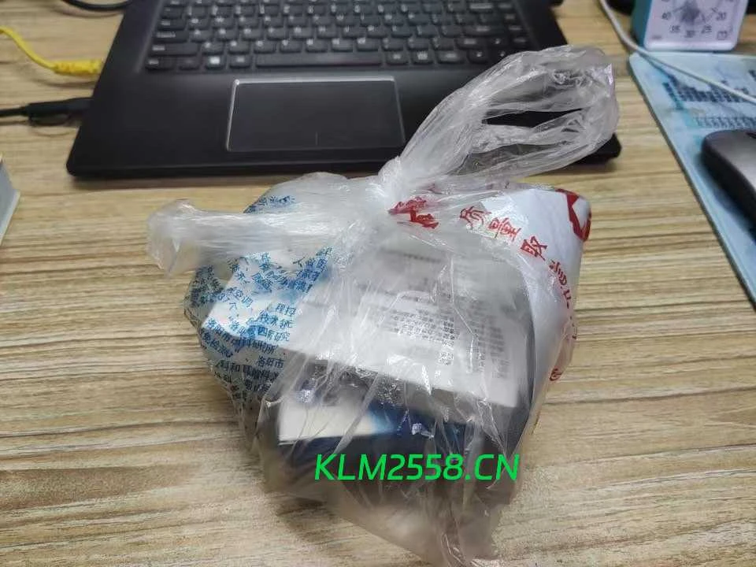

## 前言

本周较忙，月考成绩出来了，由于粗心背书少而扣了很多分。同时因为发热头痛了好久……

## 各科错题知识点总结

### 化学

- `N`指的是`氮元素`，`N2`指的是`氮气`。
- `X化X`、`液态氧`均为纯净物。
- 鉴别`CO2`、`O2`、`空气`的最好方法是用`燃着的木条`伸入集气瓶，而并非`带火星小木条`。
- 形如○● ○● ○●的是`纯净物`，形如○● ●● ○○的是`混合物`。
- 不显电性的`粒子`包括：`原子`、`中子`和`分子`。
- 加压存放气体，能够直观地看出是因为`加压可以使分子间隔变小`，无需透过现象看本质，写一个`分子间存在间隔`。
- 使用高锰酸钾制氧气，先`熄灭酒精灯`再`移开导气管`会导致的结果为`水回流至试管，试管因骤冷而炸裂`。
- 制取装置包括`发生装置`和`收集装置`。
- 仪器名称书写错误——是长`颈`漏斗而不是长柄漏斗。

### 英语

- 填空题后跟`or not`的空，优先考虑填`whether`。
- 既做`动词`又做`名词`的词，在`介词`后优先直接使用其名词形式（保持原形不变）。
- 补全对话，前文另一个人做出`对主角有利的事时`，最后一句优先考虑填写`表示感谢的话`。

## 早操迟到

应该算初中生涯第二次早操迟到。最近天气骤冷，起床突然变得异常艰难。再加上当天我又洗头了+是宿舍值日生，导致最终被拦截在了队伍前。

班主任给我们迟到的人拍了照发到领导群（似乎是发出去了，社死现场……）

最终我们没参加早操，在其他人早操结束后罚跑了1000米，但是达成的训练效果终归是不如正常训练好的。

## 为生活努力的人们

昨天从学校回来，路上淅淅沥沥地下着小雨。但是在大街小巷，尤其是学校门口，各种各样的小吃摊琳琅满目。刚才我还在为学校只放半天假期感到很生气，但是现在却是受到了一点点震撼：每个人不都是在努力地生活着吗？难道就我一个人不好过吗？答案是否定的。在当下的社会环境中，谋生是困难的。想要在这个社会生存下去，要么付出脑力劳动，要么付出体力劳动。每个人都不容易。（附路上看到的摊位图片）

 

## 发热

已经持续了一个多月了，前是因为病毒性感冒，后者暂时不明原因。前前后后吃了n天的药。前期还能压住病情，后期就一直发烧不退了。今天下午去医院检查，医生怀疑是肺炎，但是没做CT。开了一堆药，希望这次吃了能好吧。

另：阿奇霉素分散片因为味道奇特以及每片体积过大，卡在了嗓子眼。我干呕了半分钟才硬把它咽下去，后续大概1个多小时嘴里都是令人恶心的药味。吃出心理阴影了（悲）
