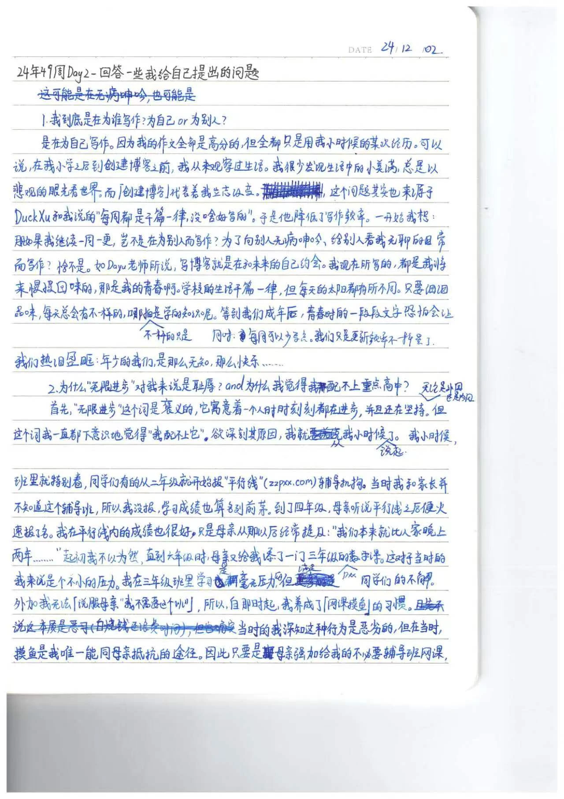
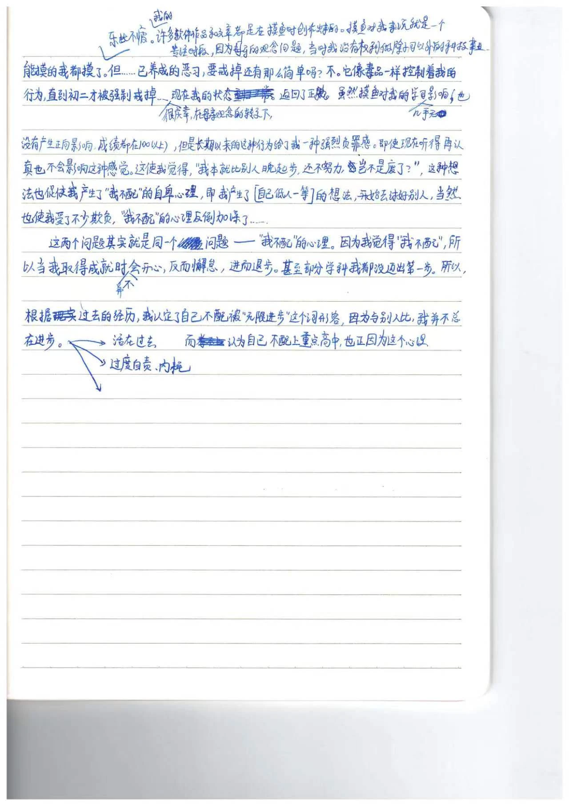

## 前言

本周花了四天时间思考了两个问题，也算是把自己抽象的心结具象化，然后一一解决掉了。

```
1.我到底是在为谁写作？
2.为什么“无限进步”对我来说感觉是耻辱？&&我为什么觉得自己配不上重点高中？
```

本文由手写笔记二改而来，手写笔记上可能会有部分句子出现逻辑错误，欢迎指正。

## 我到底是在为谁写作？

为我自己。

我从小学到现在写的所有考试作文得分都很高。但是它们都有一个共同点——都引用了我小时候经历过的同一件事（如钢琴考级、钢琴比赛），一件事反反复复造出n篇文章。

可以这么说，从我小学之后到创建博客之前，我从未细致观察过生活。我很少主动发现生活中的美好（或是说经历过美好后会很快忘记，毫无痕迹），因此总是以悲观的眼光看世界。而`创建博客`可以看作我立志要做出改变。

这个问题其实也来源于DuckXu曾和我说的一句话：

> 每周都是千篇一律，没啥好写的。

于是他降低了写作频率。

一开始我想：“那么我如果坚持下去一周一更，给自己这个压力，不就是为别人而写作了吗？”

“难道是为了向别人无病呻吟、给别人看我无聊的日常而写作？”

恰恰不是。

首先，如Dayu老师所说，写一篇博客，就是跟未来的自己约会。我现在所写的，都是我将来细细品味的，那是我的青春啊。

其次，学校的生活虽然千篇一律，如同固定的模式，但是每天经历的事肯定会有所不同。静下来想想，每天总会有不一样的，哪怕不一样的只是所学的知识呢。

再次，我写周记也不完全是为写而写，大部分是想让自己清晰地看到自己上周做了什么，没有虚度光阴。当然，这并不代表不写周记就是虚度。

等到成年后，青春时的一段段稚嫩的文字恐怕会让我热泪盈眶：年少的我，是那么无知、那么快乐……

## 为什么“无限进步”对我来说感觉是耻辱？

“无限进步”这个词是100%褒义的，他寓意着一个人不断攀升至更高的境界。但是我一直觉得我不配被用这个词来形容。欲深究其原因，就得从我小时候的经历说起了。

自打我上小学起，班里的同学就非常卷。同学们有的在二年级就开始报名`平行线奥数班`（官网[zzpxx.com](https://www.zzpxx.com/)）。这个辅导机构在本地无论是当时还是现在都是很领先的。当时我和家长并不知道有这么个东西，因此并没有报名，但我的数学成绩在班里还是名列前茅。到了四年级，母亲听说了`平行线`之后便火速为我报了名。我在平行线内的成绩也很好，只是母亲在那之后经常在我耳边提一句：

> 我们本来就比人家晚上了两年……

起初我对这句话不以为然，直到小学五年级都保持着优异的成绩。但是五年级的某次数学小考打破了沉寂——由于最近贪玩，我只得了68分/100分。这使得母亲顿时不淡定了，马上给我加报了一个`三年级`得平行线数学班。 你没听错。母亲在我`五年级`的时候给我报了个`三年级`的数学班（线上课）。我到现在都不理解这种行为的动机，因为我三年级的数学知识并没有任何漏洞。

在这个`三年级`的班里，我实力超群，课堂上每次回答问题都会比三年级的同学们快好多，可以说是`降维打击`。因此，老师渐渐地放松了对我的管理，课堂上也不再提问我，渐渐地我貌似被忽视了。

而在当时，三年级的这个班是我认为最没用且最不想上的。谁成想母亲不同意我退课，根本说不通。

所以，自那时起，我养成了`网课摸鱼`的习惯——`Classin`（一款网课软件）的强制全屏机制是有BUG的，在当时通过调节屏幕方向可以很轻松地将其卡为小窗口。于是我就在这个小窗口后写代码（当时我很迷恋VBScript，喜欢去写一些弹窗类的小玩意）、玩游戏。因为电脑配置太低，游戏后来也不玩了，纯写代码。这也为我后续的编程思维打下了不少的基础。

当时的我深知这种行为是恶劣的，但在当时，`网课摸鱼`是我唯一能同母亲对抗的途径。因此，在当时只要是母亲强加给我的不必要的辅导班网课，能摸的我都摸了，乐此不疲。我的许多软件作品和文章甚至都是在摸鱼时创作出来的。摸鱼对我来说就是一个专注时段，因为母亲的思想问题，当时的我在家并没有权利去做除学习以外的与电脑有关的任何事。而网课摸鱼，就相当于给了我两小时，让我能够酣畅淋漓、专心致志地研究两小时电脑。

但……已经养成的恶习，要戒掉还有那么简单吗？不。网课摸鱼，就像毒品一样控制着我的行为，我逐渐由只在不想上的课中摸鱼，转向了所有辅导班。

当然要说理由也有，因为初中的双休日很短，我们`周日下午两点`就要到校，而我在这短短的一天半时间里，被排了`物理`、`数学`、`英语`三门辅导班，剩下的时间只要我有空余，母亲就会让我去看辅导班发布的自学视频。这导致我的周末时间被分割成了很多片段，根本无法在家里静下心来做一件事。

很庆幸，母亲的思想在初二转变了过来。她给予我折腾项目的权利，并且给我减掉了`化学`辅导班。从那以后，我就逐渐戒掉了这个恶习。

虽然摸鱼这件事对我的学习几乎没有任何影响（当然，这些辅导班也没有对我的学习产生正面影响，我的成绩一般都在100&110分以上），但是长期以来的这种行为给了我一种`强烈的负罪感`。即使现在，我在辅导班上听得再认真，互动得再积极，也无法减轻这种感觉。它就像丧钟一样，让我的脑子里每天充斥着一个想法——“我本来就比别人晚起步，还不努力，就是个废物”。这种想法促使我对做任何事产生了“我不配”的自卑心理，以及【我烧钱】【我不孝】【我低人一等】等一系列观念。因此我在初中并没有开一个好头，我不断地讨好别人，使我受了不少欺负，“我不配”的心理反倒加深了。

而这两个问题其实指向的是同一个问题——“我不配”的心理。因为我觉得“我不配”，所以当我取得任何成就时，以及我做任何无意义但能让自己快乐起来的事时，会非常沮丧。当我成绩进步时，我并不会开心，反而会懈怠，进而退步，仿佛“那就是我应该得到的”。甚至初中的有些学科我都没有迈出第一步，导致其成为拖后腿的科目。

因此，在我看到一些朋友的博客上写着“无限进步”，想要将其作为自己的Slogan时，我的潜意识会瞬间告诉我：你不配。因为与别人比，我并不总在进步。

------

好啦，说了这么多原因，还没有说解决措施。我想对自己说的是：

不要活在过去，活在当下和未来。即使过去犯了再怎么严重的错，即使取得了再光辉的荣誉，也已经过去了。我现在要做的就是接纳现实，不论过去，不问将来。认真做好我该做的事，内耗什么的，通通去他的吧！

## 后记

这两个问题是我周二晚上在老师说了某句话时想到的，于每晚晚自习空闲的10~15分钟进行撰写。

如果你有兴趣，可以来看看原稿：




