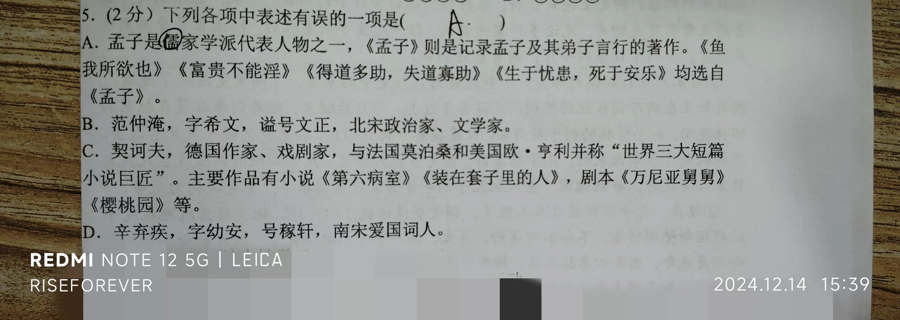

## 前言

因为没有什么特别有意义的事情发生，所以九下第三次月考便顺理成章地成为了本周的主题。

本篇文章会对我九下第三次月考进行一次总结。

## 顺序

共2天，12月12日~12月13日。

12月12日安排如下：

- 政治 15:40~16:30（开卷）
- 化学 16:50~17:40
- 历史 19:00~19:50（开卷）
- 物理 20:10~21:10

12月13日安排如下：

- 语文 8:00~10:00
- 数学 10:20~11:55
- 英语 13:00~15:40

## 政治

因为第一场考政治，所以考前我手里拿着参考资料看来看去，想着能多记一点到时候就少翻一点。

客观题做起来还挺顺利的，至少那些会跳的坑我都没跳进去。但是主观题第一题给了我当头一棒——由于我以前并未掌握主观题第一题的答题方法，这次考试是我第一次学会并亲身实践。我的写字速度不是很快，所以考试时间过半，我的主观第一题还未完成。

主观题内容：

> 1. 十几年前，在国外的华人很难感受到“年味儿”。现在，中国的春节不仅是全球华人的节日，而且吸引了多国民众。每年春节，代表中国元素的“中国红”都会扮靓国外许多城市，赏花灯、品美食、舞龙舞狮等充满了浓浓中国味的活动，受到了众多外国友人的关注和喜爱。对此，有人认为，随着中华文化对世界的影响越来越大，将逐渐代替其他国家文化，世界文化将不再具有多样性。
>
> 结合材料，运用所学知识，请你对上述观点进行辨别和分析。

说难其实也不难，我一开始想“代替其他国家文化肯定不对啊”，所以就在草稿纸上写下了：

> 1. 文化多样性的意义
> 2. 如何面对文化差异
> 3. 文化之间的误解和冲突
> 4. 中国及其他国家应该怎么做

看似内容不多，但是耗费我15分钟，写满了半页答题卡。估计是我人生中第一次在一道题上写这么多字。

但是直到考试结束前三分钟，我的答题卡第二面还基本是空白。我手心沁满了汗，慌得要死，却又无力改变现实。

后面的题只好草草了事，最终空了至少11分的题。（悲）

总结：下次做主观题时不要一味追求卷面，还要兼顾写字速度。因为主观题第一题的书写量非常大。

## 化学

考前背了背常见化学反应方程式，还挺管用。

道尔顿发明了原子论，阿伏伽德罗发明了分子学说，拉瓦锡发明了质量守恒定律。这三个人我从开始学化学就没背会过，所以几乎每次化学考试出这道题我都会错。

同样的，化学考试也觉得时间不太够用，我是在考试前最后一分钟硬挤出来的答案。

化学卷子丢失，不能精确到题，所以我就简单说说我需要补的内容。

- 历史上著名的几个科学家以及其对化学领域做出的贡献
- 常见的化学反应方程式
- 常见物质的实验室制取方法
- 利用化学方程式进行计算

总的来说，今后需要多背。

## 历史

历史是所有科目中最逆天的。老师在考试前几天给我们人手发了一册万维中考的《面对面》，里面包含初中历史的所有知识点，以及满分小短文、时间轴等资料。

在这场考试开始前，历史老师在班里希沃白板上写了：“一定要拿好《面对面》和《满分小短文》”，一开始我不以为然，但当我看到小论文主题《潮流与变革》的那一刻，我惊呆了：居然是《满分小短文》小册子中第26页的原文，内容100%匹配题目。

当时就觉得这次历史成绩绝对低不了。当我继续做下去时，我发现：所有题目，都能在《面对面》中找到100%匹配的答案。我心潮澎湃，不知道该赞美《面对面》覆盖范围广，还是该赞美老师们面向答案出题。

历史整体考起来还算顺利，没有出现时间不够用的情况。

## 物理

物理没什么好说的，我最擅长的科目。

但但但，最后一题最后一问考的是根据W=n/N 和 P=W/t求用电器实际电压，因为时间不够我没求出来，最后一题得扣一分了（悲）

万恶之源最后一题在这


考完物理之后我们就回去睡了。很高兴，考试那天晚上没有“晚三”（延时的第三节晚自习）。

## 夜

深夜，我躺在床上，翻来覆去。毛衣穿在身上嫌热，脱了又嫌冷。我整个人处于一种半睡半醒的状态，心里像以往每次考试时一样不安，难受极了。

其中我焦虑的很大原因是~~白天的那几科没考好，没有给这场考试起到一个好头，以及第二天会面临更主要的科目，心中很兴奋。~~

~~还有，当天考场不让带手表，所以我就把手环摘了放在书包里，没有拿回宿舍，导致我莫名焦虑。~~忽然想起来我白天喝了一包黑咖啡，我还寻思为啥就是睡不着呢，寄（（

总之就是第一天晚上没睡好，导致第二天早上起床昏昏沉沉的，黑眼圈很重，并且影响到了部分科目的考试。

## 语文

早自习结束前我还在背着《水浒传》里的重要人物形象和《词四首》《课外古诗词四首》的主旨，其中前者对考试提供了不小帮助，后者？啥用都没有……

同化学的知名科学家一样，语文的名人介绍我也是一张白纸。

就比如下图这道题，我就选错了，正确答案是C——契诃夫是俄国作家：




阅读题第一篇出的[柳先生的正骨膏](https://www.yuzhenhai.com/view/202003/42305.html)，我自己感觉做的还不错，柳先生刺杀日本少佐的情节的确很解气。正好，13号是南京大屠杀公祭日，就有一种…心里很舒服的感觉。

以及，因为失眠导致的精神疲惫：在写作文的时候我的脑子已经懵了，提笔忘字，写不出什么好词好句，也可能是我没灵感了。作文这次听天由命吧。

## 数学

与历史情况相同，数学的最后一道大题是我一天前做过的原题，连数字都没改。

这次数学主要涉及到了九上的二次函数、中心对称和圆等知识点，我掌握的总体还不错，正确率还挺高。

但是有一道题因为紧张没有检查出来而犯了个低级错误：

> 1. 国庆期间，大同古城热闹非凡，各大景区游人如织，大学生小云在东南邑街区卖气球，销售过程中发现每天的销量y（件）和售价x（元/件）之间满足一次函数y=-2x+70的关系，已知一个气球的成本是5元，若不计其他成本，则小云每天获得的最大利润是元。

这道题很简单，由题可列出关于利润w的方程式：

```
w=(x-5)(-2x+70)=-2x²+80x-350
```

然后很简单就可以求出当x=20的时候利润最大。

原本这时候直接把x=20带入w的解析式就能求出利润（450元）的。但是我太紧张，就把w这个解析式当成了【销量】的。最后我把20代入w，算出“销量”，再乘上15元的利润，得出“最大利润”是6750元/天。

一本正经地胡说八道。监考老师看到了估计都想跳槽去卖气球了（）

最后是至少错了2道填空题，上限也变成114分了。

## 英语

基础题全对。完形有两道是我很纠结的，我甚至画出来了，但我最终没有改答案。然后就成功错了两道完形，扣了两分。。

英语这门也没啥可说的，无限接近完美。后续巩固一下完形罢（）

## 总结

这次月考，我发现了自己的一些问题，总的来说就是：

1. 做题忽然变得很磨蹭
2. 基础知识有欠缺

前者通过改善睡眠质量可以解决，后者则需要在日常生活中加以归纳和读背。九年级第一学期只剩下明年1月9日的期末考了，加油，再创佳绩，无限进步！
