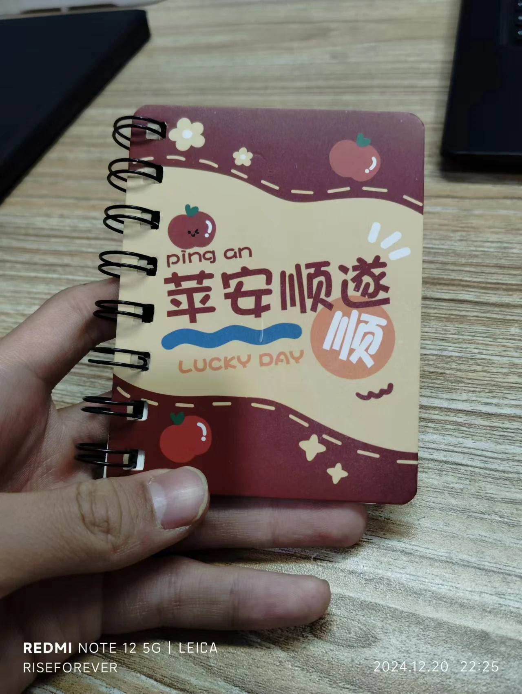
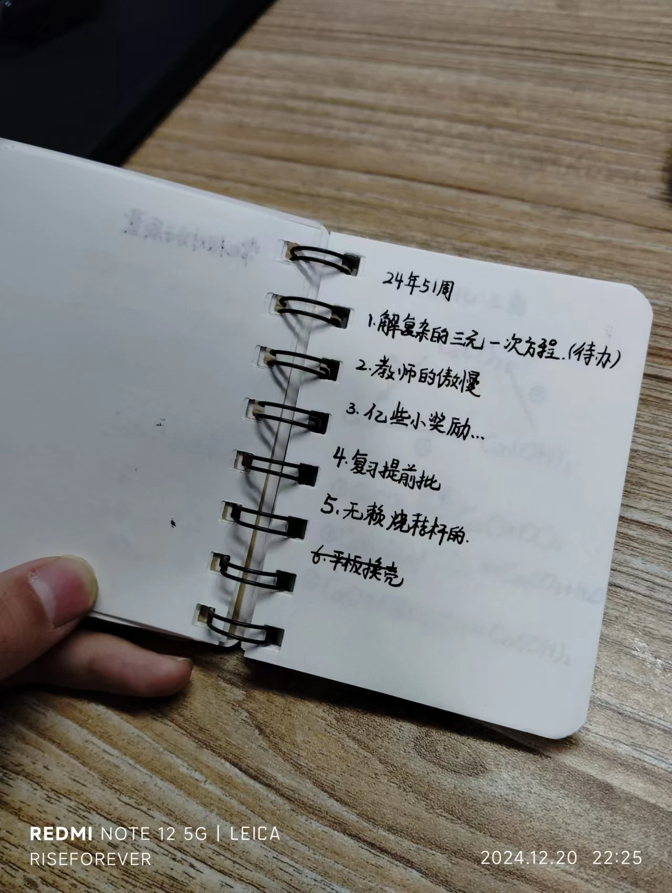

## 前言

哇塞，本周感觉有很多能记的事情呐，同时，本周我也觉得过的超级快，有种一眨眼就一周的感觉。

## 教师的傲慢

期中考试已结束，英语成绩已出——115。原本我对自己的预估成绩是118，因为我的作文满分，有两道完形填空是必错的。但是令我不解的是我在补全对话的题目上又扣了3分。就因为这三分，暴露出了我们英语老师的许多问题。

当然我不是有意冒犯英语老师，只是提出一些必要的意见，整改不整改看自己了。

### 通过学生给的答案揣测学生家教

补全对话的第一题我的分被扣了，题目如下：

> A: Look! Cindy. Here is a schoolbag. Nobody is here except us.
>
> 1._____________________
>
> B: Let me have a look. There is an English book , a notebook and a CD. Look, here is a name "Lucy" on the notebook. This schoolbag must belong to her. Let's go and find her.

我的答案：What's in it?

理由很简单，A说完这句话之后B就把那个包打开看了，并且回答了里面有什么东西。联系上下文来看，下文连续两个句子都在讲包里有什么。

老师的答案：Whose schoolbag is it?

对于老师的答案我当然是不否认的，但我还是提出了自己的答案。没想到没等我说完老师就果断地打断"不行"，理由是一句很大声的”你妈没有教过你捡到别人的包不能打开看吗？“

我很恼怒，但并没有在课堂上直接怼她，这件事就以我们俩之间暂时冷战而不了了之。

1. 答案是死的，人是活的。刚考试结束时，我就向英语老师提出了我的歧义答案，她说：”你这个应该也可以，我们出题组到时候再商量商量“。结果三个人居然都否认这个答案。真棒。
2. 一名教师怎么可以通过我对一道题目答案的不同观点来怀疑我的家教是否正常？
3. 如果说我建议他”打开捡来的包看看有什么东西“，那出题人为什么要在答语中连续两句回答包里有什么？

### 盲目支持所谓“标准答案”

为了使大家更有代入感，我仍然放出原题：

> In these videos, not only students, but also parents were having fun. "The kids were so excited," Noel Gonzalez said. "It ____ looked like great fun."
>
> Bile buses make stops like usual buses. They pick up students along the route, and then the whole group rides to school together. --
>
> A.just B.still C.also D.even

我们好多人都选C，包括成绩优异的学生。可是老师偏偏要我们选A，我们询问原因，她也无法解释清楚，只是让我们选A。

A选项如果是just，那么下文就要写这件事的缺点，可是后文并没有提到。A选项明显很牵强。

### 无脑回怼

在我们和英语老师之间的分歧达到一定程度时，她回了一句：“你们一个个来当权威呢？”言外之意即为“教师是绝对的权威”，这也是取题目为"教师的傲慢"的原因之一。

### 推卸责任

本次英语考试的试题为以我的英语老师为首的英语组命题。在考试结束后班主任们总结时，英语老师自信地说：“这次的题是我们出题组原创！”

当我们的答案与老师给出的有严重分歧且英语老师无法解释时，她黑着脸说：“你别看命题人写的是我，题是我们三个人一起出的，我是被甩锅的。”

她在自认为试卷难倒我们时自信地说是自己命题，出了歧义后第一句话便是推脱责任而非勇敢面对。

### 总结

“教师的傲慢”是我基于这几种行为归纳总结出的题目，但我意外发现极客死亡计划上也有一篇《教师的傲慢》，并且表达的思想我完全认同，所以这里贴一下[链接](https://www.geedea.pro/posts/教师的傲慢/)。

## 一些小奖励

本次考试我的语文成绩有进步，并且进入了班级前五，语文老师给我们几个发了一个本本ヾ(≧▽≦*)o

（本周的周记灵感碎片就是记录在这个本子上的噢~）

以及协助英语老师编写期末复习知识点小页子，获得了一大把糖和一包鸡肉味的~~啥玩意我忘了~~，反正挺好吃。

（周内吃完了，没拍照，哈哈）

## 烧秸秆的农民

我们学校门口路对面是一片麦地，自从上周开始就有一群农民在半夜焚烧秸秆。本周二，我们学部初一的体育老师忍受不了剧烈的浓烟，报警了。至于发生了什么我还不知道，反正秸秆的烟在周三停了一天。

本周四晚放学，我走出培优教室，在返回宿舍的途中，看到操场上浓烟滚滚，并且地势低的地方聚集了很浓的烟雾，就跟大闹天宫一样，只不过空气是呛鼻的。据培优班老师说，这群农民在报警后保持着“你能奈我何”的态度，十分嚣张。并且警察似乎无法对这件事造成影响。

周四晚上，我在宿舍里看着校门口的明火，无奈地关上窗。

周五一早起来，我滴妈还在烧！他还换了个位置，上次是在麦地里烧，这次是直接在我们学校的围墙外烧！我们在操场上跑操甚至可以直接看到校外明火，无助地看着那烟上升到半空中，再被风吹到操场上空，再落到操场上……整个操场十分壮观，一眼望去全是烟的世界，可视范围大大缩小，鼻子也感觉被强碱了（）

这种农民就纯属缺德，烧秸秆偏偏要在学校门口烧，不管他什么目的，让全校数千人承受他一个人的过失带来的后果是可恨可耻的。全校学生骂声一片，编了一堆咒骂的话，甚至改编了《做个文明中国人》，喜剧效果拉满。

## Bugs

我在很久以前发现了一些平台的Bug，并且到现在还未解决。

### 酷狗概念版

在新版本中，酷狗概念版将原有的VIP更名为了“概念版VIP”，并新增了一个“畅听VIP”，该VIP可以以原每日签到的形式获取，且只能以最低音质免费听所有歌曲。

而我之所以说官方是把原VIP`更名`为了概念版VIP，就有原因了。

现在，使用旧版本的酷狗概念版，进入福利→每日听歌领VIP，可以看到，在新版本中显示的“听歌领`畅听VIP`”，在旧版本中显示为“听歌领`概念版VIP`”，点击之后，就可以领取一天的`概念版VIP`

注：概念版VIP在新版本中是需要付费购买的，这个BUG可以使用户在老版本中免费获取概念版VIP。

解决方法也很简单，只需要对调`概念版VIP`和`畅听VIP`的`对象名称`（或类似的属性）即可。不知道开发者为什么会犯如此低级的错误且未发现。

### 清某某远视频书

清某某远视频书是需要付费才能观看视频书内的视频的，在我某次把玩浏览器时，我发现清某某远视频书在视频播放页面虽然有激活弹窗，但是其视频会被`AIX智能下载器`插件捕捉到，并完整播放。甚至想下载都不是问题。

这可是一个致命漏洞，往小了说可以让读者免费嫖到学习资源，往大了说就涉及到一个公司的存亡。

解决方法就是当用户未激活时不显示视频，只显示激活弹窗。

## 来年

好快，就要2025了。新的一年，祝大家也祝自己：

`前程似锦`、`无限进步`！
