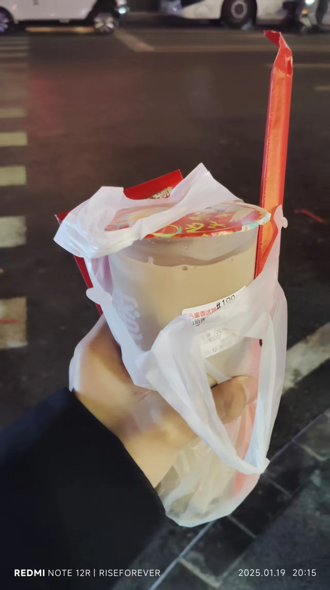
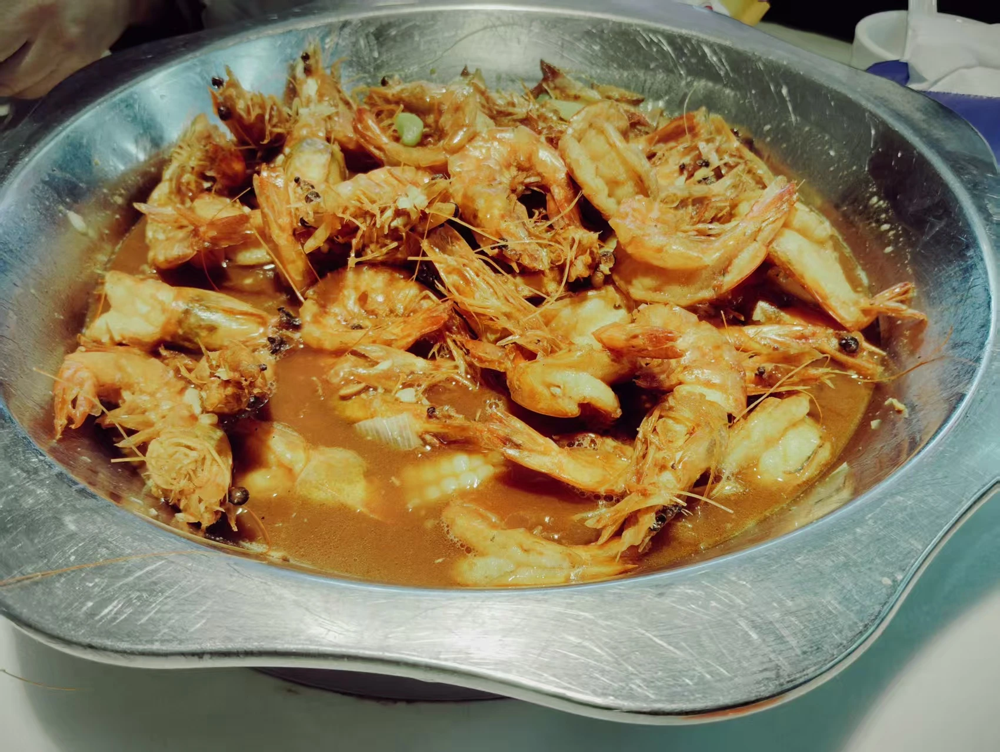
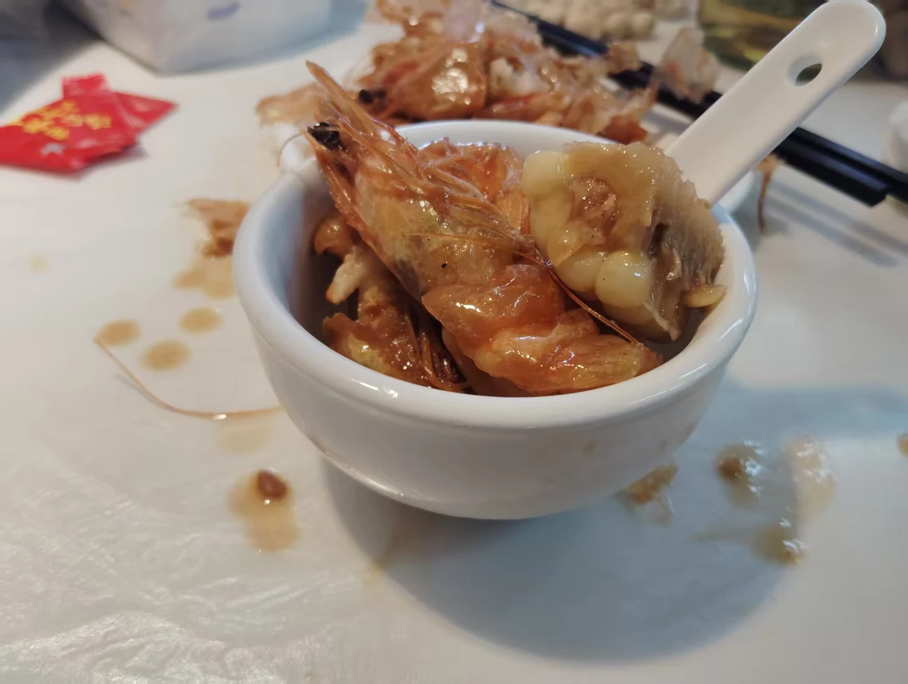

很抱歉我拖更了这么久，最近发生的事情很多很多。

寒假可能就只更新这一篇了，在家里实在没什么写作的动力。

以下将按照【离校前】和【离校后】分两个板块叙述。

## 离校前

### 手表被恢复出厂=救赎

> **前情提要**：我们班有一位陈姓同学，他使用的手表是Xiaomi Watch S1，上面有网易云音乐，并且下载了许多歌曲。我经常用他的手表听音乐。
>
> 以及：这位陈姓同学和我[前文](https://i.virelyx.com/471.html)提到的“和我一起挨处分”的同学是同一个人。

上周五下午放学前的最后一节课，陈同学未经同意把我的手环拿去玩（我的手环上有一些小游戏），并把他的手表丢给了我——我的天，上面的一百多首歌被删了个精光！这可怎行？于是我说时迟那时快，将他的手表恢复出厂设置了。

他似乎很生气，一直笑骂道：“有本事你不要让我再看到你的手表！”

期末考试那周日，我们返校。当天中午，由于我要洗头，所以便把手环扔到了我的床上。霎时，我想到了什么，但几乎来不及了——陈同学已经调出了我手环的“恢复出厂设置”确认对话框。我急忙前去抢夺，但他按下了确认。一声哀嚎，我便失去了我掌握时间用的手环。

一开始，我还很不高兴，强迫他寻找方法将手环恢复原样，但这并未见效。渐渐地，我也不再向他追究，并逐渐习惯了没有手环的生活。

考前，老师在教室里给我们重申了一遍又一遍——这次考试是全市统考，考场不允许佩戴任何电子产品进入考场。期末考试那天上午，我们考语文、数学两科。陈同学大抵是忘记了这个规则，戴着手表进入了语文考场。不出所料，他的手表——被没收了。第二节考完后，我在楼下看到了一张通报，上面显赫地写着陈同学的大名。

唉，他的上一份处分还没有撤销，新的处分就接踵而至，以前的那份也不能撤销了，真惨。当然，如果不是他把我的手表恢复出厂，那么这份处分上可能还有我的名字。因此，陈同学间接性救了我。

### 考场遇Crush

> 本段没有什么阅读价值，可以直接跳过。
>
> **前情提要**：我们这次考试的考场划分方式与以往不同：以往是按照成绩划分1~6考场，现在是按照姓氏笔画来划分1~6考场。这次考试，Crush就很巧地被分到了我的正左边。
>
> 另：Crush这个词可能形容得不够准确，应该说是单相思/tg。她对我并没有感情。（别笑…）

我并不知道这算好事还算坏事。同学都说“考试遇Crush是大忌”，我当时并不这么认为，以为这是一次难得的靠近她的机会。刚进入考场的时候，我莫名很紧张。不敢和她对视，更不敢和她搭话。现在想起来还挺尬的。不过令我没想到的是，她和我说的第一句话，居然是在语文考试结束时。语文题目我答得很赶，她问我：“所以你最后写完了吗？”，我的回答就不说了，比钢筋还直，属于下意识的了。现在想想真傻，不知道有什么好紧张的。

接下来就是煎熬的考试……休息中途她又问了我几个问题，我依旧是钢筋式回答。唉，要是我能让时间静止，再去打个草稿该多好啊。

### 估分

> **前情提要**：这次期末考试我对自己的期望挺高，总分830我预估能考783。这也为下文的`落差`做了铺垫。

各科考完后，听着其他同学对于试题难度的抱怨，我心里喜滋滋的。因为他们提到的难点我都觉得自己做得不错。不卖关子，直接说我预估的分。

| 科目 | 预估分/满分           | 扣除分数 |
| ---- | --------------------- | -------- |
| 语文 | 105/120               | -15      |
| 数学 | 117/120               | -3       |
| 英语 | 120/120               | -0       |
| 物理 | 100/100               | -0       |
| 政治 | 90/100                | -10      |
| 历史 | 90/100                | -10      |
| 化学 | 95/100                | -5       |
| 体育 | （这科出成绩了）66/70 | -4       |
| 总分 | 783/830               | -47      |

### RTools&工具箱元年

由于[蓝屏工具箱](https://tools.chgskj.cn/)是我初学编程时的作品，其代码的**扩展性和易读性**极低，**运维成本**越来越高，因此我不打算再继续维护蓝屏工具箱了，自己开了个新坑[RTools](https://tools.rsvsoft.cn/)。

我的同事曾调侃道“2024年是工具箱元年”，因为我在互联网上见到了鱼龙混杂的工具箱。我简单将这些工具箱分了一下类：

> **声明：**本段提到的“工具箱”不涉及`uTools`之类的大厂工具箱，仅针对同龄人（13~15岁群体）制作的工具箱。

| 类型       | 特点                                                         |
| ---------- | ------------------------------------------------------------ |
| 简单封装型 | 只是将部分绿色版软件打包成工具箱，离线使用，不支持扩展。     |
| 在线下载型 | 蓝屏工具箱的类型，体积小，在线使用，专攻可扩展模块，想用就下。 |
| 融合型     | 既包含了可离线使用的系统快捷操作项，还包含简单的在线应用扩展模块。 |

我见过的其中大部分都是“简单封装型”和“融合型”，很少有专门做“在线下载型”的工具箱。做“在线下载型”的似乎只有蓝屏工具箱。当然，这并不代表蓝屏工具箱是最好的。我个人其实更认可“融合型”的工具箱，因为纯在线工具箱可能在离线环境下就不能使用了。

但是RTools并不打算走融合型道路，我仍然打算走“在线下载型”道路。我自我感觉更擅长制作应用商店，那就尝试把它做到极致吧。

> **RTools**可能不会在今年过年时发版。它需要一段时间来被完善。我们会尽快。

### 落差

我考砸了。

预估的是783分，实际可能连723都考不上。

语文作文我们全校几乎都写跑题了（除了选择议论文的）；数学最后一道大题很简单，但我脑子一片空白，试卷也是；英语作文莫名奇妙被扣了4分，最终只考了115；物理因为审题错误，最终也只考了96；政治答题太磨叽，导致第二面只花费10分钟做完，分也基本扣完，最终考了65……

成绩出来时我脑子一片空白。

不多叙述了。

### 逆风翻盘

我去参加了**洛阳理工学院附属中学**的**领军班**测试。很遗憾，我没有考上领军班。但是校方和我母亲签约了**强基班**（通过普通中考能够进入的最好的班型）。这算是给我中考有了点保底。开心。

------

## 离校后

### 放亿点点毒

寒假伊始，我和父母姐姐一同去聚餐。出去吃了鱼和大虾~

### 最后

提前祝看到本篇文章的所有朋友们：新年快乐！万事如意！

祝学生朋友们：学业顺利，考神附体！

祝老师们：事业有成，健康顺遂！

 
