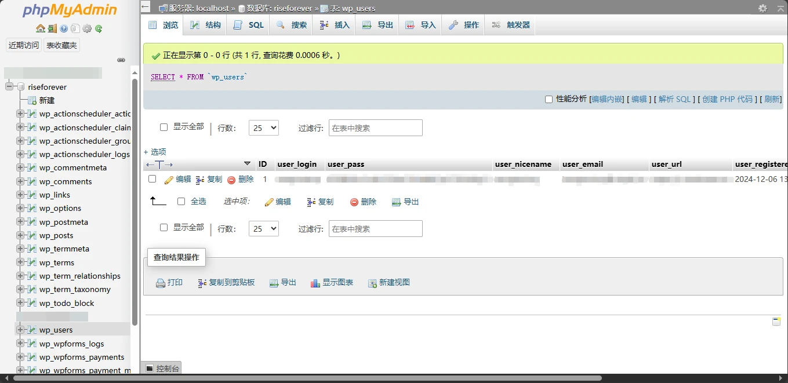
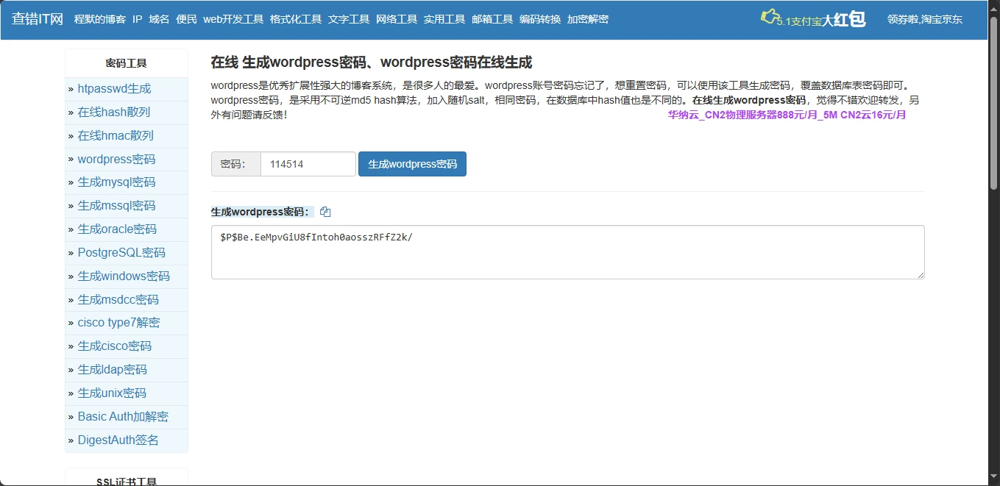
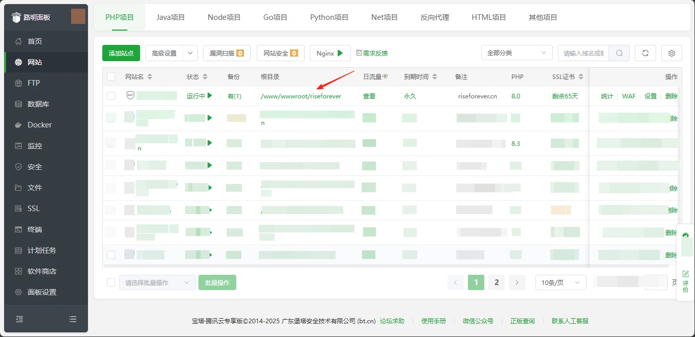
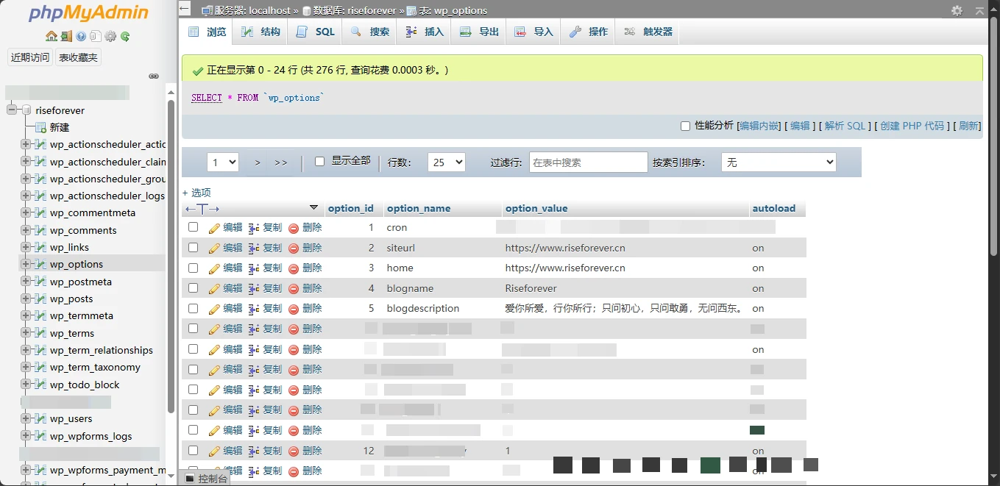

> 人非圣贤，孰能无过。我也是一名学习人，难免会犯错误。如果本文有任何不恰当的地方/您有更优的方法，请您在本篇文章的评论区留言，我将第一时间采纳。谢谢您！

# 引言

在WordPress运维过程中，相信很多站长遇到过一些“棘手”的问题：

> - 我的WordPress密码忘记了，并且未配置SMTP，导致无法登录，怎么办？
> - 我想迁移WordPress站点，但我不知道该站点对应的数据库，怎么办？
> - 我更改了WordPress站点的域名，但我忘了在WP后台更改站点地址了，现在无法正常访问，怎么办？

在本期教程中，这些问题都能迎刃而解。

# 前提准备

需要实现本期教程的全部内容，你需要具备以下条件：

> 非必要准备：
>
> 面板：宝塔面板/1Panel/XP/青龙等[/tip] [tip 
>
> 必要准备：
>
> 软件：MySQL，phpMyAdmin[/tip]

如果具备，那么小编将按照问题顺序开始逐步解决~

# 修改WordPress后台密码

相信很多朋友会遇到WP后台莫名无法登录，且因为未配置SMTP，无法通过邮箱找回密码的情况。无论是因为忘记了密码还是其它，大家现在面临的问题一定是WP后台无法正常登录。

此时，我们可以通过修改WordPress数据库来强制更改管理员账户的密码。

以宝塔面板为例，我们用phpMyAdmin打开WordPress站点所在数据库。展开数据列表后，选中“wp_users”表并找到自己的账户。



在user_pass这一列，可以看到用户的密码。

这里我们需要用到一个工具——[WordPress密码在线生成器](http://web.chacuo.net/safewordpress)。点击链接进入后，输入想要设置的新密码，再点击“生成wordpress密码”按钮，即可获得一串加密文本。



最后，将这串文本复制，并替换phpMyAdmin中用户的密码项，即可完成密码的修改。

Enjoy it !

# 查看WordPress站点对应的数据库名

首先必须清楚自己想查找站点的对应目录（这个应该没人会不知道吧）

以宝塔面板为例，在“网站”选项卡中点击欲查看网站的“根目录”项，即可进入网站目录。



进入WP站点的根目录，我们可以直接往下翻，找到一个名为“wp-config.php”的文件，这个文件就存储着我们需要的数据库信息。

使用任意编辑器打开此文件，一般可以直接看到形如下方的数据库信息：

```
// ** Database settings - You can get this info from your web host ** //
/** The name of the database for WordPress */
define( 'DB_NAME', 'xxxxxxxxxxxx' );

/** Database username */
define( 'DB_USER', 'xxxxxxxxxxxx' );

/** Database password */
define( 'DB_PASSWORD', 'xxxxxxxxxxxx' );

/** Database hostname */
define( 'DB_HOST', 'localhost' );

/** Database charset to use in creating database tables. */
define( 'DB_CHARSET', 'utf8mb4' );

/** The database collate type. Don't change this if in doubt. */
define( 'DB_COLLATE', '' );
```

代码框第三行“ define( 'DB_NAME', 'xxxxxxxxxxxx' ); ”中的“xxxxxxxxxxxx”即为该网站对应的数据库名称。

> 为了保护隐私，“xxxxxxxxxxxx”仅供参考，实际数据库名以文件中的为准。

# 修改WordPress站点地址/主页地址

许多朋友在更改域名时容易疏忽掉站点地址的修改，以至于当他们更换完毕时，会发现每每通过新域名访问网站，WordPress都会将其重定向到原先的域名。此时此刻想通过登录到WordPress后台来更改站点地址是几乎不可能的。所以，我们可以通过修改WordPress的数据库以达到更改站点地址的目的。

同样的，以宝塔面板为例，用phpMyAdmin打开WordPress站点所在数据库。展开数据列表后，选中“wp_options”表。



在这张表内，可以看到在“option_name”列中有一个“siteurl”行和“home”行。我们只需将这两行对应的“option_value”列内容修改为最新的域名即可。

> 数据库中“siteurl”和“home”分别代表不同的含义。如果想要了解，您可以参考[这篇问答](https://cloud.tencent.com/developer/ask/sof/114073181)。

# 后记

在一些紧急情况中，遇到类似的WordPress问题还是很猴急的。希望本篇文章可以帮到大家，我们下期再见！
