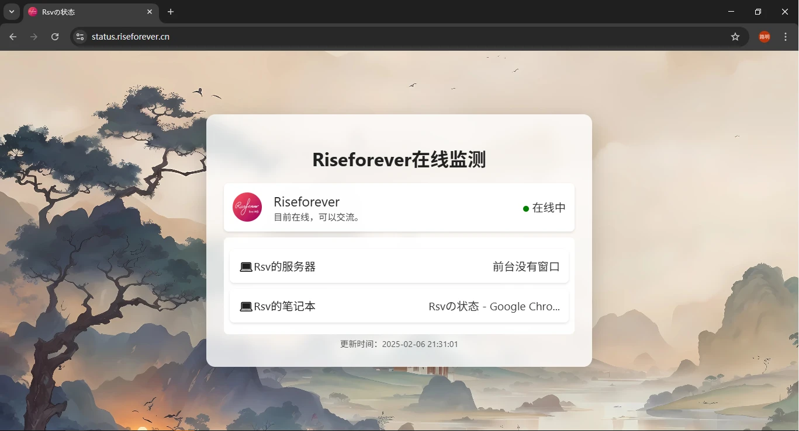
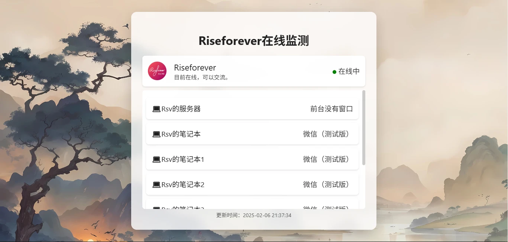
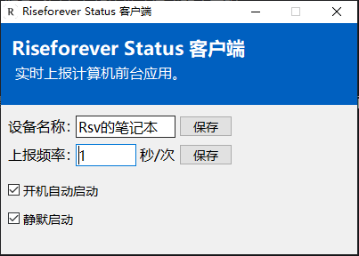

## 前言

Class Widgets是一款桌面课表软件。前几天，我加入了这个软件的交流群，发现群主RinLit搭建了一个网站，叫[RinLit似了吗？](https://sleepy.rinlit.cn/)

因为我从没有开发过网站，也没有体验过其网站中`将自己活动公开`的感觉，所以这个网站令我起了兴趣。于是我跃跃欲试，打算仿制一个。

## 开发

一开始我打算使用易语言来完成全部的开发任务，但很快我就被劝退了——易语言兼容性极差，现已无法胜任。我忽然想用Python练练手，毕竟Python的代码逻辑和易语言差不多，我能简单写上几句~~（吗？）~~。

程序的大体逻辑是：分为服务器端和客户端。服务器端负责接收数据和渲染网页，客户端负责收集PC当前的活动名称并发送至服务器。服务器端用Python编写，客户端用易语言编写。

拟好程序的大体逻辑，写好易语言客户端的例程，紧接着在DS的部分协助下，我得到了以下代码：

（1.0版本代码，仅供研究使用，我会在RStatus相对完善时进行开源。）

```
from flask import Flask, render_template_string
from flask_cors import CORS
import socket
import threading
import logging
import ctypes

# 配置日志记录
logging.basicConfig(level=logging.INFO, format='%(asctime)s - %(levelname)s - %(message)s')

app = Flask(__name__)
CORS(app)  # 启用 CORS

# 存储 TCP 服务器接收到的消息
received_message = ""
# 创建线程锁
lock = threading.Lock()
# 存储当前是否有客户端连接
has_connection = False

# HTML模板,包含现代化CSS样式和动效以及最新更新时间
HTML_TEMPLATE = '''
<!DOCTYPE html>
<html>

<head>
    <title>Rsvの状态</title>
    <meta charset="utf-8">
    <meta name="viewport" content="width=device-width, initial-scale=1.0"> <!-- 添加viewport元标签以适配手机端 -->
    <style>
        body {
            font-family: 'Segoe UI', Tahoma, Geneva, Verdana, sans-serif;
            background: url('https://blog-wp.luming.cool/wp-content/uploads/2025/01/6a22be2e4b3d370c76774ddaa58c0893.webp') center/cover no-repeat;
            margin: 0;
            padding: 20px;
            min-height: calc(100vh - 40px);
            display: flex;
            justify-content: center;
            align-items: center;
        }

        .container {
            background: rgba(255, 255, 255, 0.8);
            /* 提高背景透明度 */
            backdrop-filter: blur(10px);
            /* 添加毛玻璃效果 */
            border-radius: 15px;
            padding: 30px;
            box-shadow: 0 8px 32px rgba(0, 0, 0, 0.1);
            text-align: center;
            max-width: 600px;
            width: 90%;
            transition: all 0.3s ease;
            /* 添加过渡效果 */
        }

        .container:hover {
            box-shadow: 0 12px 40px rgba(0, 0, 0, 0.2);
            /* 增强阴影 */
        }

        h1 {
            color: #222;
            /* 加深标题颜色 */
            margin-bottom: 20px;
            position: relative;
        }

        #window-title,
        #server-title,
        .info-module {
            font-size: 1.2em;
            color: #333;
            /* 加深文字颜色 */
            padding: 15px;
            background: rgba(255, 255, 255, 0.8);
            /* 提高背景透明度 */
            backdrop-filter: blur(1px);
            /* 添加毛玻璃效果 */
            border-radius: 8px;
            margin: 10px 0;
            display: flex;
            justify-content: space-between;
            align-items: center;
        }

        #window-title .left-label,
        #server-title .left-label {
            color: #222;
            /* 加深标签颜色 */
        }

        #window-title .right-content,
        #server-title .right-content {
            text-align: right;
            cursor: pointer; /* 鼠标指针变为手型，表示可点击 */
        }

        #update-time {
            font-size: 0.9em;
            color: #555;
            /* 加深时间文字颜色 */
            margin-top: 5px;
        }

        .pinyin {
            font-size: 0.6em;
            position: absolute;
            top: -0.8em;
            left: 50%;
            transform: translateX(-50%);
            color: #444;
            /* 加深拼音颜色 */
        }

        .avatar-nickname {
            display: flex;
            align-items: center;
            /* 垂直居中对齐 */
            justify-content: flex-start;
            /* 左对齐 */
            flex-grow: 1;
            /* 让这个容器占据剩余空间 */
        }

        .avatar {
            width: 50px;
            height: 50px;
            border-radius: 50%;
            margin-right: 10px;
        }

        .nickname-container {
            display: flex;
            flex-direction: column;
            align-items: flex-start;
            /* 确保昵称和副标题左对齐 */
            margin-left: 10px;
            /* 添加一些左边距，避免和头像重叠 */
        }

        .nickname {
            font-size: 1.2em;
            color: #222;
            /* 加深昵称颜色 */
        }

        .sub-title {
            font-size: 0.8em;
            /* 减小副标题字体大小 */
            color: #444;
            /* 加深副标题颜色 */
            display: block;
            /* 确保副标题换行 */
        }

        .status-indicator {
            padding: 5px 10px;
            border-radius: 8px;
            /* 整体呈圆角矩形 */
            color: black;
            /* 文本颜色为黑色 */
            background: rgba(246, 211, 101, 0.5);
            /* 背景颜色与整个网页的背景颜色差不多 */
            border: 2px solid transparent;
            box-shadow: 0 2px 4px rgba(0, 0, 0, 0.2);
            display: flex;
            align-items: center;
        }

        .status-alive {
            border-color: green;
            /* 当状态为“在线中”时，边框颜色为绿色 */
        }

        .status-offline {
            border-color: red;
            /* 当状态为“离线了”时，边框颜色为红色 */
        }

        .status-dot {
            width: 10px;
            height: 10px;
            border-radius: 50%;
            margin-right: 5px;
            display: inline-block;
            /* 确保始终显示 */
        }

        .status-dot-alive {
            background-color: green;
        }

        .status-dot-offline {
            background-color: red;
        }

        /* 手机端适配样式 */
        @media (max-width: 600px) {
            body {
                padding: 10px;
            }

            .container {
                padding: 20px;
            }

            .info-module {
                flex-direction: column;
                /* 垂直排列 */
            }

            .avatar-nickname {
                flex-direction: column;
                /* 垂直排列 */
                align-items: center;
                margin-bottom: 10px;
            }

            .nickname-container {
                align-items: center;
                margin-left: 0;
            }

            .status-indicator {
                margin-top: 10px;
            }

            #window-title,
            #server-title {
                flex-direction: column;
                /* 垂直排列 */
            }

            #window-title .left-label,
            #server-title .left-label {
                margin-bottom: 5px;
            }

            #window-title .right-content,
            #server-title .right-content {
                text-align: center;
            }
        }
    </style>
    <link rel="icon" type="image/webp" href="https://blog-wp.luming.cool/wp-content/uploads/2024/12/65a799ce09060f728193a3146c6d0f15.webp">
</head>

<body>
    <div class="container">
        <h1>Riseforever在线监测</h1>
        <div class="info-module">
            <div class="avatar-nickname">
                
                <div class="nickname-container">
                    <span class="nickname">Riseforever</span>
                    <span class="sub-title" id="sub-title">目前离线，有事请留言。</span> <!-- 添加副标题 -->
                </div>
            </div>
            <div id="status-indicator" class="status-offline">
                <div class="status-dot status-dot-offline"></div>
                离线了
            </div>
        </div>
        <div id="window-title">
            <span class="left-label">💻RsvのLaptop</span>
            <span class="right-content" id="window-title-content" onclick="showFullContent(this)">加载中...</span>
        </div>
        <div id="server-title">
            <span class="left-label">💻RsvのServer</span>
            <span class="right-content" id="server-title-content" onclick="showFullContent(this)">加载中...</span>
        </div>
        <div id="update-time">更新时间：暂无</div>
    </div>
    <script>
        function updateWindowTitle() {
            fetch('/get_window')
              .then(response => response.text())
              .then(data => {
                    const windowTitleContent = document.querySelector('#window-title .right-content');
                    if (data.length > 20) { // 修改为 20 字符折叠
                        windowTitleContent.dataset.fullContent = data;
                        windowTitleContent.innerText = data.substring(0, 20) + '...';
                    } else {
                        windowTitleContent.dataset.fullContent = data;
                        windowTitleContent.innerText = data;
                    }
                    // 根据窗口名称更新状态指示器
                    const indicator = document.getElementById('status-indicator');
                    const dot = document.querySelector('.status-dot');
                    const subTitle = document.getElementById('sub-title');
                    if (data === '暂未使用') {
                        indicator.classList.remove('status-alive');
                        indicator.classList.add('status-offline');
                        indicator.innerHTML = '<div class="status-dot status-dot-offline"></div>离线了';
                        subTitle.innerText = '目前离线，有事请留言。';
                    } else {
                        indicator.classList.remove('status-offline');
                        indicator.classList.add('status-alive');
                        indicator.innerHTML = '<div class="status-dot status-dot-alive"></div>在线中';
                        subTitle.innerText = '目前在线，可以通过任何可用的联系方式联系本人。';
                    }
                    updateServerTitle();
                });
        }

        function updateServerTitle() {
            fetch('/get_server_window')
              .then(response => response.text())
              .then(data => {
                    const serverTitleContent = document.querySelector('#server-title .right-content');
                    if (data.length > 20) { // 修改为 20 字符折叠
                        serverTitleContent.dataset.fullContent = data;
                        serverTitleContent.innerText = data.substring(0, 20) + '...';
                    } else {
                        serverTitleContent.dataset.fullContent = data;
                        serverTitleContent.innerText = data;
                    }
                    // 获取当前时间并格式化为年月日时分秒
                    const now = new Date();
                    const year = now.getFullYear();
                    const month = String(now.getMonth() + 1).padStart(2, '0');
                    const day = String(now.getDate()).padStart(2, '0');
                    const hours = String(now.getHours()).padStart(2, '0');
                    const minutes = String(now.getMinutes()).padStart(2, '0');
                    const seconds = String(now.getSeconds()).padStart(2, '0');
                    const updateTime = `${year}-${month}-${day} ${hours}:${minutes}:${seconds}`;
                    document.getElementById('update-time').innerText = `更新时间：${updateTime}`;
                });
        }

        function showFullContent(element) {
            const fullContent = element.dataset.fullContent;
            alert(`${fullContent}`);
        }

        // 每3秒更新一次
        setInterval(updateWindowTitle, 3000);
        updateWindowTitle();  // 立即执行一次
    </script>
</body>

</html>
'''


def handle_tcp_connection():
    """处理 TCP 连接，接收特定格式的消息并更新全局变量"""
    global received_message, has_connection
    server_socket = socket.socket(socket.AF_INET, socket.SOCK_STREAM)
    server_socket.bind(('0.0.0.0', 19198))
    server_socket.listen(1)
    logging.info("TCP server started on port 19198")

    while True:
        try:
            conn, addr = server_socket.accept()
            has_connection = True
            logging.info(f"Connected by {addr}")
            try:
                data = conn.recv(1024)
                try:
                    # 使用 UTF - 8 编码进行解码
                    decoded_data = data.decode('utf-8')
                except UnicodeDecodeError:
                    logging.error("Failed to decode data using UTF-8. Skipping...")
                    continue

                if decoded_data.startswith("NewForm{}"):
                    message_content = decoded_data[9:]
                    with lock:
                        received_message = message_content
                    logging.info(f"Received message: {received_message}")
            except Exception as e:
                logging.error(f"Error handling TCP connection: {e}")
            finally:
                conn.close()
                has_connection = False
        except Exception as e:
            logging.error(f"Error accepting connection: {e}")


@app.route('/')
def home():
    """主页路由"""
    return render_template_string(HTML_TEMPLATE)


@app.route('/get_window')
def get_window():
    """返回 TCP 服务器接收到的消息的 API"""
    with lock:
        return received_message


@app.route('/get_status')
def get_status():
    """返回 TCP 服务器连接状态的 API"""
    global has_connection
    return 'alive' if has_connection else 'offline'


def get_active_window_title():
    """获取当前活动窗口的标题"""
    user32 = ctypes.windll.user32
    h_wnd = user32.GetForegroundWindow()
    length = user32.GetWindowTextLengthW(h_wnd)
    buff = ctypes.create_unicode_buffer(length + 1)
    user32.GetWindowTextW(h_wnd, buff, length + 1)
    title = buff.value
    return title if title else "暂未使用"


@app.route('/get_server_window')
def get_server_window():
    """返回当前最前方应用程序的窗口名称的 API"""
    try:
        window_title = get_active_window_title()
        return window_title
    except Exception as e:
        logging.error(f"Error getting server window title: {e}")
        return "获取失败"


if __name__ == '__main__':
    # 启动 TCP 服务器线程
    tcp_thread = threading.Thread(target=handle_tcp_connection, daemon=True)
    tcp_thread.start()

    # 启动 Flask 服务器
    app.run(host='0.0.0.0', port=5000, debug=False)
```

## 调试

不得不说，调试这一过程是真的艰巨。在开发过程中，我遇到了包括但不限于编码不一致、端口号填错、HTML标签写错等低级错误。多亏了DS，毫不嫌弃地帮助我（~~虽然它不会嫌弃~~），使我在2天之内将这个项目调试完并成功部署上线。

## 功能介绍

RStatus主要以网页端为主。

### 网页端

访问[项目网址](https://status.virelyx.com/)，你会发现其整体为一个窗口。上方是站长的个人信息（头像，昵称）以及在线状态，下方是站长在线的设备以及当前的活动。最下方是更新时间，每3秒会刷新一次列表。



值得一提的是，这个列表在1.0版本中是静态的，只能固定接收名为“RsvのLaptop”的活动名称；在2.0，列表全新升级为动态列表，支持在服务器的可承载范围内无限增加监控设备数。



在1.0版本中，如果列表项目过多则会使整个窗口硬生生被拖长，影响美观；在2.0版本中，为列表加入了进度条，所有内容都在窗口内，避免了因页面整体滚动造成的不美观。

### 客户端

客户端的作用是检测当前设备的顶端窗口名称并上报给服务器端。其界面是这样的：



至于各个控件的作用，都是与服务器端一一对应的，这里我就不过多解释了。

## 体验

链接：[捕捉Riseforever](https://status.virelyx.com/)

即将开源，敬请期待！

## 后记

原本，我一直在构思：自己应该做一个什么项目好。没想到，一次意外想法竟然造就了我的第一个项目。真是一次奇妙的旅程。
