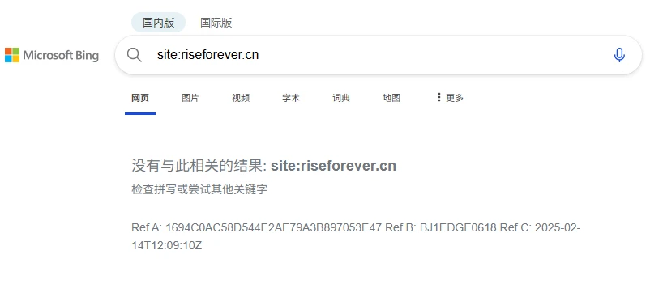
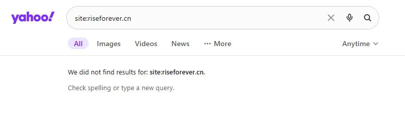
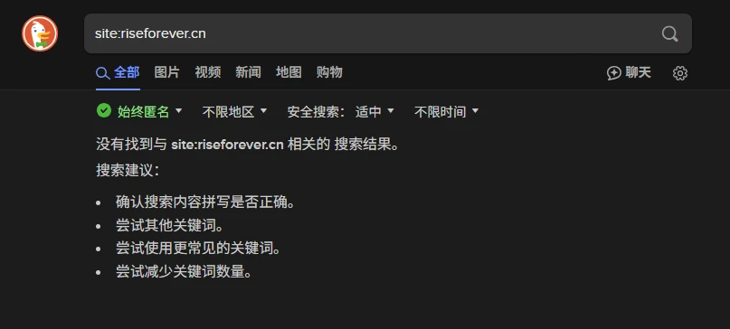

# 前言

注：每期文章的背景图颜色都是我瞎配的，不喜勿喷。

今天是2月14日情人节。路明先在这里祝各位朋友们情人节快乐！

本周因为周四早晨返校，周五下午离校，在校时间实在是短，所以就只分享两个主题吧——我的域名被国外主流搜索引擎屏蔽、六个小练笔。

# 域名被屏蔽

大概是10天前，我像以前一样用Bing搜索自己（~~自恋~~），结果发现查询出的条目中并没有直接指向本站的。

于是我直接输入“site:virelyx.com”，看到了以下场景：



我不信邪，便前往了Yahoo，也是如此：



继续。前往DuckDuckGo，亦是如此：



不知道为何，他们三家都屏蔽了我的域名。我寻思谷歌这边都收录的好好的，他们怎么就掉了？


向Bing站长工具提交了站点域名和Sitemap，但是十几天过去了，虽然工具那边提示我成功，但引擎这里没有任何动静。

当然，Bing也提醒我：我的站点有多处SEO错误。而我暂时不知道怎么调整SEO。

有哪位大佬知道的可以向我科普一下，在这里表示衷心的感谢！

# 六个小练笔

本周（其实只在学校呆了1天半）我共完成了6个小练笔题目（来自《666件可写的事》，上篇文章有提到），题目如下：

```
1.你做过的最离谱的梦是什么？
2.描写一下你灵魂的形状。
3.用四个词形容你的初恋。
4.你的人生座右铭是什么？
5.一觉醒来，发现自己回到了2000年的第一天，你会如何度过？
6.从你读过的文学作品中，选择一个可悲可叹的任务，简述这个人物形象。
```

## 你做过最离谱的梦是什么？

（仅为梦境记录，会出现一些不符合日常逻辑的东西，不必当真。）

夜晚，我走在某不知名小巷内。天空很黑，呼吸时甚至能尝到金属锈味的黑暗，我的耳膜被虚无的重量挤压着。即使路灯亮得快要刺瞎眼睛，那光也仿佛被黑暗吸收，根本无法打破这片死寂。

突然，我在手机上接收到了一个公司的Offer。我打算前往公司所在的大厦，但双腿却不自觉地往家的方向迈去。

到了家楼下，我发现我需要猫着腰才能进入楼道——这栋楼的每一层都很矮，连天花板都只到我一个14岁孩子的胸前。楼内是用红砖砌的墙，散布着霉臭味。我的眼前是一部电梯，它倒是正常的形态，只不过它的门已经嵌入了天花板，估计都到二楼去了。

我按下按钮，稍等片刻，门开了——电梯里有两个小男孩，背对着我，不停地蹦跶。我意识到电梯不安全，便转身前往楼梯间。

走在楼梯上，我发现并非是我在向上运动，而是整栋楼在以电梯般的速度曲线下降。只觉得一阵天旋地转，没一会，我就醒了。

## 描写一下你灵魂的形状

我的灵魂，很多变。

它可以是闪电的形状——代表着高效率、要强和善变的我；

它可以是水滴的形状——代表着细致入微，柔韧坚定的我。

它也可以是煤炭的形状——虽然会在需要的时候给予别人帮助，但有时候一点就着。

## 用四个词形容你的初恋

首先，我没有初恋。

如果非要让我形容一位异性，那么……

她：眉清目秀、文武双全、真诚朴实、英姿飒爽。

（没瓜，没瓜，没瓜。）

## 你的人生座右铭是什么

有两个：

- 走自己的路，让别人议论去吧。
- 爱你所爱，行你所行；只问初心，只问敢勇，无问西东。

二者表达的主旨其实差不多。

## 一觉醒来，发现自己回到了2000年的第一天，你会如何度过

上午，我会去父母居住的地方看看（虽然当时他们还尚未成为我的父母）。我要去参观他们开的家电卖场，体验一下如今只能在积灰的说明书中见到的⌈索科数控复读机⌋和⌈可视复读机⌋。我要去找父母喝杯茶，和他们唠唠家常，悄悄观察他们尚未变白的头发，以及仍不失青春色彩的脸颊。

中午，我会舒舒服服地睡上一觉，细细体味没有智能手机和即时通讯软件打扰的宁静。

下午，我会去电脑城买一台台式电脑，为它装上最新的WindowsXP和当下流行的软件。伴随着拨号上网漫长的等待音，我要在电脑上一边挂着千千静听，一边聊QQ，体验那互联网的新鲜感。这还不够，我还打算畅玩《红色警戒》。CRT显示器的波纹时隐时现，我也逐渐地沉浸其中。虽然硬件的上限使游戏运行得并不十分流畅，但我仍玩得很开心。

傍晚，本着帮助父母的心（父母的家电卖场遇到了困难），我会去他们的家电卖场买一台VCD，搭配极为先进的全景声音响功放，外加一套卡拉OK套装。

夜里，我放荡不羁地在家中唱着《New Boy》，恍惚间听到父母年轻时的歌声。到了21:00，我戴上耳机，躺在床上，听着MP3，渐渐地进入了梦乡......

## 从你读过的文学作品中，选择一个可悲可叹的人物，简述这个人物形象

我选《活着》中的福贵。他先前是地主家的儿子，却因吃喝嫖赌败光了家产，成为了农民。他只是一味地后悔，却没想到土地改革让新一任地主替他受死。他与贤妻家珍喜得一儿一女，命运却先后安排女儿失语、儿子被害死、女儿因生育大出血去世、妻子病故、女婿意外死亡、外孙因暴食致死。从福贵逃脱一死可看出他是一个幸运的人，而从家人先后离世可看出他是一个苦命的人。但是，经历如此大劫大难后福贵仍能沉着地应对生活，可看出福贵是一个内心强大、活着意志坚定的人。

# 写在最后...

我想以后如果没有素材就以小练笔代替，但我自己觉得这可能会使我更新的内容缺乏意义。各位朋友们，你们觉得如何？
