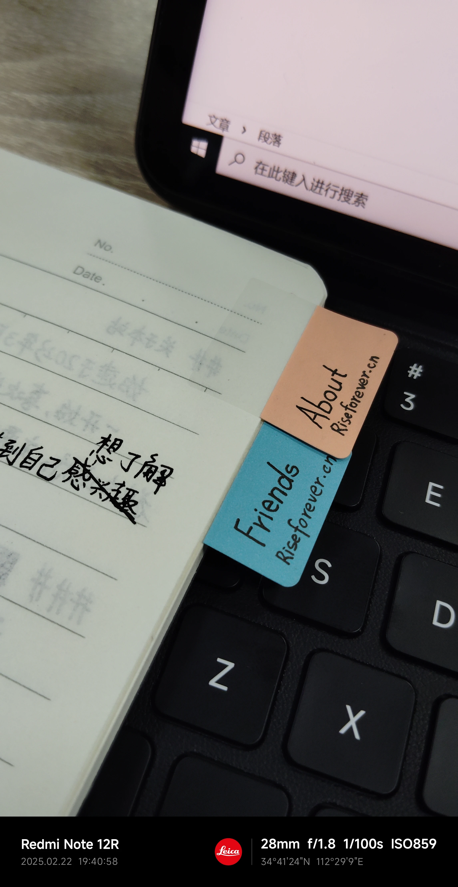
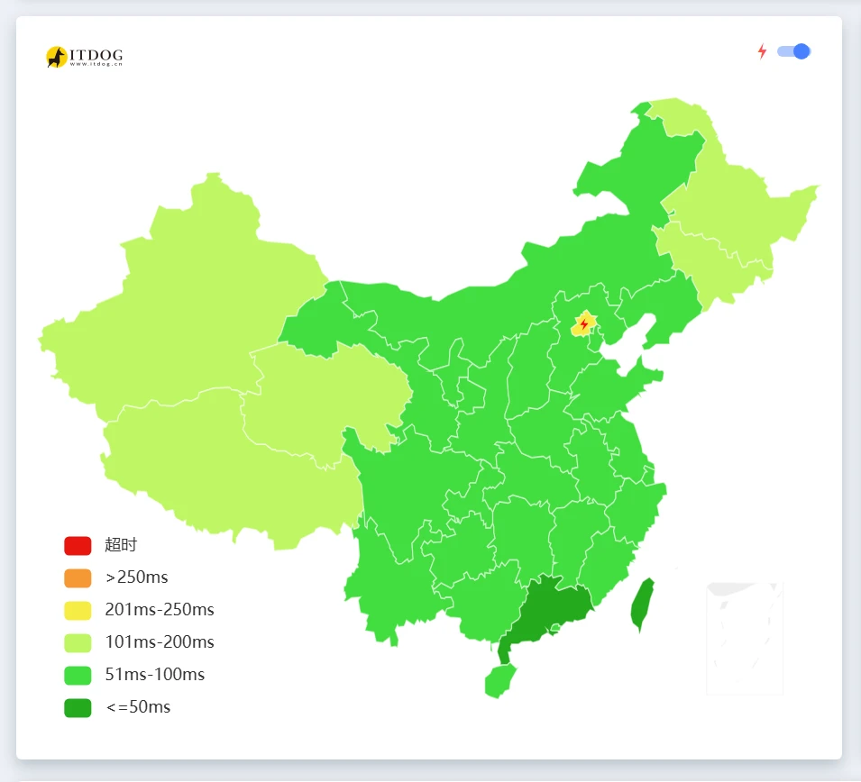
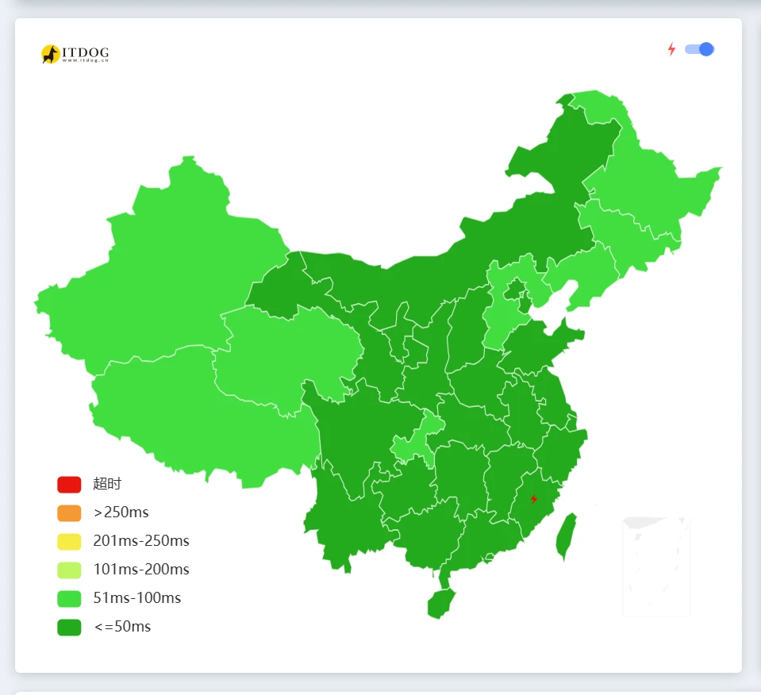
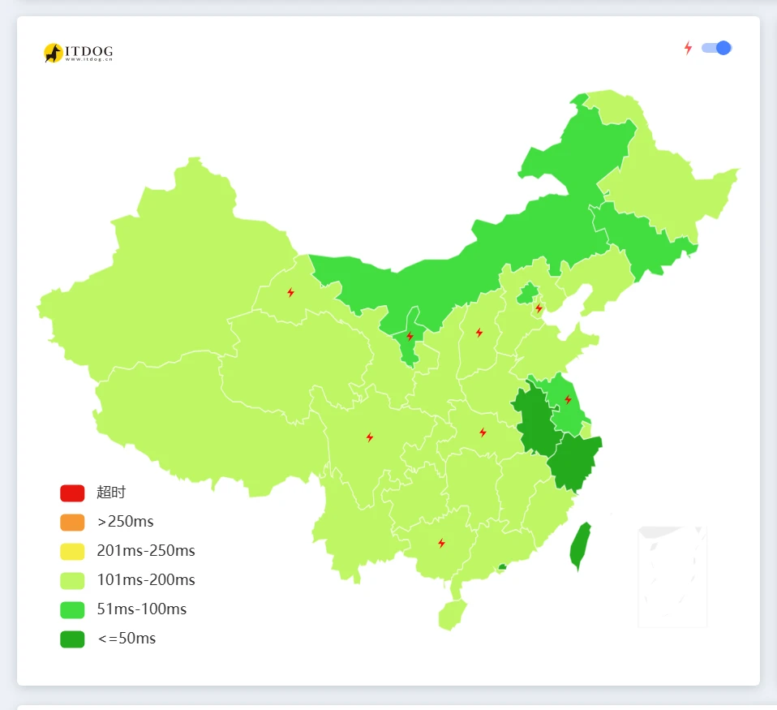
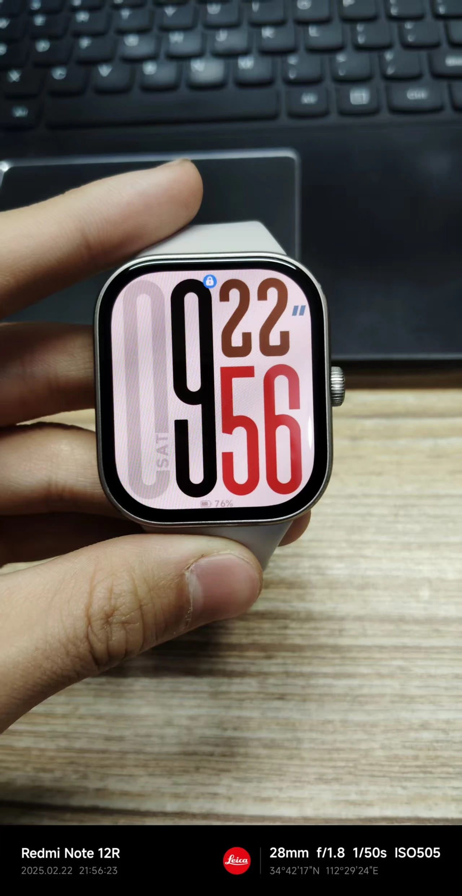
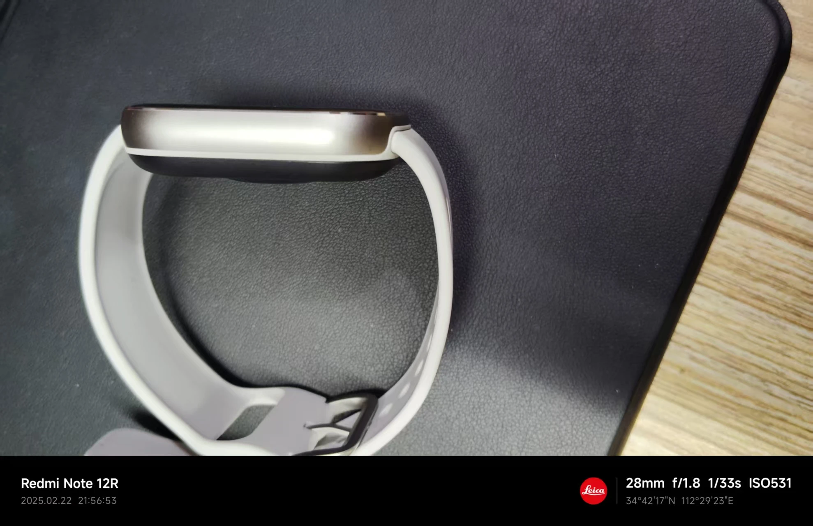
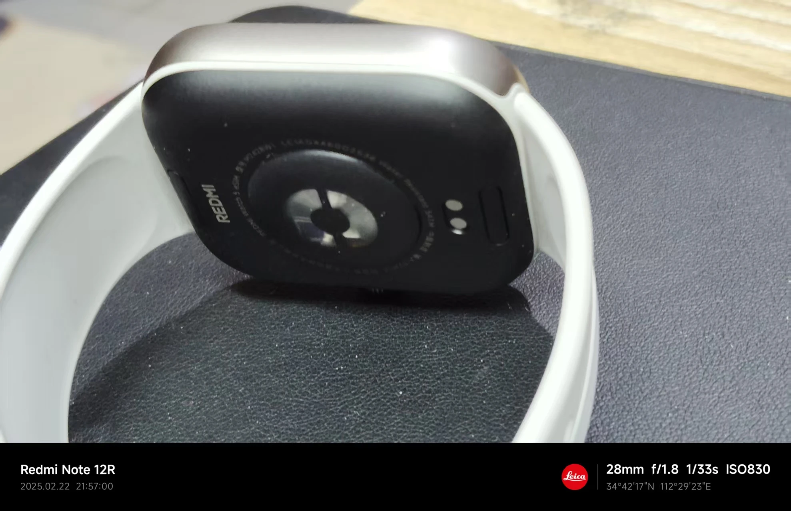
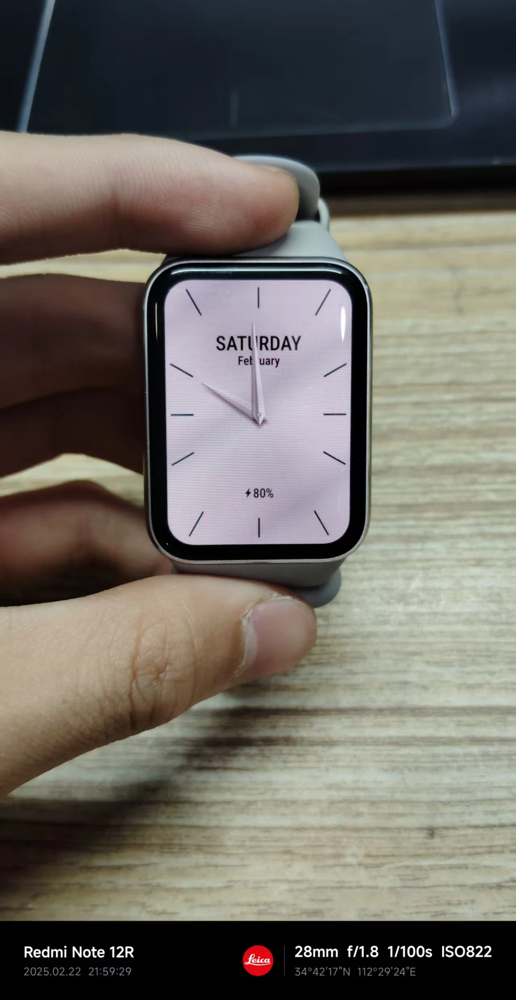
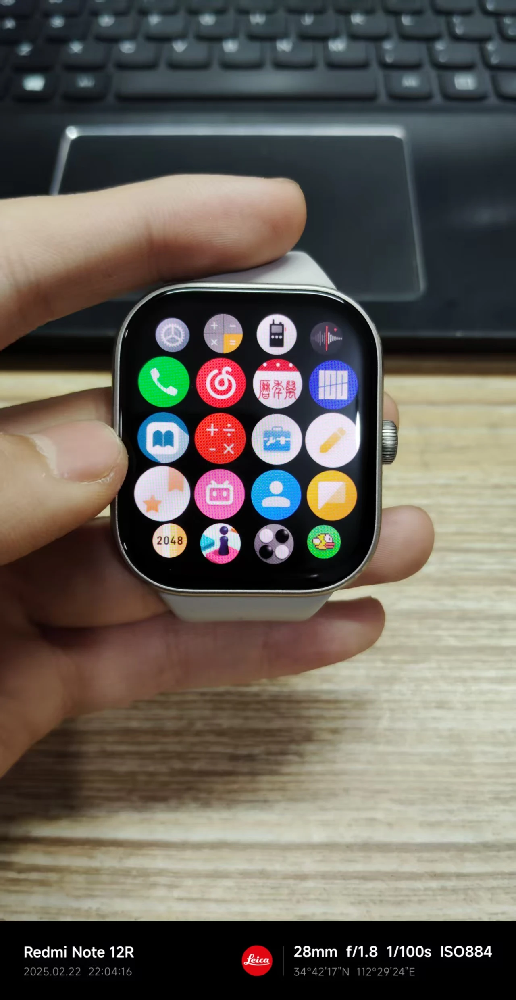

# 前言

本周是充满惊喜的一周。

关键词：`处分撤销`、`奖学金`、`好用的便签`、`邮件插入NEXT域`、`喜糖`、`火毅盾CDN`、`独立思考的重要性`、`Redmi Watch 5 eSIM`。

# 处分撤销

好奇我为什么被处分的朋友们可以去看[这篇文章](https://virelyx.com/471)。

本周一中午，我在跟随本班队伍去食堂时，被德育处主任叫了过去。他说：

> 我放寒假之前不是和你说了“开学以后交撤销处分申请书”吗？你不交你怎么评优评先？

听到“评优评先”四个字的时候，我就莫名兴奋起来：主任的言外之意可能是“处分撤销后就可以继续跟随大家一起参与上学期的评优评先”。

于是我便在下午飞速拼凑出了一封简洁的申请书，并于大课间将其上交到了德育处。

第二天上午大课间时，学部公告栏里出现了一张“撤消处分公告”。我解放了。

# 奖学金

书接上段，我在上交完撤消处分申请书的当天晚上，班主任在我打饭的时候把我叫到他身旁，小声和我说：

> 你去告诉杜XX（同学）和覃XX（同学），让他们和你在今天晚上6:10的时候去行政楼门前排练。你们要领奖学金。

我当时脑子还没迷过来——“真的是我吗？”，“我不是挨过处分了吗？”，“难道德育处主任的言外之意真被我猜中了吗？”

打完饭坐到座位上，我疯狂扇自己耳光——皮肤出现皱纹，脸上的肌肉在抽动着，所有的所有都在证明这里不是地球Online。

我顿时狂喜，于是也没心思出去玩了，如饿虎般三口两口把米饭塞进嘴里，结束了今晚的晚餐后，便一路小跑回班。

在彩排现场，老师们为不同奖项的同学划分了不同的队伍。在得知我又是二等奖学金的时候，我又喜又悲——喜，是因为我的成绩不带体育是年级第13，顶多能得一个三等奖学金，而加上体育直接干到了年级第八；悲，是因为我这初中三年就得过这两次二等奖学金，不像那些名列前茅的同学，个个奖学金拿到手软，感慨“这辈子没拿过二等奖学金”。

# 好用的便签

为了政治开卷考试时方便查阅，老师要求同学们需要带一些彩色半透明小便签用于教材标记。听闻此消息后，父亲很快就从拼多多上下单了一款不知名便签，并且买了好多本，让我顺了两本。

在学校，我发现这一板便签上只有8张。仔细看，发现它的胶粘部分是全透明的，能够避免遮挡文本内容；并且其书写部分和普通透明便签不同，这款便签用水笔直接书写，字迹很清晰，不断墨，并且似乎还自带速干功能。（只是猜的）

# 邮件插入NEXT域

英语老师需要制作一个主题为“历史成绩参考及学习目标”的文档，需要打印出来并手工裁切成小纸条的样式，分发给每一位同学。

文档大概是这样：一页A4纸中包含3个表格，每个表格都是一样的：姓名、八下期末英语成绩、九上英语成绩.......

最开始，老师打算一个一个用手敲数据。但她觉得太累了，于是就把我喊来敲。我意识到可以使用邮件合并功能来实现此效果。

可是，以我当时的认知，我认为“每一张A4纸只可以放得下一张表格”，因为“邮件合并”这个功能是按页合并的。（因为我对文档操作的机会甚少，并且义务教育阶段信息技术只教授了单页合并操作，所以我会产生上述想法。）

于是我就先缩小所有表格，然后按单页输出每一个人的数据（一个人的表格占了一整页），最后让英语老师手动挪动表格，使一页能有3个表格。

英语老师当晚肝了一夜都没肝完，因为她被“表格自动吸边”（两个表格放到一块，其边缘会站连在一起）折磨得痛不欲生。

第二天，我又被叫到了英语办公室。

面对着眼前的WPS窗口，我心想：“WPS的用户这么多，肯定有别的用户和我有相同的需求——一页放多条记录吧”，于是，我便开始上必应搜索“WPS如何一页合并多条数据”，您猜怎么着，WPS还真就有这个功能，只不过是我没发现罢了。它叫“插入NEXT域”，用上了它，我只是修改了下模板文档，轻点几下鼠标就完美地完成了这项任务。

现在我将这个功能分享出来，以方便更多蒙鼓人：https://www.wps.cn/learning/course/detail/id/330065.html

# 喜糖

曾教我们音乐的老师在上周结婚了。他结婚算是比较晚的。

我在帮英语老师做完文档后，为了表示感谢，她像往常一样拿出一些糖果奖励我。不过不同寻常的是，这次她不仅拿了糖，还拿了一包瓜子一包花生，包装袋上面都贴着“囍”字。

我顿时明白了——这是我们音乐老师的喜糖。

不得不说，我把花生和瓜子拿去和同学们分着吃了。花生是蒜香味的，瓜子的味道无法形容，总之就是同学们吃了都叫好。

顺便，祝我的音乐老师新婚快乐，早生贵子❤

# 火毅盾CDN

我有一台闲置的4c4g服务器，一直在角落里吃灰。我想用它创造一点价值，于是便将其赞助给了火毅盾。作为回馈，火毅盾给我提供了CDN服务。

不得不说，火毅盾的海外CDN效果很显著。以下是我套CDN前后的对比：

套CDN前：延迟较大

套CDN后：延迟显著减小

可能在你看来这个提升比较小。没有对比就没有伤害，接下来我会放我朋友的网站延迟。他的网站服务器和我的服务器地域相同（均为腾讯云新加坡），配置略优于我，并配套使用了EdgeOne CDN加速。

EdgeOne：？？？

不言而喻，火毅盾的加速效果远远超过了EdgeOne。

除此之外，在火毅盾的加持下，我的网站可用率大大提高。

我的学校用的是中国电信的宽带，网络质量极差，遇到境外服务器的网站要么无法加载，要么加载得十分缓慢。

在使用火毅盾CDN前，我的网站亦是如此，每次加载都要花费30秒起步。这直接导致了我无法正常在同学面前装X和同学分享我的文章。

使用了火毅盾CDN之后，不管是在教室里的一体机上，还是在机房电脑上，我的网站都可以在3秒钟内极速加载完毕。以及，得益于火毅盾的超大带宽回源配置，我站点上的图片等资源就像打开本地网页一样快。

火毅盾是多家政企信赖的CDN服务商，提供全场景（境内加速、境外加速）CDN加速方案，让您的网页响应&加载更丝滑，更流利。个性化的套餐方案，总有适合你的。价格跌破底线（最低仅需5元/月），并伴随着丰富的赞助活动等你参与。

火毅盾官网：https://www.hydun.com/

火毅盾CDN网站联盟赞助计划：https://blog.hydun.com/archives/3/

# 独立思考的重要性

平时，我们在下午5:40下课后，九年级先去食堂用餐。七、八年级在6:05的时候准时前往餐厅用餐。

本周三，九年级同学被召集到学术报告厅，开了一场大班会。当天晚上，七、八年级被安排在5:40先行用餐，九年级推迟到6:05用餐。

周四下午，按理来说用餐时间已恢复正常。可是当我到达餐厅时，八年级有好几个班坐在九年级的位置上。八年级的主任和我们说：“九年级6:05才来用餐”，于是我便和班里几个同学跑着回教室，顺便”通知“了许多前往食堂的同学”现在不要去吃饭“。

直到我在班里的电脑上打开冰与火之舞（好吧只是开机）后，班主任悄无声息地走入了教室。他问我：”你在这待着干嘛嘞？“，我说：”老师，他们都说九年级6:05吃饭“。

班主任一脸诧异地看着我：”啥时候通知九年级6点吃饭了？没有说过，快去吃饭吧！“

到了食堂我才知道，是八年级主任搞错了，误以为今天是和昨天一样的时间安排。

这件事中，我在听了八年级主任的话之后，没有经过大脑思考就去通知其他同学，不太合适。不仅让自己没及时吃到饭，并且还耽误了一大堆同学的用餐时间。

# Redmi Watch 5 eSIM

本学期我获得了奖学金500元。而Redmi Watch 5 eSIM版只卖￥799，国补以后这个价格就到了￥679.15。

父亲答应我用奖学金加上他贴上的￥179.15给我买一台Redmi Watch 5 eSIM版。

原本我以为这款手表并不热门，没几个人买。于是我便让父亲载着我直接前往了就近的小米之家。没想到刚和店员开口就被贴脸开大——没货。

我上小米商城查了查——整个洛阳市只有离我们6公里的”丹尼斯·大卫天地 8楼小米之家“还剩最后一台现货。于是我赶紧给店家打电话，让她帮我留着货。

经过约20分钟的路程，我们来到了目的地。这中途有一个小插曲——我们向店员说明了情况后，店员便开始翻开抽屉给我们找货，没想到翻遍了抽屉都没有找到一个eSIM版。接着他走向展示桌，打算询问另一位店员。此时我一眼看到了展示桌上放着一个全新的Redmi Watch 5 eSIM包装盒。我忙叫那位店员，于是他便教我父亲领取国补券，最终以￥679.15买下了这块手表。

## 外观

正面表盘

侧面边框

背面传感器

Redmi Watch 5 相比于 Watch 4 ，屏幕改成了四边等宽微曲屏，边框甚至比小米手环9Pro还要窄：

小米手环 9 Pro

不过 Watch 5 的侧面并不是一体成型工艺，而是有一道塑料支架，这也使得其质感稍逊于小米手环 9 Pro。其背面传感器和 9 Pro 看上去是一样的，但不知道为什么 9 Pro 支持小米健康研究，而 Watch 5 就不支持。

## 功能

Redmi Watch 5 eSIM的功能与小米手环 9 是一样的，并在后者的基础上添加了录音机、音乐、独立通话、移动数据、短信等功能。

在购买之后，我们就紧接着赶到中国联通的营业厅，为新手表开通了eSIM服务。值得一提的是，我开通的是”一号双终端“业务，在一号双终端模式下，手表无法使用短信功能，其余都可使用。

### 独立联网听歌

作为一个热爱音乐的寄宿生，我最看重这块表的原因之一，就是它可以通过移动数据来独立使用网易云音乐。即点即听，无需下载。这就完全满足了我住校听歌的心愿。

### 大内存

Redmi Watch 5 标准版的内存只有164MB，而 eSIM 版的内存就直接给到了 2GB 。这也就意味着我可以装更多的表盘、快应用和音乐。

别看 2GB 这个数字很小，在手表上，这的确是一个很大的空间。毕竟，连小米手环 9 Pro 也才有 143MB 的空间。

### 独立GPS

在我使用小米手环 8 标准版的时候，我最大的痛点就是——它没有GPS。这代表着我将无法精准地掌握我每一次户外运动的数据。

而 Redmi Watch 5 具有独立双频GPS，经实测，在户外可以实现3秒卫星速连。

### Others...

但有一个致命缺点需要说：**这块表的eSIM版在小米运动健康上是没有应用商店的！**

对于新手，将无法直接通过官方APP来自行添加软件&小游戏，需要通过表盘自定义工具来添加，互联网上到处是教程。

这块表的功能还有很多很多，来不及一一对你说……

# 写在最后...

又是充实的一周，同时我距离中考又近了一周。

提前祝我中考加油，无限进步！
