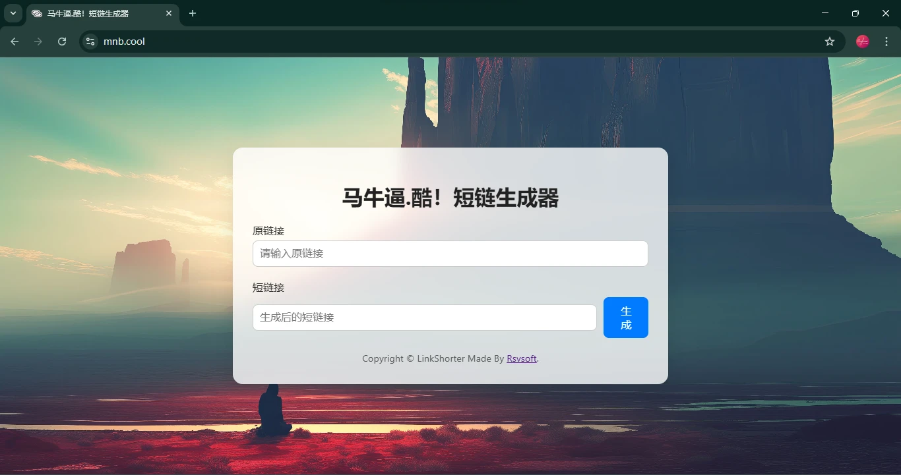

## 前言

时光总是公平而又无情。转眼间，寒假的余额只剩两天。回顾博客，这个寒假我没有写一篇周记，因为实在“没得写”。本篇文章，我要复盘一下我初中生涯的最后一个寒假。

先来说说有哪些天我是实实在在地学习了：27天的寒假，其中有15天安排了辅导班，3天学校网课补习。这些天的我，过着千篇一律的生活：起床→辅导班→午休→辅导班。

要问我课余时间都去干嘛了？这可就是我想说的了。

## 读书

假期里，我利用碎片时间读了《活着》这本书。其实也不算“读了”——因为我只读到了133/216页，也就是“徐有庆”给校长献血被缺德医生抽死的部分。

我并没有读完这本书，但是我对我读过的部分深有感触：福贵因赌博而败光家产，由地主阶级变为租地的农民，没想到土地改革使得买他家地的人替了他一死；为了生活而将女儿凤霞送人，又在几天后因为不忍心而决定不送人了；省吃俭用给儿子有庆买了鞋，有庆却攥在手里不舍得穿……前者体现了一句谚语“大难不死，必有后福”；后者则体现了社会底层人民为了活着而表现出的无奈。

初中的历史学了中国近代史，讲了“人民公社化运动”，但并未详细讲述当时人民的生活。读了这本书，我看到了公社化初期为了煮钢铁而让人民砸锅，强占人民住宅作为炼钢地的队长，和公社化末期，因粮食短缺带领大家伙去福贵家蹭米饭吃的队长。原本我并不完全了解人民公社化，这本书让我更全面地认识了人民公社化。

## 延迟开学

原本我们学校定的是2月5日（农历初八）开学（属于违规开学）。但是我们学校有一位勇士出面举报了学校，所以老师们在2月7日发布通知：我们要从2月8日上网课到2月11日，2月13日返校。

我以为这事就这么平息了，便跟着学校上网课。没想到第二天晚上，老师又在班级群发布通知：

> 由于一些“具体原因”，假期辅导“明天停止”。请家长朋友们监督学生做好收心工作，做好开学准备。

我前往“洛阳网市民呼声”小程序一看，果然是我们学校又被举报了。

唉，以我对班主任的了解，他能在群里的消息中加入**双引号**，估计是气炸了。

## 和平精英

从1月23日起，我抱着试一试的态度玩了《和平精英》。原本时间控制的还不错，一天只玩了一把——7分钟。但我这自制力……

| 日期    | 时长        |
| ------- | ----------- |
| 1月23日 | 7分钟       |
| 1月26日 | 1小时29分钟 |
| 1月27日 | 1小时2分钟  |
| 1月28日 | 2小时38分钟 |
| 1月29日 | 3小时29分钟 |
| 1月30日 | 1分钟       |
| 1月31日 | 28分钟      |
| 2月2日  | 40分钟      |
| 2月3日  | 1小时20分钟 |
| 2月4日  | 2小时27分钟 |
| 2月5日  | 1小时59分钟 |
| 2月6日  | 1小时       |
| 2月7日  | 1小时11分钟 |
| 2月8日  | 1小时41分钟 |
| 2月9日  | 1小时14分钟 |
| 2月10日 | 1小时57分钟 |
| 总共    | 22.9小时    |

很令人失望，对吧，我不该相信人性。

虽然游戏给我带来了正面的情绪价值，但是它对于我时间的消耗逐渐变得不可控。所以今后学习的时候我会将电子产品全部移至自己看不到的位置。

## 项目

这个寒假我共为三个项目做出了贡献：

- [蓝屏工具箱 5.0](https://tools.cnstlapy.cn/) 功能设计
- [RStatus](https://gh.hydun.cn/Rise-forever/RStatus) 产品研发
- [LinkShorter](https://mnb.cool/) 产品研发

### 蓝屏工具箱

#### 速度革命

蓝屏工具箱4.x的资源加载逻辑完全不像是一个上市产品——它在需要图片的时候直接从服务器拉取，永远都是这样。于是我为其构建了媒体库系统，使其在本地建立缓存，致使加载速度巨幅提升。

#### 商店内核焕新

工具箱的新商店界面其实我在2024年10月就已经写完，但是由于精易模块的一个玄学BUG，导致迟迟没有发版，直到在今年寒假我才排查出来。自此，工具箱5.x商店内核焕新，更好看，更好用。

（由于未安装字体，所以截图比较丑，请见谅）

### RStatus

这是一个从零开始的Python Flask+易语言项目，首要用途是让大家~~视奸~~更好地监督我，次要用途是给班主任作为班里一体机的监管系统。具体信息可见[RStatus介绍文章](https://virelyx.com/686.html)。

RStatus网页界面

程序已[开源](https://github.com/Rise-forever/RStatus)，并且附上了部署文档。这个项目对我来说目前只能部署在Windows服务器，因为Linux宝塔的各种方法我都试过了，无论如何都不能在反向代理的情况下通过TCP服务器向其发送消息。如果哪位大佬摸索出了在Linux上部署的方法，欢迎在本文评论区留言亦或是[电邮](mailto:hi@virelyx.com)我，我将非常感激！

### LinkShorter

这仍是一个Python Flask项目，域名为[mnb.cool](https://mnb.cool/)，欢迎各位前来使用！

ShortLinker 网站界面

注：该项目由于技术不成熟，所以不适用于生产环境，仅供临时使用。

## 买买买

### 手机贴膜

买了两款手机膜，踩了一次坑。

#### 磨砂膜

我于寒假开始时购入了2张“电竞磨砂膜”，从此看手机就跟瞎了眼一样，1080P的屏幕秒变720P。并且，这个磨砂膜似乎还吸油，用了一段时间之后屏幕上全是油，擦干净之后用手指轻触几下就又起油了。

#### AR高透膜

三天前，我买了三张AR高透膜，今天到货。我贴上之后发现买错型号了——我用的是 Redmi Note 12R ，但我买的是 Redmi Note 12 的贴膜。还好 Note 12 的屏幕宽度和 12R 一样，只是没有 12R 高，外加我要开学了，所以就留下来用了。

哔哔一句：揭下电竞膜的那一刻，我的心里直呼：“我的天，原来我的手机屏幕这么清晰！我以前遭的什么老罪呀！”

### 写作书

为了预防开学后的无所事事，我买了一本写作游戏书，也是互联网上最近比较火的：《666件可写的事——创意无限的写作游戏书》。这本书的内容就是问读者666个问题，并给每一个问题提供了适当的留白，引导读者进行写作。这个模式很新颖，我很期待我会在这上面留下什么。

## 后记

整体来说这个寒假我认为我过得比较空虚，没有合理掌控好自己的时间，反而成了时间的奴隶。在未来中考冲刺的过程中，我要戒骄戒躁，无限进步！
