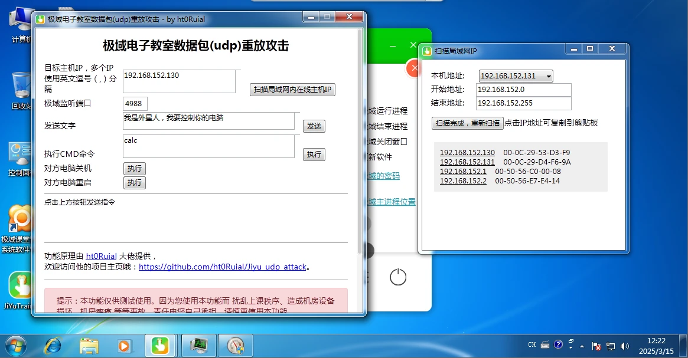
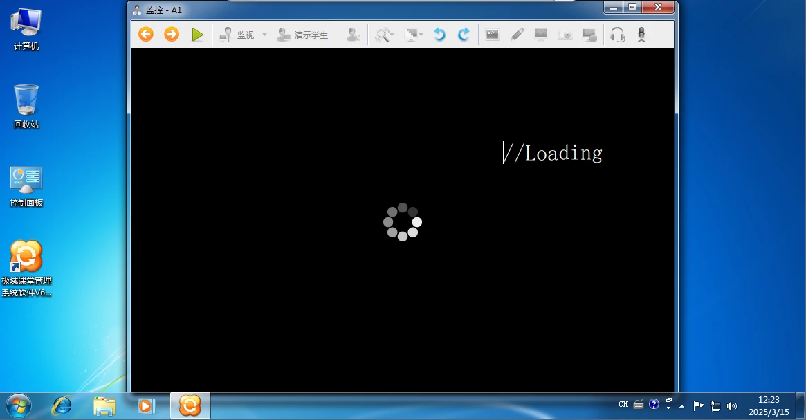

# 前言

临近实验和信息技术中招考试，我们学部组织班级前十五名的同学在每周一、三中午进行信息技术题目集训，同时要求信息老师在晚自习时带我们去机房训练。

由于我擅长计算机，每次答题都是满分，所以我就一直尝试用机房电脑摸鱼，但每次都会被老师从教师端看到，这让我十分烦恼。

就在上周三中午集训时，我在互联网上苦苦探索“解除极域控制”的方法。当所有人都在教我“暂停StudentMain.exe”时，一位大佬在文章里提到了“[JiYuTrainer](https://github.com/imengyu/JiYuTrainer/)”这个项目，这让我眼睛一亮。

# 简介

JiYu Trainer 是一款针对 极域电子教室 各正代版本的外挂程序。其功能如下：

> - 在不影响极域正常运行的情况下将 全屏的广播 转为 窗口广播 模式，您不仅可自己操作，也可看老师讲解课程。
> - 内置强杀、启停极域 StudentMain.exe 进程功能，无需依赖其他软件。
> - 内置破解极域解锁卸载密码功能，支持新版极域。
> - 反监视功能，经测试，开启反监视，教师端就无法监视您所用的电脑。
> - 防控制功能，防止教师通过极域控制您所用的电脑。
> - 监控极域远程执行命令，您可以自由选择是否允许教师端远程执行的命令。
> - 通过极域电子教室对同学的电脑远程发送信息或远程执行命令。

总结成一句话，就是：它不仅可以帮你脱离老师对你的控制，还可帮助你控制全班的每一台电脑。

# 使用方法

## 下载软件

前往 [Github Releases](https://gh.hydun.cn/imengyu/JiYuTrainer/releases/tag/1.7.6) （已套国内镜像CDN，可正常访问） 下载你系统对应的版本（WindowsXP 请下载旧版本）。

下载完成后，你会得到一个 .exe 文件，那便是该软件的主程序，程序的所有功能将全部基于该文件。将它移动到一个不易被发现的角落，开始你的反控之旅吧！

## 启动软件

直接双击 exe 文件即可启动。请在启动前确保极域学生端正常运行，稍等两秒，程序会显示“已控制极域电子教室”。


## 解除屏幕监控

程序在初次启动时，就已经实现了“阻止教师机控制此电脑”功能。不过，教师端此时仍可以看到此电脑的屏幕。我们需要点击主窗口下方的“设置”图标，在程序配置窗口中取消勾选“允许教师监视你的电脑”。如下图所示。


当然，在程序配置窗口里，我们还可以破解极域的管理密码。这个密码可以用来进入极域学生端设置&卸载极域。

## 反控局域网内其他电脑

JiYu Trainer 有一个“重放攻击”功能，它可以实现通过极域来反控局域网内的其它计算机。

点击“程序配置”窗口下方的“重放攻击”链接框，程序就会弹出一个窗口，如图所示。



至于这个“重放攻击”的功能，还不是很齐全。目前只有给对方发送消息、执行CMD命令、关机和重启功能。最要吐槽的还得属“CMD命令执行”功能，需要执行的命令不可以包含空格，否则就会无效。这也就导致了我们只能控制别人的电脑来实现弹一个计算器之类的简单功能。

但这里要重点说一个我遇到过的问题：不知道极域的端口号。

网上很多人在教排除极域端口号的方法，但是几千个端口号范围，让人手打一个一个排查，太慢了。

所以我们就可以使用重放攻击的脚本版——[Jiyu_udp_attack](https://github.com/ht0Ruial/Jiyu_udp_attack)。

去Release页面下载完最新的.exe文件后，我们在cmd中运行：

```
python Jiyu_udp_attack.py -e g
```

此时，程序会自动罗列出数十个端口号。这就是极域所使用的端口号了。此时将其一一粘贴至重放窗口内实验，直到测试成功，就可以愉快地硬控同学啦。

# 实际效果演示

## 禁止教师端查看屏幕

此时，教师端打开你的屏幕画面是这样的：



一直转圈圈，永不会出画面。

## 屏幕广播窗口化

此时，如果教师端向你共享屏幕，那么你这边再也不会是强制全屏显示画面了，而是变成了一个窗口：


# 结语

虽然这个软件可以让大家畅行信息课，但我们还是要自律，不要让一时的摸鱼耽误自己的信息课成绩。最后，祝大家使用愉快！我们下期再见。
