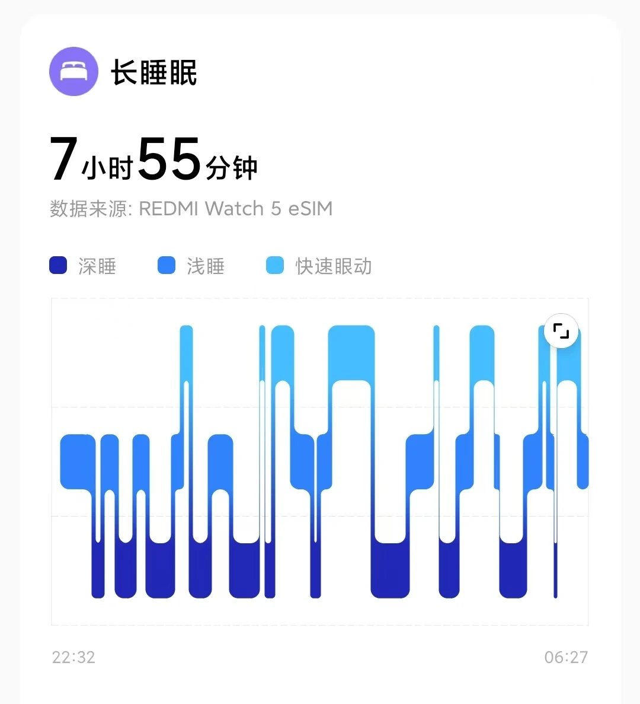
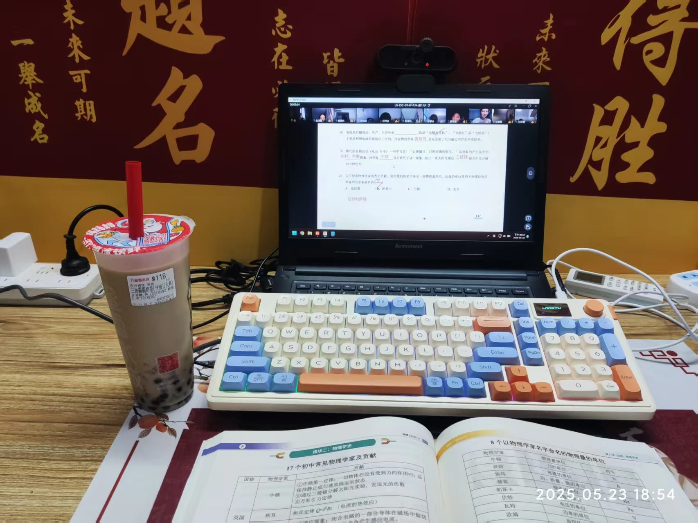
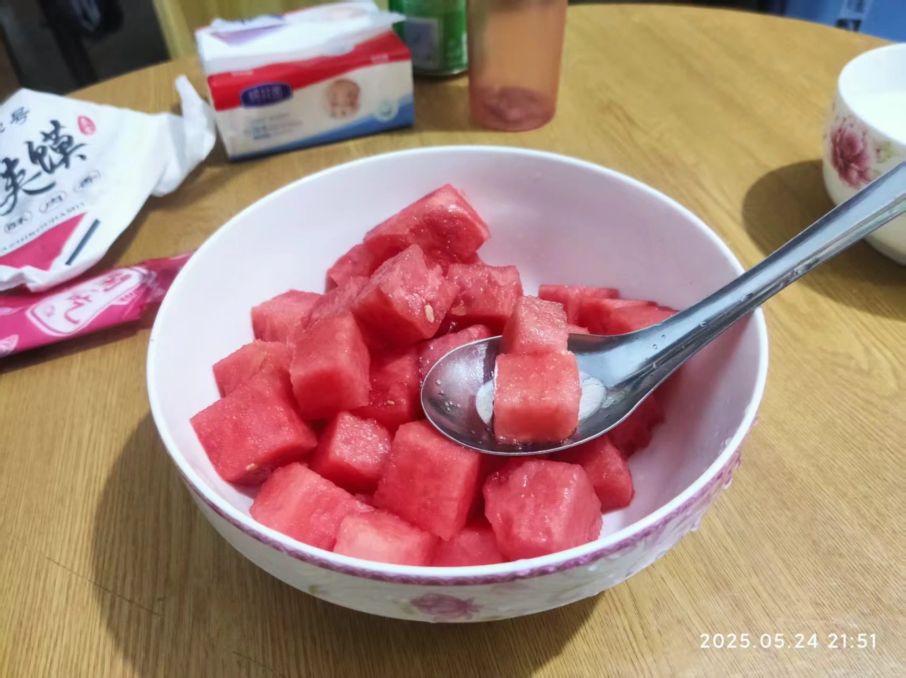
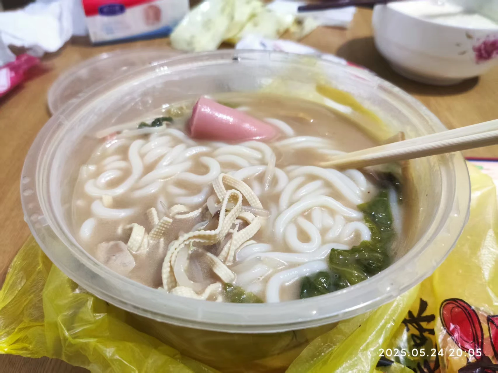

这篇文章写于2025年5月23日，距离河南省中招考试还有29天。

我不清楚写这么一篇文章算不算无病呻吟，只是我觉得我和以前真的有点不一样了。

关键词：`学`、`睡`、`表`、`雨`、`吃`。

# 学

前文提到的退掉的辅导班我报回来了，并且又额外报了个历史的一对一辅导班。现在每周末我要上8小时的辅导班。

19日起，学校里的“培优班”时间范围**又扩大了**，全日制单独安排课程，独立布置作业，就相当于**新分了个班**。

因为这里的学生水平比各自原班的要高，所以这个班里的课程进度非常快，纪律要求也比班里严得多。在这里，没有任何勾心斗角，摆在我眼前的只有血腥的成绩和残酷的竞争。每天除了学习就是学习，课余时间只要看见有人在学，我就不敢休息。课上我不再分神，努力使自己跟上老师的节奏，相比以前老实安分了许多。晚自习，在作业写完之后我开始去钻研自己不会的难题……

就这样持续了一周。

。。。

怎么说呢，现在我感觉整个人都累僵了。

# 睡

19日到22日的睡眠质量异常的好，因为白天学习累到虚脱，晚上几乎是倒在床上就睡着，不像平时那样聊天聊到十点半。平均每天睡了7h40min。

我的午睡时间也自然而然地增长了许多，由原来的20分钟变为了一个多小时。

课间我在以前是出去玩上一会，但是现在一般都是出去上个厕所就趴在课桌上睡。跟高中的同学有的一拼。

睡眠得分

睡眠时长

# 表

18日我才得知，REDMI Watch 5 eSIM 版搭载的芯片就是和标准版不一样。eSIM 版搭载了玄戒芯片，在开启通讯功能后手表性能会比不开要好很多。不过小米在手机端玄戒芯片发布前就给手表用上玄戒还是令我挺意外的。

水凝膜刚贴了不到一周就被桌角磨开了。至此，我上次网购的十二片水凝膜已经全部贴完。我开始审视自己给手表贴膜的行为——这大抵是因为我“想要把这块手表爱护着用一辈子”，说白了点，就是“划痕恐惧症”。既然我已经明白它只是一块手表，只是作为一个工具陪伴在我身边，那么就没必要把它像金子一样捧在手里，自然使用，让它经受岁月的洗礼是最好的。因此，我不再给手表贴膜。

这一周手表屏幕上增加了几道细划痕，不仔细看完全看不出来，我并没有为之伤心。

# 雨

本周三我们学校迎来了强降雨。待在教室里，我觉得头部神经有一种劣质塑料绳被扯出纤维的感觉，随时要断掉，甚至感觉脑子里有一股血味。受这种感觉的影响，我那天的学习效率奇低。但是看着周围的人丝毫不受影响的样子，我真的痛不欲生。

我怀疑自己发烧了，便在大课间跑到医务室量了个体温——36.5℃。好一个发烧。然后我惊奇地发现出了教室之后那些异样的感觉全都消失了。回到教室，又觉得生不如死了。

# 吃

放毒当然要放在最后啦~

周五下午-奶茶配物理课

周日晚上-冰西瓜

周日晚上-外卖米线

# 结语

好累，这篇文章，好潦草。

这篇文章于2025年5月24日22:35写完。

虽然很累，但是我知道我离蜕变不远了，我离破茧成蝶不远了！

中考加油，中考必胜！
