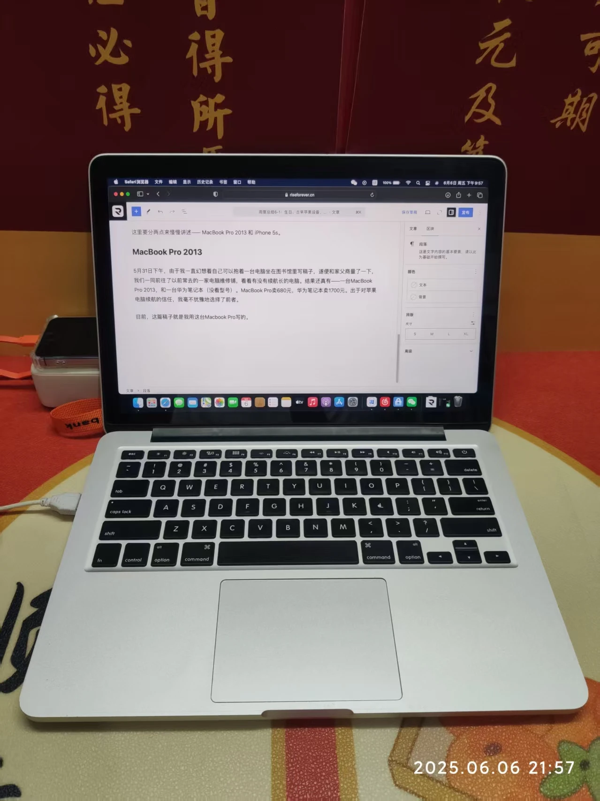
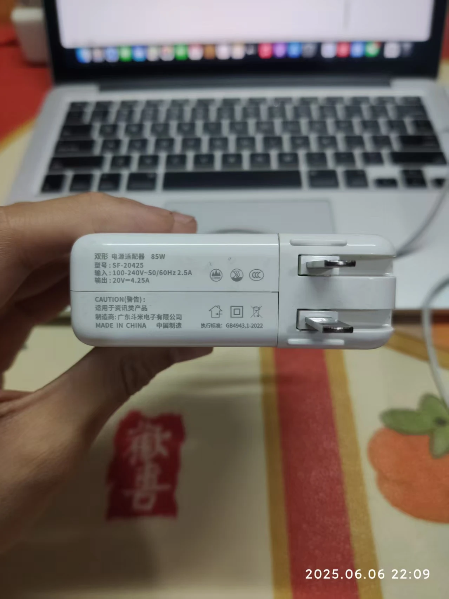
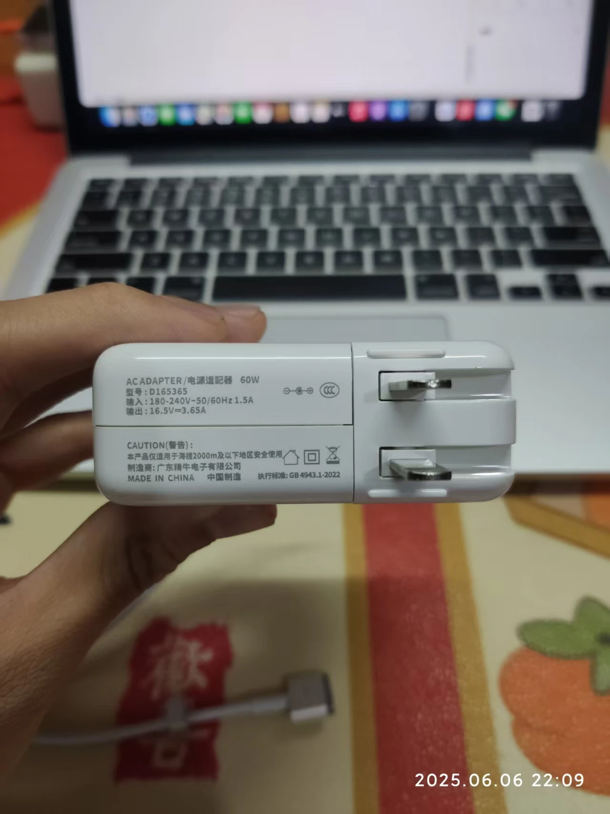
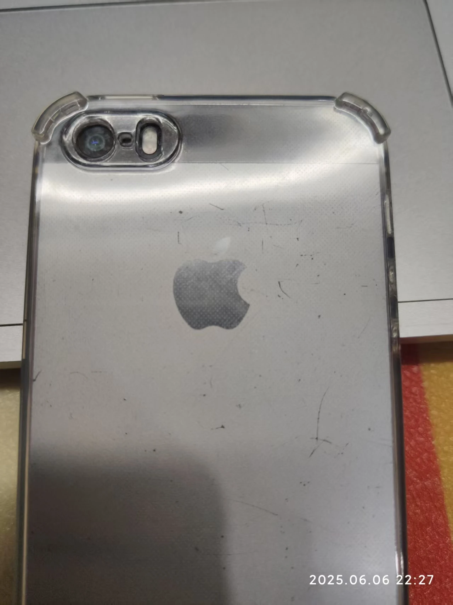
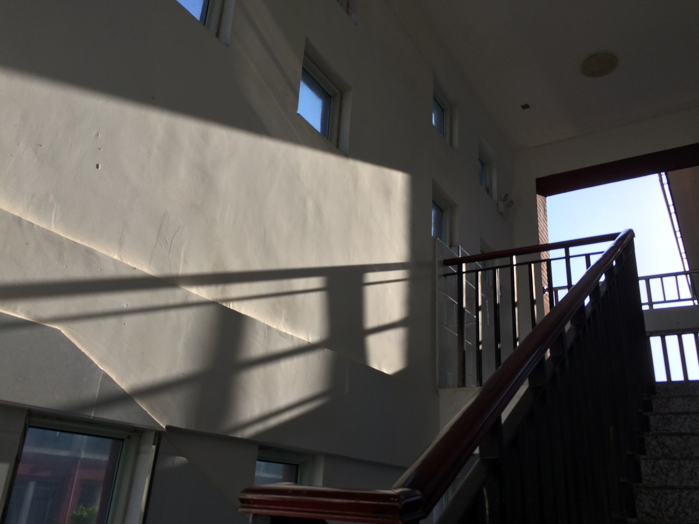
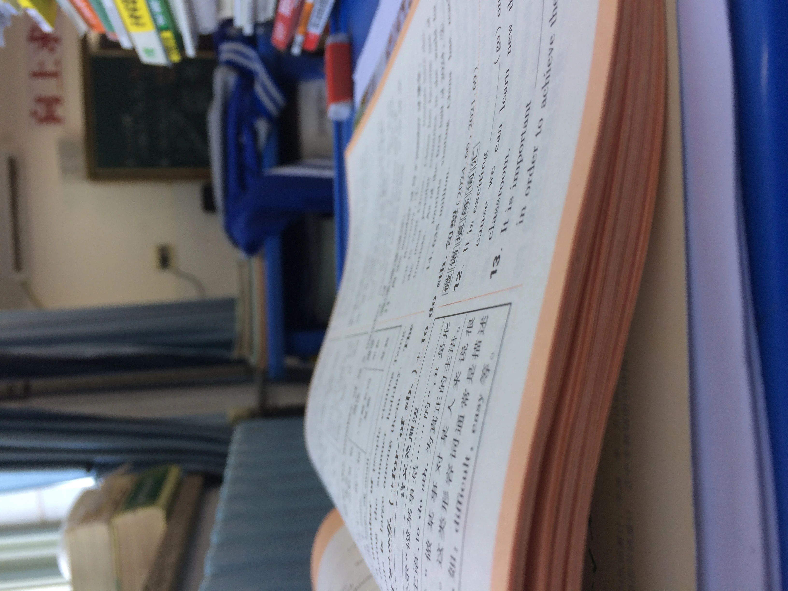

各位朋友，晚上好。欢迎收看Riseforever在25年6月的第一篇周记。

记录范围：2025.5.30～2025.6.6

本周的关键词如标题所示：`生日`、`古早苹果设备`、`毕业前的留念`。

# 生日

恭喜小伙子15岁了🎉，更成熟了一丢丢。

生日蛋糕🎂

# 古早苹果设备

这里要分两点来慢慢讲述—— MacBook Pro 2013 和 iPhone 5s。

## MacBook Pro 2013

5月31日下午，由于我一直幻想着自己可以抱着一台电脑坐在图书馆里写稿子，遂便和家父商量了一下，我们一同前往了以前常去的一家电脑维修铺，看看有没有续航长的二手电脑。结果还真有——一台MacBook Pro 2013，和一台华为笔记本（没看型号）。MacBook Pro卖680元，华为笔记本卖1700元。出于对苹果电脑续航的信任，我毫不犹豫地选择了前者。

目前，这篇稿子就是我用这台Macbook Pro写的。

MacBook Pro 2013

在这台MacBook刚买到家的时候，我就发现了几处问题：

- 屏幕内部多处有灰尘，看上去像是坏点，很难受；
- 触控板下半部分失灵，无法正常使用；
- 充电器严重发烫，最高温度能达到90摄氏度。

次日，我和父亲携电脑一同前往卖家，反映了这些问题。卖家给出的答复是这样的：

> 屏幕里头的是灰，不是坏点。这样，我给你屏幕保修六个月，如果是屏幕坏点并且扩散了，我给你免费换个新屏幕。

> 触控板这问题我还真没发现。这样，我给你换一个触控板试试。（去仓库找了触控板结果没找到）这样，我给你退150元，这个不影响使用。

> 充电器我在收过来的时候就是这样，发烫是正常现象，不知道该咋办。

卖家的态度总体我还算挺满意。

我查了一下，充电器之所以发烫，是因为这台MacBook的额定功率约为60W，而附带的充电器功率是85W，不发烫才怪。于是，父亲在网上花50给我买了一个新的充电器，60W，不发烫了，挺好。

旧充电器-85W

新充电器-60W

这台MacBook的电池很抗造。虽然是Intel芯片，但是续航最起码比我的Lenovo S40-70长太多了。

总体来说，安全下车。

## iPhone5s

出于对小手机的喜爱，我于5月31日在闲鱼平台上购买了一台iPhone5s，要求是无ID锁、指纹正常、可以插卡。挑选了许久，我在“**数码”这家店花费了92元成功下单。

由于家长限制，到货之后我第一时间偷偷前往驿站取快递，并在第一时间将其拆开。看到手机的第一眼，我惊呆了。

迎面而来的是屏幕上的一道亮眼的大划痕，手机背面更是惨绝人寰。

破损的机身，戴壳缓解一下

手机预装的是iOS12.5.7，很卡的一个系统。但是好在能下载微信等主流软件的旧版本，并且可以正常使用。指纹解锁挺迅速的，但是当我把我的手机卡插上的时候，问题出现了——手机弹出了“需要激活”的界面，在点击下一步后，开始报错——“不受支持的SIM卡运营商”。我也是立刻和商家联系，商家说他误发了，给我发了个Wi-Fi版的手机，有网络锁。

我很郁闷。一开始，我打算把货退回去，让商家重新发一个正常的。但谁知菜鸟快递不让寄带有电池的电子产品。干脆不寄回去了，商家主动返了我10元。

连上电脑，这里出现了个小插曲。估计是电压不稳，手机出现了鬼畜的情况——来回充电、断开、充电、断开……无限循环。我接了一个拓展坞，再连接手机，终于是能连接上了。我第一时间打开爱思助手验机，发现这机子的摄像头换过、电池换过，其余都绿，悬着的心便放下了些。这时，我瞟了一眼左侧的“今日估价”栏目——18元。

> 好的，朋友们，欢迎观看今天的小丑——Riseforever！

这次购物算是翻车了，但是有总比没有好。（哼哼哼啊啊啊啊啊啊啊啊啊啊……）

# 毕业前的留念

沾同学的福，我借到了一台华强北手表，可以拍照的那种。在这周内，我留下了若干张照片。时间真快，转眼间距离中考只剩15天，真正的在校时间也只剩下10天。我在学校拍了一些照片，分享出来和大家一起纪念我的初中。

拍照技术有点菜，勿喷。

晚霞

楼道

课本

# 后记

中考前可能就更新这一篇文章了，各位，我们中考后见！
