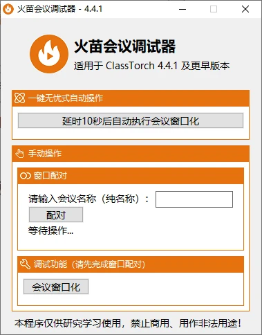
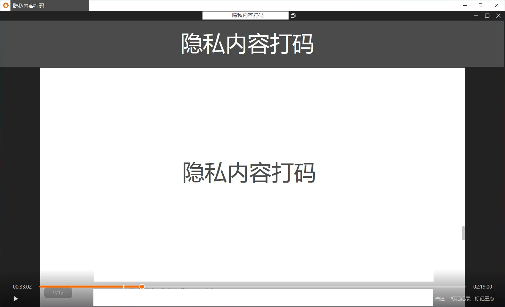

## 前言


朋友们，下午好。众所周知，我早在 6 月 23 日就完成了中考。而我的家长，也早就为我准备好了直到 7 月 12 日才结束的 “高中衔接班”—— 数学、物理、化学、英语，每科两小时，一天一共要上 8 小时课、完成 4 科作业。


但是，我的数学、物理、化学都是线上课，而我又[不是喜欢全神贯注听课的人](https://virelyx.com/507/)，总是喜欢在网课时找点事情干，一句话讲，就是喜欢摸鱼。摸鱼能够很好地平衡我的课业压力，并且也不会耽误我的学习，所以这个 “恶习” 被我延续到了现在还没有结束。


我们的网课软件是 “[火苗会议](https://www.classtorch.com/)”，似乎是辅导机构自研的一款网课软件。在 2.5.0 及以前的版本，这款软件是可以在 Windows 环境下通过多桌面实现摸鱼而不被发现的。但是在 2.6.0 版本，软件加入了 “防摸鱼机制”—— 当检测到当前窗口前有其它窗口时，会议窗口会自动消失片刻，再以置顶的方式重新铺满整个屏幕。


在此之后，火苗会议的防摸鱼机制日益成熟。它逐渐加入了快捷键屏蔽、多桌面屏蔽、分辨率自适应等功能，旨在阻止学生切出屏幕进行摸鱼。说句见笑的话，“如何攻破防摸鱼机制”，是我当时认为我人生中最难攻克的问题之一。


所以从火苗会议加入防摸鱼系统起，到我有了开发 “调试器” 的念头之前，我都在使用云电脑作为容器来放置会议窗口，实现摸鱼操作。但我前一天看控制面板的时候惊奇发现，去年花 99 元买的阿里云新人体验款云电脑马上就要过期了，时间真快！看着一年续费 ¥400+ 的高昂价格，以及我那尚未动笔的作业，我不禁起了一个以前根本不敢想的念头 —— 攻破火苗会议。


## 面临的问题


据我所知，火苗会议的防摸鱼系统十分成熟，包括但不限于以下几点：


- 会议窗口强制置顶并铺满屏幕；
- 会议窗口检测到非置顶时会消失片刻并重新恢复置顶；
- 会议窗口显示时会屏蔽 Windows 快捷键；
- 等待发现...


接下来，我就需要针对这一个个问题，逐个攻破。


## 开发过程


### 程序命名 & Logo 设计


考虑到这不是什么正面的程序，命名不能太过直接，所以我就为其命名成 “火苗会议调试器”，英文名 “ ClassTorch Debugger ”。


Logo 我也没敢直接照搬火苗会议的，因为会构成侵权。所以我在 Canva 上面照葫芦画瓢设计了一个。


[](https://img.riseforever.cn/blog_src/2025/07/9079a39da00449f9720526335f6f1cb3.webp)


### 基础 UI 设计


第一版 UI 是这样的：


[](https://img.riseforever.cn/blog_src/2025/07/d47a837005205f9b11c3aa0e5e533309.webp)User Interface v1


参照了 [@KFACBT](https://gytxtx.xyz/) 的设计风格。不得不说，我需要更多地学习他的审美。


纯文本界面有点单调，于是我就在第二版用户界面上，为每个分栏添加了图标：


[](https://img.riseforever.cn/blog_src/2025/07/fb75544689b48a7284a68db6934c42ef.webp)User Interface v2


> 看上去顺眼多了。


### 功能设计


#### 攻破会议窗口置顶机制


一开始，我尝试直接使用 “窗口_嵌入桌面 ()” 这个函数，因为嵌入到桌面里既不会阻碍摸鱼的进行，也可以实现高效听课 —— 毕竟被发现时，Win+D 直接返回网课界面。


结果试了之后发现，会议窗口直接消失了，无论如何也调不回来。所以我就放弃了这个方法。


```
' 窗口_嵌入桌面 (会议窗口句柄)  ' 这是无效方法，会使会议窗口消失
```


紧接着没多久，我就想起了自己记录过的一个软件 —— [Jiyu Trainer](https://virelyx.com/809/) 。它的功能里包含了这样一句话：


> - 在不影响极域正常运行的情况下将 全屏的广播 转为 窗口广播 模式，您不仅可自己操作，也可看老师讲解课程。
>
> 
>
> 
>
> From: [使用 JiYu Trainer 轻松解除控制并硬控全班 – Riseforever](https://virelyx.com/809/#title-2)


那我为何不可将全屏的会议界面窗口化呢？这样既可以满足摸鱼需求，也可以在摸鱼的同时节省桌面空间。


说干就干。就在那时，我的脑子中闪过了一个念头 —— 彗星置父窗口。这是我在编写[蓝屏工具箱](https://tools.cnstlapy.cn/)的时候使用过的模块。我急忙地引用，并写了以下代码：


```
载入 (窗口_火苗容器, , 假)
彗星置父窗口 (窗口_火苗容器.取窗口句柄 (), 会议窗口句柄, 0, 0, 窗口_火苗容器.宽度, 窗口_火苗容器.高度)
```


虽然父窗口置完了，但是以火苗会议的防摸鱼机制，它可能会将自己的窗口大小设定为与屏幕分辨率相匹配的大小，这样会导致会议窗口上的部分内容无法被显示。所以，我又添加了一行代码，限制窗口的大小：


```
窗口_限制尺寸 (会议窗口句柄, 窗口_火苗容器.取用户区宽度 (), 窗口_火苗容器.取用户区高度 (), 窗口_火苗容器.取用户区宽度 (), 窗口_火苗容器.取用户区高度 ())
```


OK，接下来我进行了调试运行，结果，会议容器窗口中一片空白，但是会议正常进行，并且**鼠标指针放在会议窗口的控件位置上，鼠标会对应地变成手型。**这就给了我很大启发，说明会议窗口是因为某种不兼容的因素无法直接显示，需要通过某种手段让它显示出来。


我首要想起的就是`窗口重画`之类的函数。于是，我使用精易模块里的 “窗口_重画 ()” 函数进行了窗口重画：


```
窗口_重画 (会议窗口句柄, 真)
```


这一试还真灵，会议窗口就这样被显示到了容器窗口里。


[](https://img.riseforever.cn/blog_src/2025/07/b540bb71b479748e9daf29dbe921d179.webp)


我高兴坏了，于是又给程序写了个会议窗口尺寸自适应功能。这样，不管容器窗口大小怎样调整，会议窗口都会被完整地限制在容器窗口内。


#### 攻破会议窗口消失机制


由于前一天晚上我并没有可以用来实验的直播课，所以我只使用了一个回放窗口来实验。而回放窗口只具备强制置顶的特性，像是前文提到的`消失片刻并重新置顶`、`屏蔽 Windows 快捷键`等特性，在回放窗口中是不具备的。


所以今天我在直播课上测试的时候，果不其然，火苗会议的`消失片刻并重新置顶`特性稳定发挥：


[](https://img.riseforever.cn/blog_src/2025/07/9332c9ef92f3b715317dc4439a311ac8.webp)


我当场懵圈了，于是急忙停止了调试，重启了火苗会议。毕竟还是要以正常听课为主。


过了一会儿，我利用它`消失片刻并重新置顶`的特性，启动云电脑，启动云电脑上的火苗会议，跳过更新、检查设备、进入会议，一气呵成。至此，火苗会议调试器又出现了新的待解决的问题 —— 如何让会议窗口不消失。


由于我对 Windows API 并不是很熟悉，所以我咨询了工作室里的另一位伙伴 [@GDWare](https://gdware.cnstlapy.cn/) ，他对这方面比较了解。经过他的一系列帮助，我们一次性成功攻破了火苗会议里`消失片刻并重新置顶`、`屏蔽 Windows 快捷键`的特性。


至此，火苗会议调试器的功能已全部完善。支持一键智能识别并自动操作和手动操作两种模式，满足了不同用户的需求。


## 结语


我深知这款程序如果在互联网上被传播会遭到许多人的谩骂，所以我并不打算发布此程序，只打算留着自己用。如果你需要这类程序，你可以根据这篇文章里的代码，自己照葫芦画瓢用**易语言**写一个。


最近想写一篇杂记，记录自己中考期间的精神状态，结果磨磨蹭蹭硬是写了八天没写完。哈哈，静等下期，我们再见！
