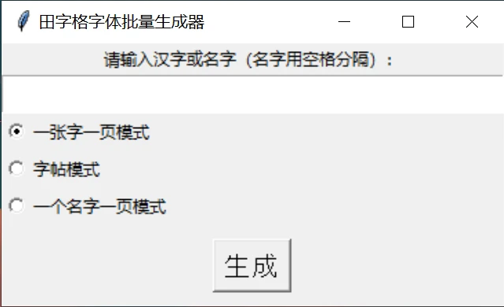
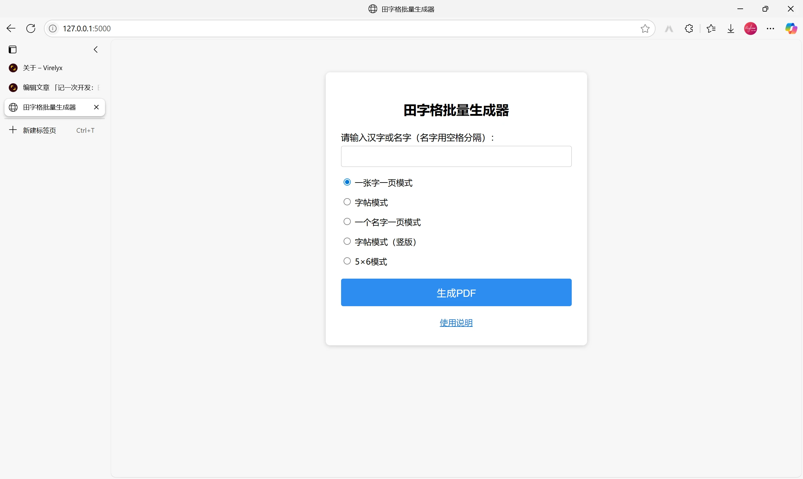
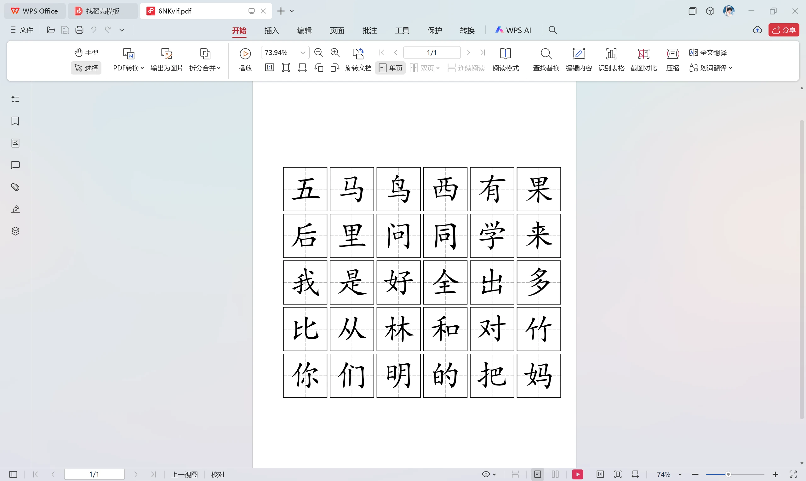
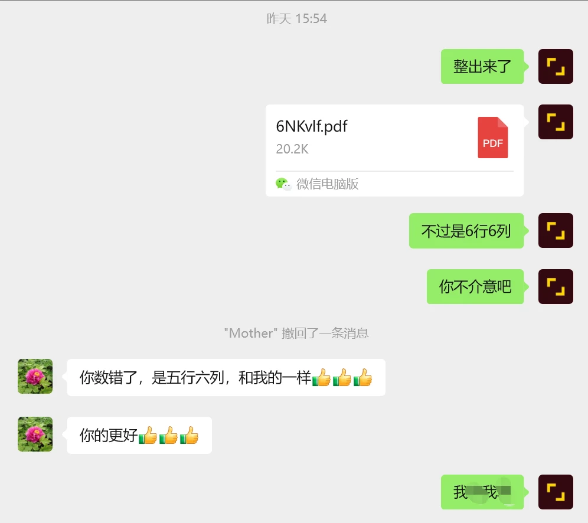

## 前言

朋友们，上午好。今天我想和大家分享一下我近期与 AI 协作，使用 Python+Flask 进行开发的经历。

本次开发的软件名字叫“田字格生成器”，已经部署上线，可以点击[这里](https://tzg.rsv.ee/)使用。

## 立项原因

家母最近参与了洛阳日报社的托管班暑期托管活动，担任硬笔书法教师。这是她第一次在正式的单位进行授课，没有教材，需要她自己准备。

我并不知道母亲是怎么准备教材的。前几天的下午， 我在衔接班的空隙，看到母亲用尺子在一张纸上画着什么。走近一看，霍！纸上打印的是她用手机拍下来的范字，糊成了保密级画质。而她拿着尺子，是为了手动将模糊的田字格虚线描实。

而目光一转，她旁边还有一摞跟教辅一样厚的原始稿件等待处理，这得处理到猴年马月！于是我毫不犹豫地对她说：“交给我吧！”

就这样，一个名为“田字格批量生成器”的文件夹就被新建了。

## 需求确定

母亲的要求有很多，比如：

1. 一页A4纸，放一个田字格，撑满整张纸，贴到黑板上给学生讲；
2. 一页A4纸，放一个学生的名字，横版，撑满整张纸，用来教学生写自己的名字；
3. 一页A4纸，放一张字帖；
4. 一页A4纸，放一页竖版的字帖；
5. 一页A4纸，放30个字，用作自己练习，6行5列。

而网上的田字格在线生成器并不能满足母亲的需求，所以，Cursor，启动！

## 基础功能

我先将需求投喂给 Cursor，接着，它帮我写出了如下界面的程序：

初版程序

主要功能：用户往编辑框里输入需要生成的汉字→选择模式→程序根据对应的模式生成 PDF 文件并输出到 output 目录下。

当我把生成好的 PDF 拿给母亲看的时候，她果断地摇了摇头：

> 你这个字体面积占整个田字格面积的占比太小了。
>
> 你刚才给我看的那个字帖生成网页，那个网页的田字格我觉得符合我的需求。

于是我便把网络上的田字格字帖生成器打开了，母亲仔细看了看，认可地点点头，要求我按照它一样做。

为此，我将那个田字格生成器作为 HTML 保存了下来，并放到了项目根目录，和 Cursor 说：

> 模仿 xxxxxx.html 的田字格排版形式，重新排版现有的田字格。

等到 AI 生成完毕，我再次测试让母亲看，这次她终于接受了。

## 网页版改编&上线

既然母亲已经接受了 AI 生成的田字格样式，那么怎么排版就是我的事情了。在向 AI 投喂了一大堆提示词之后，终于生成了以下样式的田字格生成器：



期间还有一个小插曲：我在让 AI 编写出 6 行 5 列的排版时，错将“6 行 5 列”表达成了“5 行 6 列”，AI 生成了以下样式的排版：



由于这整体看起来太像是正方形了，所以我把它错看成了 6 行 6 列。于是我竭尽全力地让 AI “纠正”，却无济于事。我笑骂了 AI 几句，便想着放弃，关闭了 Cursor。

当我把这份废稿发给母亲的时候，母亲的一句话点醒了我——是我数错了：



得知这个消息的我兴奋极了，连忙再次打开 Cursor，输入提示词，等待改编完毕，运行，生成，成功了！

## 源代码

因为我的 Github 账号的 2FA 验证器被我卸载了，同时，恢复密钥也被我误删了，所以我的 Github 账号（Rise-forever）现在完全用不了了。

这个程序就先在这里开源吧，后续我可能会在 [CNB](https://cnb.cool) 上开源。

以下是主程序（.py）的源码，命名为 app.py：

```
from flask import Flask, render_template, request, send_file, redirect, url_for, flash
import os
import io
import random
import string
from reportlab.pdfgen import canvas
from reportlab.lib.pagesizes import A4
from reportlab.pdfbase import pdfmetrics
from reportlab.pdfbase.ttfonts import TTFont
from werkzeug.utils import secure_filename

app = Flask(__name__)
app.secret_key = 'tianzige_secret_key'

# 注册楷体字体（确保simkai.ttf在同目录下）
pdfmetrics.registerFont(TTFont('KaiTi', 'simkai.ttf'))

def random_str(length=6):
    return ''.join(random.choices(string.ascii_letters + string.digits, k=length))

def draw_tianzige(c, x, y, size, border_width: float = 2.0, dash_width: float = 1.0, dash_color=(0,0,0), mode=None):
    cx = x + size/2
    cy = y + size/2
    if mode == 'zitieborder':
        c.setLineWidth(dash_width)
        c.setStrokeColorRGB(*dash_color)
        segs = 5
        gap_ratio = 0.3
        for i in range(segs):
            seg_len = (size/2) / (segs + (segs-1)*gap_ratio)
            gap = seg_len * gap_ratio
            y1 = cy + i * (seg_len + gap)
            y2 = y1 + seg_len
            if y2 <= y + size:
                c.line(cx, y1, cx, y2)
        for i in range(segs):
            seg_len = (size/2) / (segs + (segs-1)*gap_ratio)
            gap = seg_len * gap_ratio
            y1 = cy - i * (seg_len + gap)
            y2 = y1 - seg_len
            if y2 >= y:
                c.line(cx, y1, cx, y2)
        for i in range(segs):
            seg_len = (size/2) / (segs + (segs-1)*gap_ratio)
            gap = seg_len * gap_ratio
            x1 = cx - i * (seg_len + gap)
            x2 = x1 - seg_len
            if x2 >= x:
                c.line(x1, cy, x2, cy)
        for i in range(segs):
            seg_len = (size/2) / (segs + (segs-1)*gap_ratio)
            gap = seg_len * gap_ratio
            x1 = cx + i * (seg_len + gap)
            x2 = x1 + seg_len
            if x2 <= x + size:
                c.line(x1, cy, x2, cy)
        c.setLineWidth(border_width)
        c.setStrokeColorRGB(0,0,0)
        c.rect(x, y, size, size)
        return
    dash = [8, 5]
    c.setLineWidth(dash_width)
    c.setStrokeColorRGB(*dash_color)
    for i in range(10):
        y1 = y + i * size / 10
        y2 = y + (i + 1) * size / 10
        c.setDash(dash)
        c.line(x + size/2, y1, x + size/2, y2)
    for i in range(10):
        x1 = x + i * size / 10
        x2 = x + (i + 1) * size / 10
        c.setDash(dash)
        c.line(x1, y + size/2, x2, y + size/2)
    c.setDash([])
    c.setLineWidth(border_width)
    c.setStrokeColorRGB(0,0,0)
    c.rect(x, y, size, size)

def generate_single_page(chars):
    buffer = io.BytesIO()
    c = canvas.Canvas(buffer, pagesize=A4)
    width, height = A4
    margin = 20
    size = min(width, height) - 2 * margin
    x = (width - size) / 2
    y = (height - size) / 2
    font_size = int(size * 0.725)
    for char in chars:
        draw_tianzige(c, x, y, size, border_width=4.0, dash_width=3.0, dash_color=(0.2,0.2,0.2))
        c.setFont("KaiTi", font_size)
        c.setFillColorRGB(0, 0, 0)
        c.drawCentredString(width/2, height/2 - size*0.25, char)
        c.showPage()
    c.save()
    buffer.seek(0)
    return buffer

def generate_zi_tie(chars):
    buffer = io.BytesIO()
    c = canvas.Canvas(buffer, pagesize=A4)
    width, height = A4
    mm = 2.8346
    grid_size = 15 * mm
    gap = 2 * mm
    cols = 12
    rows = 15
    total_grid_h = rows * grid_size + (rows - 1) * gap
    total_grid_w = cols * grid_size
    margin_x = max((width - total_grid_w) / 2, 0)
    margin_y = max((height - total_grid_h) / 2, 0)
    font_size = int(grid_size * 0.725)
    chars = list(chars)
    page_count = (len(chars) + rows - 1) // rows
    char_idx = 0
    for page in range(page_count):
        for row in range(rows):
            if char_idx >= len(chars):
                break
            char = chars[char_idx]
            for col in range(cols):
                gx = margin_x + col * grid_size
                gy = height - margin_y - (row + 1) * grid_size - row * gap
                draw_tianzige(c, gx, gy, grid_size, border_width=0.8, dash_width=0.5, dash_color=(0.69,0.69,0.69), mode='zitieborder')
                if col == 0:
                    c.setFont("KaiTi", font_size)
                    c.setFillColorRGB(0, 0, 0)
                    c.drawCentredString(gx + grid_size/2, gy + grid_size/2 - grid_size*0.25, char)
            char_idx += 1
        c.showPage()
    c.save()
    buffer.seek(0)
    return buffer

def generate_name_per_page(text):
    buffer = io.BytesIO()
    c = canvas.Canvas(buffer, pagesize=(842, 595))
    width, height = 842, 595
    margin = 20
    names = [n.strip() for n in text.split() if n.strip()]
    for name in names:
        n_chars = len(name)
        if n_chars == 0:
            continue
        size = min((width - 2*margin) / n_chars, height - 2*margin)
        font_size = int(size * 0.725)
        y = (height - size) / 2
        start_x = (width - size * n_chars) / 2
        for i, char in enumerate(name):
            gx = start_x + i * size
            draw_tianzige(c, gx, y, size, border_width=4.0, dash_width=3.0, dash_color=(0.2,0.2,0.2))
            c.setFont("KaiTi", font_size)
            c.setFillColorRGB(0, 0, 0)
            c.drawCentredString(gx + size/2, height/2 - size*0.25, char)
        c.showPage()
    c.save()
    buffer.seek(0)
    return buffer

def generate_zi_tie_vertical(chars):
    buffer = io.BytesIO()
    c = canvas.Canvas(buffer, pagesize=A4)
    width, height = A4
    mm = 2.8346
    grid_size = 15 * mm
    gap = 2 * mm
    cols = 12
    rows = 15
    total_grid_h = rows * grid_size + (rows - 1) * gap
    total_grid_w = cols * grid_size
    margin_x = max((width - total_grid_w) / 2, 0)
    margin_y = max((height - total_grid_h) / 2, 0)
    font_size = int(grid_size * 0.725)
    chars = list(chars)
    page_count = (len(chars) + cols - 1) // cols
    char_idx = 0
    for page in range(page_count):
        # 获取当前页的字符（最多12个）
        page_chars = []
        for col in range(cols):
            if char_idx < len(chars):
                page_chars.append(chars[char_idx])
                char_idx += 1
            else:
                page_chars.append('')  # 空字符占位
        # 绘制当前页
        for col in range(cols):
            char = page_chars[col]
            for row in range(rows):
                gx = margin_x + col * grid_size
                gy = height - margin_y - (row + 1) * grid_size - row * gap
                draw_tianzige(c, gx, gy, grid_size, border_width=0.8, dash_width=0.5, dash_color=(0.69,0.69,0.69), mode='zitieborder')
                # 在第1、6、11行显示范字（如果该列有字符）
                if char and (row == 0 or row == 5 or row == 10):
                    c.setFont("KaiTi", font_size)
                    c.setFillColorRGB(0, 0, 0)
                    c.drawCentredString(gx + grid_size/2, gy + grid_size/2 - grid_size*0.25, char)
        c.showPage()
    c.save()
    buffer.seek(0)
    return buffer

def generate_5x6_mode(chars):
    buffer = io.BytesIO()
    c = canvas.Canvas(buffer, pagesize=A4)
    width, height = A4
    mm = 2.8346
    cols = 5  # 改为5列
    rows = 6  # 改为6行
    # 计算田字格大小，让总宽度贴边A4纸宽度
    gap = 1.5 * mm  # 间距
    # 计算田字格大小和边距，确保左右边距相等
    margin_x = 10 * mm  # 设置左右边距
    available_width = width - 2 * margin_x
    grid_size = (available_width - (cols - 1) * gap) / cols  # 计算田字格大小
    # 重新计算边距确保居中
    total_grid_width = cols * grid_size + (cols - 1) * gap
    margin_x = (width - total_grid_width) / 2  # 确保左右边距相等
    # 计算总高度和垂直边距
    total_grid_h = rows * grid_size + (rows - 1) * gap
    margin_y = max((height - total_grid_h) / 2, 15 * mm)
    font_size = int(grid_size * 0.725)
    chars = list(chars)
    page_count = (len(chars) + 29) // 30  # 每页30个格子
    char_idx = 0
    for page in range(page_count):
        # 先绘制所有田字格（6行5列）
        for row in range(rows):
            for col in range(cols):
                gx = margin_x + col * (grid_size + gap)
                gy = height - margin_y - (row + 1) * grid_size - row * gap
                # 加重框线、虚线和字体颜色
                draw_tianzige(c, gx, gy, grid_size, border_width=3.0, dash_width=2.5, dash_color=(0.2,0.2,0.2), mode='zitieborder')
        # 再填充字符（从左往右，从上往下）
        for row in range(rows):
            for col in range(cols):
                if char_idx < len(chars):
                    gx = margin_x + col * (grid_size + gap)
                    gy = height - margin_y - (row + 1) * grid_size - row * gap
                    c.setFont("KaiTi", font_size)
                    c.setFillColorRGB(0, 0, 0)  # 纯黑色字体
                    c.drawCentredString(gx + grid_size/2, gy + grid_size/2 - grid_size*0.25, chars[char_idx])
                    char_idx += 1
        c.showPage()
    c.save()
    buffer.seek(0)
    return buffer

@app.route('/', methods=['GET', 'POST'])
def index():
    if request.method == 'POST':
        chars = request.form.get('chars', '').strip()
        mode = request.form.get('mode', '1')
        if not chars:
            flash('请输入要生成的汉字或名字！')
            return redirect(url_for('index'))
        if mode == '1':
            pdf_buffer = generate_single_page(chars)
        elif mode == '2':
            pdf_buffer = generate_zi_tie(chars)
        elif mode == '3':
            pdf_buffer = generate_name_per_page(chars)
        elif mode == '4':
            pdf_buffer = generate_zi_tie_vertical(chars)
        elif mode == '5':
            pdf_buffer = generate_5x6_mode(chars)
        else:
            flash('请选择生成模式！')
            return redirect(url_for('index'))
        # 文件名：前三个字+随机串
        base = chars[:3] if len(chars) >= 3 else chars
        filename = f"{base}{random_str(6)}.pdf"
        filename = secure_filename(filename)
        return send_file(pdf_buffer, as_attachment=True, download_name=filename, mimetype='application/pdf')
    return render_template('index.html')

if __name__ == '__main__':
    app.run(debug=True) 
```

以下是 index.html 的源码，index.html 需要在主程序所在目录新建一个名为“templates”的文件夹，并将 HTML 放进去。


```
<!DOCTYPE html>
<html lang="zh-CN">
<head>
    <meta charset="UTF-8">
    <title>田字格批量生成器</title>
    <style>
        body { font-family: '微软雅黑', Arial, sans-serif; background: #f7f7f7; }
        .container { max-width: 420px; margin: 60px auto; background: #fff; border-radius: 8px; box-shadow: 0 2px 8px #ccc; padding: 32px 28px; }
        h2 { text-align: center; margin-bottom: 24px; }
        label { display: block; margin: 16px 0 6px 0; font-size: 16px; }
        input[type="text"] { display: block; box-sizing: border-box; width: 100%; padding: 8px 10px; font-size: 18px; border: 1px solid #bbb; border-radius: 4px; margin: 0 auto; }
        .modes { margin: 18px 0 22px 0; }
        .modes label { display: block; font-size: 15px; margin-bottom: 6px; }
        button { width: 100%; background: #2d8cf0; color: #fff; border: none; border-radius: 4px; padding: 12px 0; font-size: 18px; cursor: pointer; }
        button:hover { background: #1976d2; }
        .msg { color: #d32f2f; text-align: center; margin-bottom: 10px; }
    </style>
</head>
<body>
<div class="container">
    <h2>田字格批量生成器</h2>
    
      
        <div class="msg">{{ messages[0] }}</div>
      
    
    <form method="post">
        <label for="chars">请输入汉字或名字（名字用空格分隔）：</label>
        <input type="text" id="chars" name="chars" required>
        <div class="modes">
            <label><input type="radio" name="mode" value="1" checked> 一张字一页模式</label>
            <label><input type="radio" name="mode" value="2"> 字帖模式</label>
            <label><input type="radio" name="mode" value="3"> 一个名字一页模式</label>
            <label><input type="radio" name="mode" value="4"> 字帖模式（竖版）</label>
            <label><input type="radio" name="mode" value="5"> 5×6模式</label>
        </div>
        <button type="submit" id="generateBtn">生成PDF</button>
        <div style="text-align:center;margin-top:18px;">
            <a href="#" id="helpLink" style="color:#1976d2;font-size:15px;text-decoration:underline;">使用说明</a>
        </div>
    </form>
</div>
<script>
// 拦截表单提交，异步生成PDF
const form = document.querySelector('form');
const btn = document.getElementById('generateBtn');
form.onsubmit = async function(e) {
    e.preventDefault();
    btn.disabled = true;
    btn.textContent = '生成中...';
    const formData = new FormData(form);
    const res = await fetch('/', {
        method: 'POST',
        body: formData
    });
    if (res.ok) {
        // 生成成功，弹窗选择
        const blob = await res.blob();
        const filename = decodeURIComponent(res.headers.get('Content-Disposition').split('filename=')[1].replace(/['"]/g, ''));
        showChoiceDialog(blob, filename);
    } else {
        alert('生成失败，请重试！');
    }
    btn.disabled = false;
    btn.textContent = '生成PDF';
};

function showChoiceDialog(blob, filename) {
    // 创建弹窗
    const mask = document.createElement('div');
    mask.style = 'position:fixed;left:0;top:0;width:100vw;height:100vh;background:rgba(0,0,0,0.25);z-index:9999;display:flex;align-items:center;justify-content:center;';
    const dialog = document.createElement('div');
    dialog.style = 'background:#fff;padding:32px 28px 28px 28px;border-radius:8px;box-shadow:0 2px 8px #888;text-align:center;min-width:260px;position:relative;';
    // 右上角关闭符号
    const closeBtn = document.createElement('span');
    closeBtn.innerHTML = '&times;';
    closeBtn.title = '关闭';
    closeBtn.style = 'position:absolute;top:10px;right:14px;font-size:22px;color:#888;cursor:pointer;font-weight:bold;';
    closeBtn.onmouseover = function(){closeBtn.style.color='#d32f2f';};
    closeBtn.onmouseout = function(){closeBtn.style.color='#888';};
    closeBtn.onclick = function(){ mask.remove(); };
    dialog.appendChild(closeBtn);
    // 选项按钮纵向排列
    const content = document.createElement('div');
    content.innerHTML = `<div style='font-size:18px;margin-bottom:22px;margin-top:6px;'>PDF已生成，选择操作：</div>`;
    const btnBox = document.createElement('div');
    btnBox.style = 'display:flex;flex-direction:column;gap:18px;align-items:center;';
    const dlBtn = document.createElement('button');
    dlBtn.id = 'dlBtn';
    dlBtn.textContent = '直接下载';
    dlBtn.style = 'padding:8px 28px 8px 28px;font-size:16px;';
    const shareBtn = document.createElement('button');
    shareBtn.id = 'shareBtn';
    shareBtn.textContent = '转发给好友';
    shareBtn.style = 'padding:8px 28px 8px 28px;font-size:16px;';
    btnBox.appendChild(dlBtn);
    btnBox.appendChild(shareBtn);
    content.appendChild(btnBox);
    dialog.appendChild(content);
    mask.appendChild(dialog);
    document.body.appendChild(mask);
    // 下载
    dlBtn.onclick = function() {
        const url = URL.createObjectURL(blob);
        const a = document.createElement('a');
        a.href = url;
        a.download = filename;
        document.body.appendChild(a);
        a.click();
        setTimeout(()=>{
            URL.revokeObjectURL(url);
            a.remove();
            mask.remove();
        }, 100);
    };
    // 转发
    shareBtn.onclick = function() {
        // 生成临时下载链接
        const url = URL.createObjectURL(blob);
        dialog.innerHTML = `<div style='font-size:17px;margin-bottom:12px;'>将下方链接复制发给好友：</div>
            <input type='text' value='${url}' style='width:90%;padding:6px 8px;font-size:15px;' readonly onclick='this.select()'>
            <div style='margin-top:18px;'><button id='closeBtn' style='padding:7px 22px;font-size:15px;'>关闭</button></div>`;
        dialog.querySelector('#closeBtn').onclick = function() {
            setTimeout(()=>{
                URL.revokeObjectURL(url);
                mask.remove();
            }, 100);
        };
    };
}

// 使用说明弹窗
const helpContent = `
<h2>欢迎使用田字格生成器！</h2>
<p>接下来，请您了解一些基本操作。</p>
<h3>“一个字一页模式”</h3>
<p>使用此模式，您可以生成如下图所示的田字格文件：</p>

<p>只需选择“一个字一页模式”，在页面上方的输入框内输入您需要生成的文字，输入完毕后，点击页面下方的“生成PDF”按钮，即可生成。</p>
<h3>“字帖模式”</h3>
<p>使用此模式，您可以生成如下图所示的田字格文件：</p>

<p>只需选择“字帖模式”，在页面上方的输入框内输入您需要生成的文字，输入完毕后，点击页面下方的“生成PDF”按钮，即可生成。</p>
<h3>“字帖模式（竖版）”</h3>
<p>使用此模式，您可以生成竖版字帖，范字出现在每列最上方的田字格内，从左往右排列，自动分页。</p>
<p>只需选择“字帖模式（竖版）”，在页面上方的输入框内输入您需要生成的文字，输入完毕后，点击页面下方的“生成PDF”按钮，即可生成。</p>
<h3>“5×6模式”</h3>
<p>使用此模式，您可以生成5列6行的田字格，每页固定30个格子，文字从左往右、从上往下排列，自动分页。</p>
<p>只需选择"5×6模式"，在页面上方的输入框内输入您需要生成的文字，输入完毕后，点击页面下方的"生成PDF"按钮，即可生成。</p>
<h3>“一个名字一页模式”</h3>
<p>使用此模式，您可以生成如下图所示的田字格文件：</p>

<p><b>注意，这里是重头戏！</b>您需要在每输入一个人名之后，在输入框中敲击一下“空格”键，这样，程序才可以正常识别出人名，并为其分页生成。</p>
<h3>生成之后...</h3>
<p>不论您使用什么模式，点击“生成PDF”按钮之后，稍等片刻，程序会弹窗提醒您生成完毕。</p>

<p>此时，您可以选择“直接下载”或者“转发给好友”。我们更建议您选择“直接下载”，这样可以在微信中直接预览。</p>
`;

function showHelpDialog() {
    const mask = document.createElement('div');
    mask.style = 'position:fixed;left:0;top:0;width:100vw;height:100vh;background:rgba(0,0,0,0.25);z-index:9999;display:flex;align-items:center;justify-content:center;';
    const dialog = document.createElement('div');
    dialog.style = 'background:#fff;padding:32px 28px 28px 28px;border-radius:8px;box-shadow:0 2px 8px #888;text-align:left;min-width:320px;max-width:520px;max-height:80vh;overflow:auto;position:relative;';
    dialog.innerHTML = `<div style='margin-top:8px;'>${helpContent}</div>`;
    // 右上角关闭符号（最后append，确保在最上层）
    const closeBtn = document.createElement('span');
    closeBtn.innerHTML = '&times;';
    closeBtn.title = '关闭';
    closeBtn.style = 'position:absolute;top:10px;right:14px;font-size:22px;color:#888;cursor:pointer;font-weight:bold;z-index:10000;';
    closeBtn.onmouseover = function(){closeBtn.style.color='#d32f2f';};
    closeBtn.onmouseout = function(){closeBtn.style.color='#888';};
    closeBtn.onclick = function(){ mask.remove(); };
    dialog.appendChild(closeBtn);
    mask.appendChild(dialog);
    document.body.appendChild(mask);
}
document.getElementById('helpLink').onclick = function(e) {
    e.preventDefault();
    showHelpDialog();
};
</script>
</body>
</html>
```

## 结语

这次开发，真正让我体会到了科技改变生活。

另外，再提一嘴，蓝屏工具箱将在近一个月内发布，大家可以去关注[蓝屏工具箱官网](https://tools.cnstlapy.cn/)。
