## 前言（摘要）

7 月 17 日至 23 日，父亲带我去武汉度过了六天，我感觉不大开心；

本站（virelyx.com）成功备案，并获得了火毅盾的全球 CDN，站点速度大幅提升；

中考结果出来了，我对道德与法治科目成绩存疑，但申请核分无果，最终未能成功上岸。

长文警告。

## 武汉六日游

> 由于记忆有偏差，原本应是五日游，记忆偏差变为了六日游。不影响阅读，敬请谅解。

7 月 18 日，父亲和我一同前往武汉，一方面是为了谈他的生意，一方面是为了带我出来玩玩。

本期文章将按按照时间顺序来介绍我的武汉五日游。

> 注：Day04 的内容均为扯淡流水账，你可以选择性忽略这些内容，直接从 7 月 21 日开始阅读。

### Day0 - 初来乍到

上午 9:00，我们赶到地铁站，坐了 40 分钟到了火车站。候车候到了约 10:40，我们上了火车。

买的是硬卧票，但我们太过匆忙，稀里糊涂地进了一节硬座车厢。就在父亲纳闷时，我掏出手机翻出车票，随后发出一声惊嚎 ——“咱走错车厢了！” 车票上显示的是 13 号车厢，而我们此时在 3 号车厢。

既来之则安之，说时迟那时快，我们找到了一组面对面的空位坐了下来，躲避这暂时的人流高峰期。过了一会，人流量逐渐减小，我们便提起行李继续前行。

一路上的事就不过多赘述，接下来给你们看几张我拍的照片

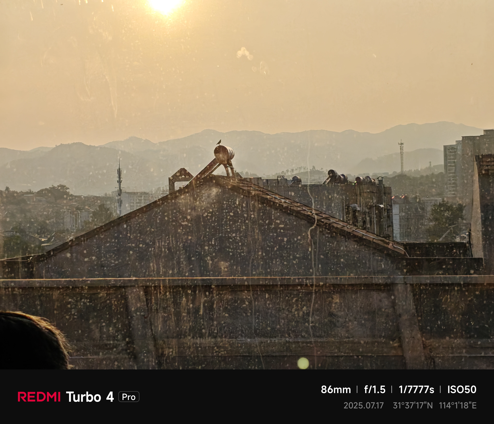

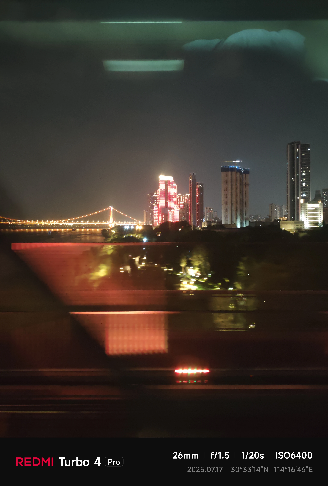

晚上 8 点，我们到达了目的地 —— 武昌站。出站后，父亲公司安排的司机就把我们接上了车。二十分钟后，我们到了阳逻开发区的新港国际大酒店。

我们坐电梯上到了 11 楼。电梯门打开的那一刻，我顿时虎躯一颤：外面的天已经完全黑了，酒店楼道几乎伸手不见五指，外加地上铺了绒质地毯，让我觉得很瘆。

刷卡，进入房间，我发现我们的屋子里也铺了这种绒质地毯，并且这间屋子的内部设施（空调、开关等）都很老旧，这更加重了我的不适感。同时，手机弹了三条通知，都是强对流天气预警。我没有放在心上，因为此时窗外十分静谧，丝毫没有暴风雨来临之势。

在酒店坐了没多久，我就饿了，想和父亲出去 “觅食”。父亲干脆利落地同意了。酒店正对面有一家 “XX 网吧” 和一家便利店，我们便往便利店方向走去。走在大马路上，我忽然觉得头顶尖尖凉凉的，下雨了！我们赶紧窜到便利店里，想着先买东西，过一会雨就停了。我们选了几个肉松饼，付款之后，走出店门，愣住了：相比于刚才的星星点点，此时的雨完美诠释了为什么叫 “强对流”。

就这样，我们在便利店里转了一圈，试图拖延时间等到雨停。可是，当我们再次走到门口，却发现时间并未削弱这雨丝毫。

怎么办？闷头干。

我们冲向雨中，跑了一百多米，回到了酒店。衣服自然被淋湿，父亲管这叫 “自由”。

回到酒店，我们一边吃，一边聊着第二天的会议，不亦乐乎。就这样消遣直到凌晨 1 点，我们才昏昏睡去。

### Day1 - 商业展览 & 网吧初体验

早上 6 点，我就被父亲叫了起来，他说七点就要去开会，让我提前准备。我洗脸，刷牙，这一切都结束之后，见我昏昏沉沉的，他便让我去洗了个澡。就这样稀里糊涂地到了 7 点，我们下楼了。

一出酒店大门，就遇见了与父亲合作的客户。他和父亲握了握手，我正想用对付学校里老师的那一套来向这位叔叔鞠躬，他却向我伸出了手 —— 这是我没有想到的。我刚鞠了一半，却又条件反射似的伸出了手。哈哈，真奇怪。他让父亲称呼他为 “小王”，那我就管他叫 “王叔” 吧。

王叔开车带着我们去了一家小餐馆，我们吃了武汉热干面，喝了米酒。热干面的味道很新奇，嗦入口中先是醋酸味，紧接着是酱香味，嚼起来很筋道。

吃完早饭，王叔说带我们去公司。出了餐馆门，我开始找王叔的车，可王叔和父亲却笔直往前走去。见我没跟上，王叔回头叫我：“小伙子，公司就在前面！” 我急忙快步跟上。

上午，我们跟着王叔参观了要合作的公司。先去看了成功案例，接着听老板给我们讲了产品的原理…… 时间才过了一半，我已经厌烦了 —— 因为现在是夏天，而我们参观的是一家地暖公司。公司展示区里还有汗蒸房，室温 46℃，差点把我热晕？

下午 13:00，上半场展示结束，父亲需要去进一步开一个研讨会，我向王叔提出了送我回酒店的要求。王叔也是很爽快，订了辆网约车送我回了酒店。

到了酒店之后，我碌碌无为地度过了一个下午。

傍晚，父亲回来了。他对这个项目表现出了一种消极的态度 —— 因为要参与这个项目，需要交 12 万的定金。

过了不久，和父亲对接的王叔为我们送来了晚餐。王叔在吃饭的过程中和父亲继续交谈着商业合作的事，父亲持续消极对话，最终他俩没有谈成。不过也没有不欢而散 —— 父亲的语言艺术还是很可以的，属于是婉拒了王叔。

王叔离开酒店之后，我向父亲提议第二天就改签车票回洛阳。父亲拒绝了。他说：

> ” 明天我跟他们老总谈谈，如果真的不合作那就不会麻烦到你王叔了。现在贸然离开，公司肯定会找你王叔麻烦。明天试试再说，说不定能谈成。“

我简单地回了他一句” 行 “。没过多久，我因为太过无聊，便提议父亲带我下楼逛逛，顺带看看酒店对面的 XX 网吧。

我对网吧这玩意是不抱有任何期望的。因为法律就在那里摆着，我未满 18 周岁，这类场所禁止未成年进入。

所以我们先去楼下的街上逛了逛。不得不说，开发区就是开发区，楼下死一般的寂静，只有个别餐馆开着灯，却没几个顾客。所以我们没走一小会，就转头向网吧的方向走去。

走进网吧，我很怯，可能是因为自知未成年没有资格，也可能是因为我第一次来网吧这个场所，不知道网吧里面是来自哪里的、什么性格的人群。可是坐在前台的网吧老板就没有那么严肃了，她热情地问我是不是需要开机子，丝毫没有注意到我是未成年。（ps：这里估计是真的没辨认出来，因为博主太显老了，555…）而我局促地表示着自己想试试。老板娘是一点都不带尴尬的，直接问我成年了没有。我慌到了极点。如果我说未成年，老板会不会赶我出门？会不会被众人嘲讽？

最终，我选择了说实话。

> “我没成年。”

> “没成年让你爸帮你实名一下就行了。”

我傻了。一旁的老板手把手教着父亲使用自动购卡机购买时长，我就傻站着。不到一分钟，就买完了。

这是一家黒网吧。唯一的理智告诉我。

但是价格还算合理，6 块钱一个小时。

社恐的我跑到了二楼的一个空座位，仓惶坐下，结果找电源找了半天才找到。令我意外的是并没有人嘲笑我，网吧里的人都在各玩各的，整间屋子里并没有我想象中那么严重的社会戾气。于是，我松了口气。

打开机子，输入卡号和密码，进入桌面。我习惯性地点开任务管理器查电脑配置。好家伙！12 代 i7，4060Ti！这么逆天的配置是我这辈子第一次体验。所以我下意识用浏览器访问毒蘑菇，想试试这电脑的性能上限。结果：

<video controls="" src="https://img.riseforever.cn/blog_src/2025/07/20250725135643647806.mp4" style="box-sizing: border-box;"></video>

> 我敢保证，这是我人生中体验过最流畅的电脑。

电脑用的是 240Hz 显示器，鼠标在屏幕上滑动都能感受到 LCD 的残影。震撼之余，我开了把和平精英。在选择了顶级画质的条件下，这台电脑居然能满帧运行。玩了一局，爽了一局。

但是，受限于和平精英 PC 模拟器只支持和平精英模式，不支持绿洲起源等更多的玩法，所以我很快失去了兴味，只是对网吧设备的性能表示震撼。

### Day2 - 平淡

依然是早上七点，父亲和我早早起来。只不过，这一天我不打算跟着父亲在公司里度过。父亲把我送到了网吧，给我充了一张 VIP 卡（充 30 送 20，一共可以用 8 小时 20 分钟），开好机子，便找王叔听公司讲座去了。

至于我？在网吧待了不到一个小时，因为太热，就选择了下机，然后出门休息。等到我回来时，意外发现再次登录时系统提示 “密码错误”。我惊讶地去问前台，得到的回复是：“你每次开机都需要你父亲过来实名认证一下，然后密码会通过短信验证码的形式发送给你父亲。”

> 天塌了。

也就是说，8 个多小时的额度，我只用了几十分钟，就被迫结束了。我得等父亲下午回来才能继续。

我带着后悔的心，拖着沉重的身体，回到了酒店。

刷了会手机、看了会随身带的《意林》，实在是太无聊，我便锁好门，躺在床上再度睡去。

下午，父亲掂着大包小包的货回来了。那是他要推广的样品。我惊讶地表示：

> “你不是不打算合作吗？”

没想到，他说：

> ” 我和人家谈成了，先做着这生意，如果有利润并且前景好，我就后续再交定金。“

可我看着他合同上的”x 月 x 日前若不交定金 xxxxxx 元，则此合同作废……“，陷入了沉思。

父亲似乎是察觉到了我的不安，忙说：

> ” 这个合同还有点问题，你看看内容就行，不用认真，我明天还要跟他们谈。“

我答应了。

父亲在抖音上又找了几家同类型的厂家，并尝试联系。他说他打算给自己留条后路，明天去谈完合同之后，他还要去其它公司看看，如果以这次来为目标的公司没谈成，那就去其它公司问问能不能合作。

于是，一夜无话。

### Day3 - 合作谈成

不再过多赘述，我在网吧把剩余额度用完了。父亲与老总成功谈成了。这是我们在这所酒店睡的最后一晚。

### Day 4 - 武汉长江大桥

下午 2 点，我们上了地铁，倒了 2 趟车，兜兜转转到了我们新订的酒店。

这家酒店挨着我们来时的武昌站，交通很方便。在酒店待了几分钟之后，我们起身前往武汉长江大桥。

并拍到了以下照片：

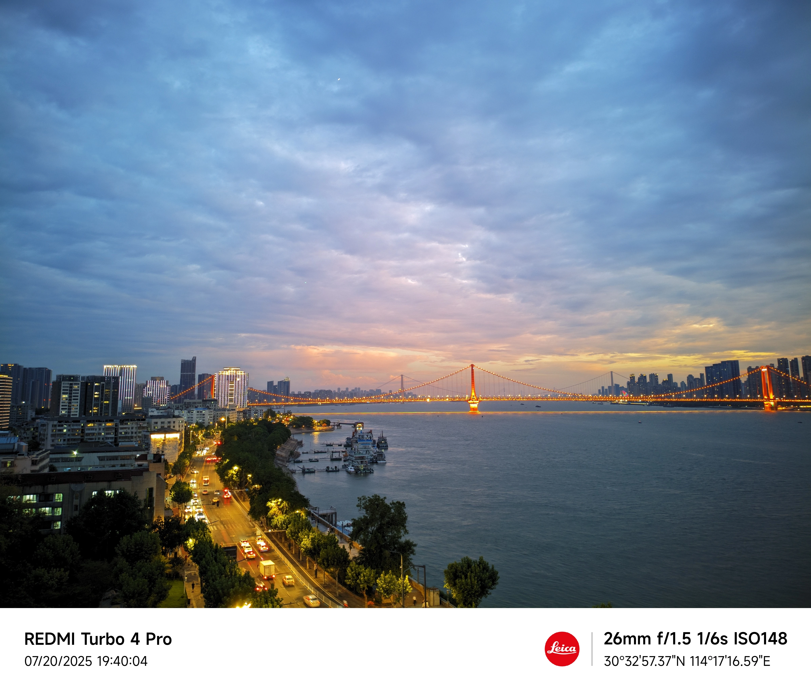

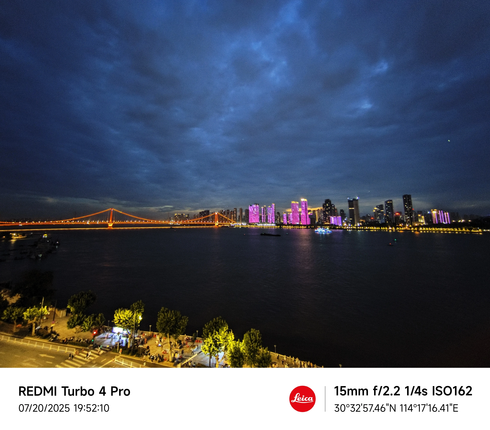

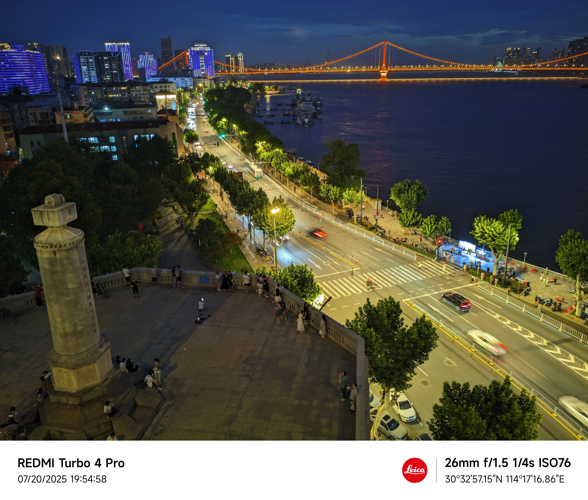

### Day5 - 武汉大学 & 汉口江滩

早上 9 点，我们蹬上共享单车，前往武汉大学参观。

武汉大学占地面积实在是太大了，彻底刷新了我对大学的认知。一上午我们只逛了约 1/6 的地方，中午实在热得受不了了，我们就回去了。

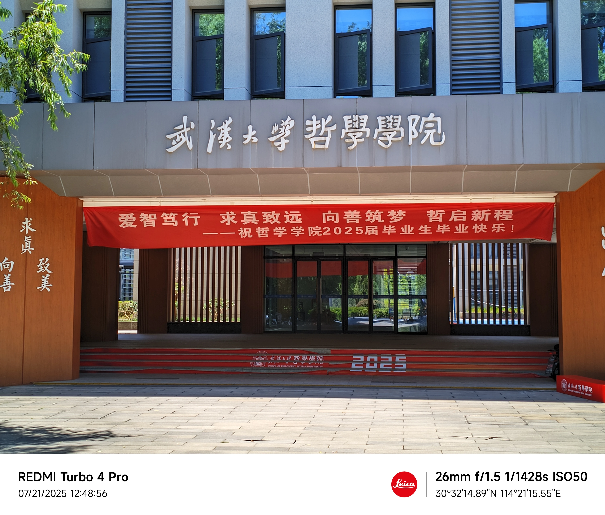

下午四五点的时候，父亲耐不住性子，再次带我出了门。

还记得他一开始的目的地是一条小吃街。小吃街上到处是花花绿绿的灯，与我们 Day1 酒店附近的小吃街截然不同，这里的灯光几乎能把天空照亮，把人的倦意熔化了。我们买了几串烤鱿鱼，两杯蜜雪冰城，便开始寻找附近其它的景点。

正在我们思考的时候，一位开着电三轮的老爷爷把我们的思绪揪了出来。于是，父亲开始问他附近的景点，他毫不犹豫地推荐了汉口江滩。于是，我们就坐上了老爷爷的三轮车，出发前往汉口江滩。

三轮车里面布置了彩色灯带，看起来很亮堂。坐在车上有股莫名的安全感。（虽然这安全感比起汽车来说差多了）

同样的，在汉口江滩一带，我们得到了以下照片：

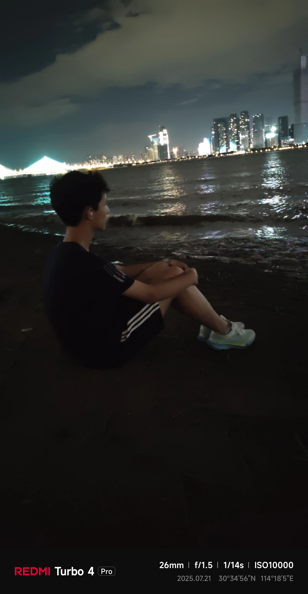

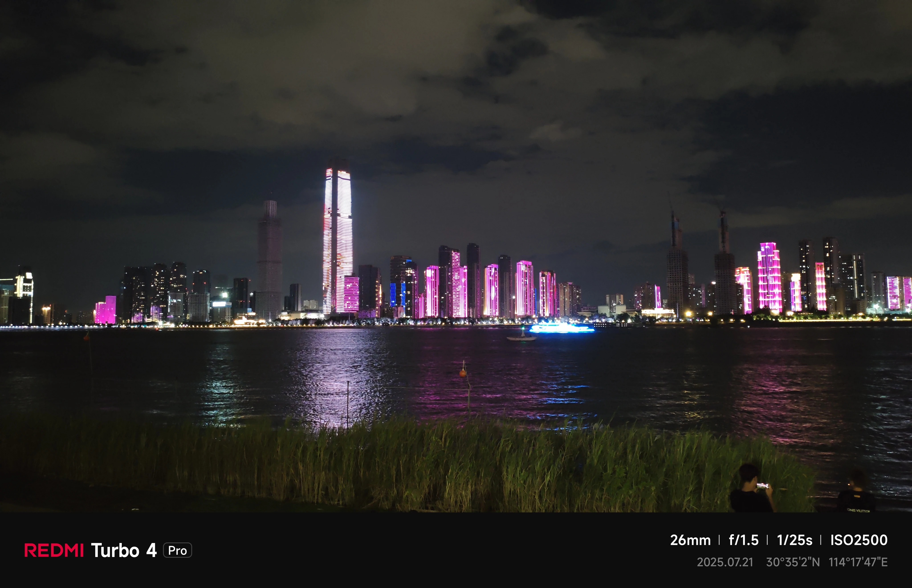

### Day6 - 黄鹤楼，返程

依然是早晨，我们骑共享单车来到了黄鹤楼。只不过有两个大槽点：

1. 黄鹤楼为中心，方圆一百米内没有共享单车停车点，我们甚至抬着共享单车下了过街天桥才找到停车点；
2. 黄鹤楼旁边的自行车道与平台上的人行道中间有围栏，一直延续到武汉长江大桥上。我们一直骑到了武汉长江大桥上面才敢把自行车抬上人行道。

走进景区大门，映入眼帘的就是 “三楚一楼” 的牌坊。

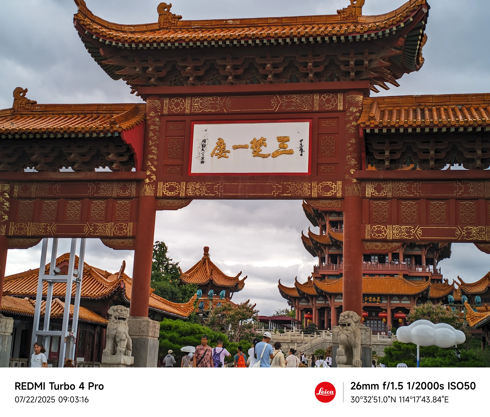

黄鹤楼台前有一座石像，雕刻的是一只鹤，像不像不重要，气势是给到了。

上黄鹤楼顶，望车水马龙，好一个 “江山入画”。

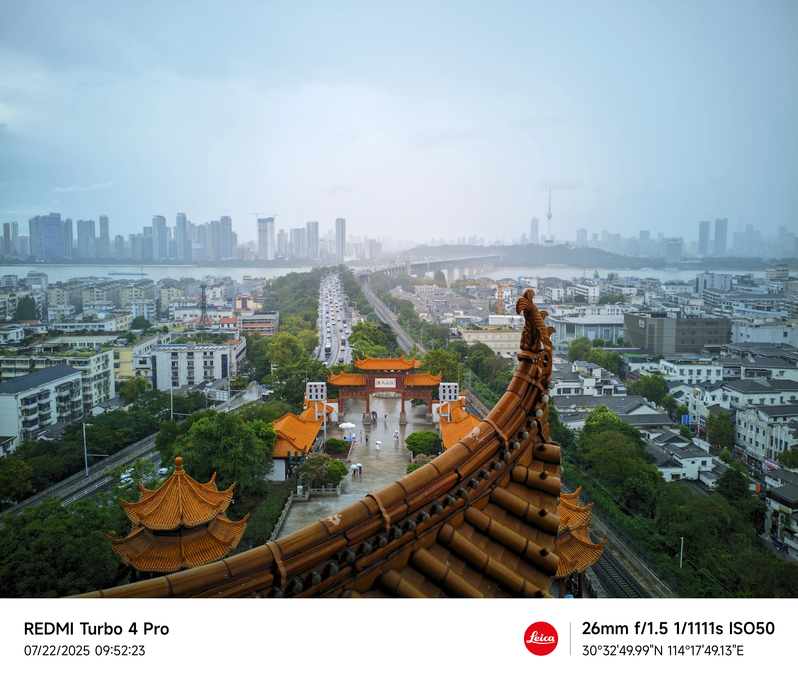

附 我拍的亿点点照片：（似乎也找不出来更多的照片了，全是拍人的？）

所以，我的武汉六日游就到此结束了。

## 网站升级

经常来访的朋友应该知道，本站从 7 月 15 日开始，连续 7 天左右都处于无法访问的状态。那是因为我的域名处于备案期，删除掉了所有解析。现在，域名备案完毕了，同时我也用上了火毅盾提供的全球 CDN，网站全国绿，如图所示：

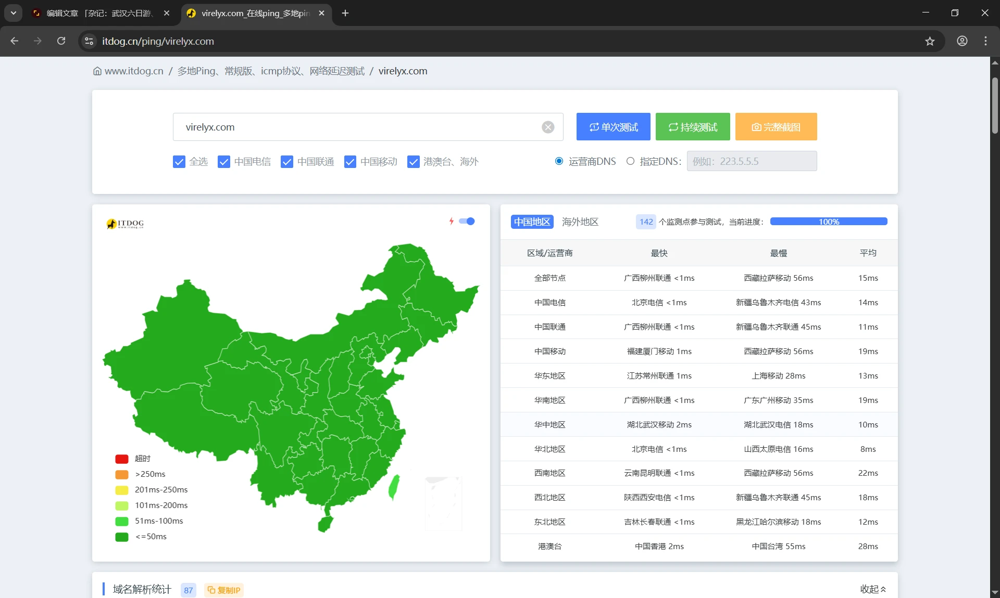

同时，服务器也从原来的腾讯云新加坡转到了火毅盾（独家），带宽增大，以后我可以放心地往博客里放原图，而不用担心加载不过来了。

## 落水

中考分在 7 月 7 日就出来了，我考了 672 分。

也许你不知道这意味着什么，我来解释一下：

中考总分由文化课分和体信实验（体育 + 信息 + 实验）分组成。我的体信实验得了 143 分（满分 145）。

文化课的分数情况如下：

| **科目名称** | **预估分** | **实际分** | **差值** |
| ------------ | ---------- | ---------- | -------- |
| 语文         | 105        | 100        | -5       |
| 数学         | 113        | 113        | 0        |
| 英语         | 115        | 112        | -3       |
| 物理         | 67         | 67         | 0        |
| **道法**     | **62**     | **51**     | **-11**  |
| 历史         | 38         | 40         | 2        |
| 化学         | 44         | 46         | 2        |
| 总分         | 544        | 529        | -15      |

其中，语文、英语这两科的落差是在我意料之中的，但是道法这一科目属实出乎我的意料。

对于道法，我是仔细估的分，按照最严格的标准来的。我保证我估的分会比实际要低。成绩出来后，我当场联系班主任，要求核查分数。我以为核分可以看到每一题得了多少分，结果核分结果就是 “客观题：xx 分、主观题：x 分”。卵用没有。

最终我差了 6 分，无缘第一志愿，只好投奔第二志愿的怀抱。记得中考前的全真模拟我考了 687，结果中考只考了 672。在中考这艘船上，我不幸落水。

不过第二志愿也不错，也是省示范，而且我签约了精英班三年不调班。只是我心里的落差太大了，无法释怀。希望洛阳市的核分过程透明一点吧。不然我连自己怎么落水的都不知道。

## 后记

恭喜本文成为本博客有史以来最长的文章 ——4941 字。这算是一个月度总结，把我的心理压力释放掉，让我准备好迎接新的挑战。

感谢阅读，我们下期再见。

> 顺便借这次机会吐槽一下：[blogscn.fun](https://blogscn.fun/) 的审核员，你跑哪去了？我 7 月 9 日提交的站点变更申请到现在还没有反应，说好的 24 小时内审核完毕呢？是不是应该整一个机器审核？
