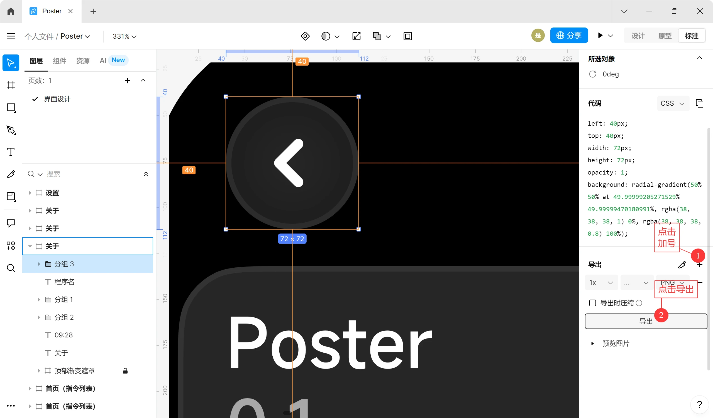

## 前言

看到互联网上有关 Xiaomi Vela JS 应用程序开发的教程实在是少之又少，故撰写此文，希望能帮到那些想要开发 Xiaomi Vela JS 快应用但找不到教程的朋友们。

本篇文章仅针对 Windows 系统进行简要 Vela 应用开发教程，其它系统可适当参考。

> 声明：本文封面素材来自 [Xiaomi Vela 官网](https://iot.mi.com/vela)，如有侵权，敬请[联系我](mailto:hi@virelyx.com)，我将立即删除。

### 何为 Vela

Xiaomi Vela 操作系统（下统称为“Vela”）是小米基于 NuttX 打造的嵌入式软件平台。具有性能要求低、占用体积小、兼容性强等特点。2023年8月14日，小米首次将 Vela 引入到穿戴设备领域，发布了搭载 VelaOS 的小米手环8 Pro。此后推出的小米手环9、小米手环9 Pro、红米手表4、红米手表5、小米手环10等产品也都搭载了 VelaOS。

### 何为 Vela 快应用

> Xiaomi Vela JS快应用（下统称为“Vela 快应用”）是小米为物联网（IoT）设备打造的一种应用开发框架和运行时环境。它允许开发者使用流行的前端技术（主要是JavaScript）来为搭载 Vela 系统的设备开发应用。
>
> From：DeepSeek

目前，比较新的小米手环/手表、红米手表的 Vela 操作系统都搭载了快应用引擎，这意味着用户可以为自己的穿戴设备安装各种应用程序。

> 请注意，红米手环3 虽然搭载了 Vela 系统，但其并未搭载快应用引擎，因此其无法安装和运行 Vela 快应用。

Vela 快应用使用的语言为 HTML、CSS和Javascript。如果要以最快的时间学习 Vela 快应用开发，你需要先掌握一些简单的 HTML、Javascript 基础。

## 开发环境配置

工欲善其事必先利其器。在开始 Vela 快应用开发生涯之前，我们需要正确配置一下 Vela 快应用开发环境，这有利于我们今后的顺利开发。

在这里整合一下需要下载的资源：

- AIoT IDE：https://vela-ide.cnbj3-fusion.mi-fds.com/vela-ide/ide/v1.7.0/AIoT_IDE_windows.exe
- Node JS：https://nodejs.cn/download/
- Platform Tools：https://developer.android.google.cn/tools/releases/platform-tools
- JDK：https://www.oracle.com/cn/java/technologies/downloads/#jdk24-windows
- OpenSSL：https://slproweb.com/products/Win32OpenSSL.html

> 下载软件即代表您默认同意其对应的《用户协议》。

### 系统要求

Windows 10 或 更高版本

### 安装 AIoT IDE

> `AIoT-IDE` 是用于开发`Xiaomi Vela JS 应用`的官方集成开发环境。建立在 [Visual Studio Code (opens new window)](https://code.visualstudio.com/)（以下简称 VS Code）的基础上，它继承了 VS Code 的全部功能，比如**代码编辑**、**插件集成**、**主题定制**及个性化设置。此外，`AIoT-IDE` 还引入了一系列专门针对 `Xiaomi Vela JS 应用` 应用开发的增强功能。
>
> From：[小米 Vela JS 应用开发文档](https://iot.mi.com/vela/quickapp/zh/tools/)

下载完 AIoT IDE 安装包后，直接右键单击 → 以管理员身份运行，执行默认安装步骤即可。

> 注：此处“执行默认安装步骤”指的是一路点击“下一步”，不修改任何安装选项。如果您有改变安装路径的需求，可自行修改。

### 安装 JDK

同上，直接以管理员身份运行，正常安装即可。

### 安装 Node JS

同上，直接以管理员身份运行，正常安装即可。

### 安装 Platform Tools

Platform Tools 是由 Google 提供的 ADB（Android Debug Bridge，安卓调试桥）调试工具，在 Vela 快应用的开发过程中，Platform Tools 会被用于与模拟器通信，即将调试用的程序推送到模拟器中，并控制模拟器运行。

首先，将下载好的`platform-tools-latest-windows.zip`解压。


解压完毕后，会得到一个文件夹，其内部还有一个名为`platform-tools`的文件夹。


将`platform-tools`移动到自己想要安装到的路径。比如我就将其移动到`C:\Program Files\`下。


紧接着，我们打开搜索功能，搜索“编辑系统环境变量”，并进入。


具体环境变量添加流程如下：

1. 点击`系统属性`窗口中的“环境变量”按钮；
2. 点击`环境变量`窗口中`系统变量`模块下的“新建”按钮；
3. 输入变量名：`ANDROID_HOME`；
4. 输入变量值，此处复制`platform-tools`文件夹所在的路径。就比如我是`C:\Program Files\platform-tools`。

在添加完环境变量后，还需要在 Path 变量中添加一个项。


具体步骤如下：

1. 选中`环境变量`窗口中的“Path”变量；
2. 点击`环境变量`窗口中`系统变量`模块下的“编辑”按钮；
3. 在`编辑环境变量`窗口中，点击“新建”按钮；
4. 输入`%ANDROID_HOME%`，别忘了半角百分号！
5. 点击`编辑环境变量`窗口中的“确定”按钮。

至此，Platform Tools 已经安装完毕。点击各窗口中的“确定”按钮即可保存设置。保存完毕后，我们打开 cmd ，在其中输入`adb`并回车。如果安装成功了，那么 cmd 窗口中就会输出一大堆东西，如下图。


如果提示“‘adb’不是有效的命令”，那么请自查是否按照上述步骤完成安装，或者重启电脑再试。

### 安装 OpenSSL

OpenSSL 是在软件发布时制作签名证书的工具。

下载好安装包后，双击运行，正常安装。并记下安装路径。

譬如，我的安装路径就是`C:\Program Files\OpenSSL-Win64`。

安装完毕后，按照前面的方法，在 Path 变量中添加 OpenSSL 的 bin 路径。比如按照我的情况，那么我实际添加的值就是`C:\Program Files\OpenSSL-Win64\bin`。

操作完之后，重启电脑，随后打开 cmd，输入以下命令：

```
openssl version
```

若正常输出版本，则代表安装成功。若提示“‘openssl’不是有效的命令”，请自查是否严格按照上述步骤操作。

### 配置 AIoT IDE 环境

AIoT IDE 在安装完毕后，还需要进行模拟器环境配置。

启动 AIoT IDE ，首次使用可能会弹出一堆信任弹窗，点击“Trust Publisher & Install”按钮即可。点击之后，AIoT IDE 会自动安装必要的扩展。比如简体中文语言包、Vela 快应用开发套件等。


当扩展安装完毕后（通常需要1~2分钟），窗口右下角会有一个浮窗提示“中文语言包已安装完毕”，此时点击“Change Language and Restart”，即可重启 AIoT IDE，IDE 语言会变为中文。

接下来，点击菜单栏的“文件” → “新建项目”，选择创建一个“Watch”项目，以“常规”模板创建。


项目名称、项目路径可以随便填写。只要能完成创建即可。

创建完成后，会有弹窗“是否信任此文件夹中文件的作者”，点击“是，我信任此作者”即可。

随后，IDE 窗口中会出现上方模拟器工具栏（如①所标）、右侧辅助侧栏（如②所标）等。这些都是后续开发中很重要的辅助工具。


在右侧的辅助侧栏中，可以看到醒目的提示——“当前项目不可以正常启动”。此时我们需要按照它的提示，一步步完成项目和模拟器环境的初始化。

> 注：项目环境初始化流程在每次新建项目后都需要走一遍，模拟器环境只需要初始化一次即可。

点击“安装项目依赖”后，在 IDE 内部下方会出现终端，输出安装进程。大部分 PC 在这时会报错：

```
 *  正在执行任务: npm i 

npm : 无法加载文件 C:\Program Files\nodejs\npm.ps1，因为在此系统上禁
止运行脚本。有关详细信息，请参阅 https:/go.microsoft.com/fwlink/?Lin
kID=135170 中的 about_Execution_Policies。
所在位置 行:1 字符: 1
+ npm i
+ ~~~
    + CategoryInfo          : SecurityError: (:) []，PSSecurityExcep
    tion
    + FullyQualifiedErrorId : UnauthorizedAccess

 *  终端进程“C:\Windows\System32\WindowsPowerShell\v1.0\powershell.exe -Command npm i”已终止，退出代码: 1。 
 *  终端将被任务重用，按任意键关闭。 
```

这是由于 npm 命令被 PowerShell 识别成了不安全脚本，导致命令无法执行。

要解决这个问题，只需以管理员身份运行 PowerShell ，并输入以下命令：

```
set-ExecutionPolicy RemoteSigned
```

如果 PowerShell 询问是否确认更改，选择“A（全是）”就可以了。

如果 PowerShell 什么都没输出，直接关闭 PowerShell 窗口就行了。

此时再次点击“安装项目依赖”，就可以正常安装项目环境了。通常需要1~3分钟，稍等即可。

项目依赖安装完毕后，在 IDE 窗口的右下角就会有一个极为舒适的浮窗：


接下来，初始化模拟器环境。点击“初始化模拟器环境”按钮，IDE 会弹窗，点击“创建所有设备模拟器”按钮即可。IDE 会自动下载模拟器所需的资源。


模拟器资源下载大约需要5分钟。下载完毕后，IDE 右侧辅助侧边栏会显示“当前项目可以正常启动”。至此，AIoT IDE 全部环境配置完毕。


## 了解 Vela 快应用基础结构

Vela 快应用项目目录下有一个`src`文件夹，文件夹内部存放的就是与项目有关的文件。接下来我将以`src`文件夹下的视角，一一讲解与项目有关的文件。

### manifest.json

manifest.json，是主管应用信息、权限申请和页面路由的配置文件。

使用`默认模板`创建的 Vela 快应用项目，其 manifest.json 内容如下：

```
{
  "package": "com.application.watch.demo",
  "name": "demo",
  "versionName": "1.0.0",
  "versionCode": 1,
  "minPlatformVersion": 1000,
  "icon": "/common/logo.png",
  "deviceTypeList": [
    "watch"
  ],
  "features": [
    {
      "name": "system.router"
    }
  ],
  "config": {
    "logLevel": "log",
    "designWidth": "device-width"
  },
  "router": {
    "entry": "pages/index",
    "pages": {
      "pages/index": {
        "component": "index"
      },
      "pages/detail": {
        "component": "detail"
      }
    }
  }
}
```

虽然 AIoT IDE 最新版本中已存在 manifest 可视化编辑器，但是了解一下 json 的基本结构还是挺有必要的。

这里用表格来解释一下一些典型的配置节点含义。

| 项名           | 含义                               | 格式要求                                                  | 示例                  |
| -------------- | ---------------------------------- | --------------------------------------------------------- | --------------------- |
| package        | 应用包名                           | 通常为“com.作者名称.软件名称”                             | com.virelyx258.poster |
| name           | 在穿戴设备应用列表中显示的应用名称 | 尽可能6个汉字以内                                         | 环间电子书            |
| versionName    | 应用版本名称                       | 无                                                        | 1.0.0                 |
| versionCode    | 应用版本号                         | 尽可能每次更新都增加                                      | 1                     |
| deviceTypeList | 支持的设备类型                     | 手表/手环等穿戴设备，统一填"watch"                        | watch                 |
| features       | 应用使用到的接口列表               | 使用 json 数组形式                                        | 见上方示例代码        |
| router         | 应用中包含的页面，需要在此定义     | 先定义"entry"（主页地址），再分别定义各个页面地址及名称。 | 见上方示例代码        |

当然，如果你实在受困于上方令人头疼的 json，那么你可以试试使用 AIoT IDE 自带的 manifest 可视化编辑器。只需要点击 IDE 中代码框顶部的按钮即可。


新版本 AIoT IDE 的可视化编辑器很人性化，为每项功能都做出了详细解释。所以此处不再针对可视化编辑器进行解释。

### \pages\

`pages`是一个目录，里面存放着程序中的窗口数据。目录结构大致如下：

```
pages
|_窗口名称
|   |_窗口名称.ux
|_窗口名称2
    |_窗口名称2.ux
```


如果需要新建页面，只需要在`pages`目录下新建一个文件夹，将其命名为新窗口名称，并在该文件夹下新建一个名为"窗口名称.ux"的文件。至于“.ux”文件是什么，请往后看。

### .ux文件

在`pages`目录下，后缀名为“.ux”的文件很常见，它代表着 Vela 小程序的页面，能够显示在屏幕上让用户看见。

### \common\

`common`是一个目录，用于存放程序中公用的一些资源，类似于常量，不可被修改/删除。

在现有的示例项目中，`common`目录下有一个`logo.png`，它就是程序的 Logo。像是我开发 Vela 快应用的时候，就喜欢在`common`目录下按照页面名称分别新建目录，保存页面内需要用到的资源。

### \i18n\

`i18n`是一个目录，用于存放程序的多语言数据。不怎么常用，我也不会写。后续可能会把这一块给补上。见谅。

至此，

## .ux 代码编写规范

一个标准的`.ux`文件，内部由三大部分代码组成：`template`、`script`和`style`。其分别代表着`HTML`、`Javascript`和`CSS`语言。

比如，AIoT IDE 新建的模板页面代码如下：

```
<template>
  <div class="demo-page">
    <text class="title">{{ $t("a.b") }},欢迎打开{{ title }}</text>
    <!-- 点击跳转详情页 -->
    <input class="btn" type="button" value="跳转到详情页" onclick="routeDetail" />
  </div>
</template>

<script>
import router from "@system.router"

export default {
  // 页面级组件的数据模型，影响传入数据的覆盖机制：private内定义的属性不允许被覆盖
  private: {
    title: "示例页面"
  },

  routeDetail() {
    // 跳转到应用内的某个页面，router用法详见：文档->接口->页面路由
    router.push({
      uri: "/pages/detail"
    })
  }
}
</script>

<style>
.demo-page {
  flex-direction: column;
  justify-content: center;
  align-items: center;
}

.title {
  font-size: 20px;
  text-align: center;
}

.btn {
  width: 200px;
  height: 40px;
  margin-top: 20px;
  border-radius: 5px;
  background-color: #09ba07;
  font-size: 20px;
  color: #ffffff;
}
</style>

```

需要提醒一下，Vela 如果想要实现一些功能（如本地文件读写、网络请求发送等），需要先在`manifest.json`中声明需要的系统接口，并在对应页面的`<script> </script>`段首引用模块。格式如下：

```
<script>
import app from '@system.app' 
// 或 
const app = require('@system.app')
// 下方代码省略...
```

对于 Vela 系统支持的接口，详见[接口 | Xiaomi Vela JS 应用开发文档](https://iot.mi.com/vela/quickapp/zh/features/)。

------

接下来讲一下`.ux`文件在编写时需要注意的规范。这些都是新手在编写`.ux`文件时常见的，会关乎到程序能否正常运行。

**首先是template段。**template段代表着页面的前端元素，使用 HTML 语言进行编写，但实际上会与标准的 HTML 页面有些许差别：

1. template 段中的所有元素都需要被包裹在一个大的`<div>`中。切忌在一个 template 段中直接出现多个`<div>`，如下演示：

```
<template>
    <!-- 这是错误演示，template中直接出现多个<div>容器 -->
    <div class="time_label"></div>
    <div class="date_label"></div>
</template>
<template>
	<!-- 若要让程序正确运行，需要将页面内元素包裹在一个大的<div>容器里 -->
	<div>
		<div class="time_label"></div>
		<div class="date_label"></div>
	</div>
</template>
```

1. Vela 系统的组件库中支持部分原生 HTML 组件，如`<a>`、`<span>`等。支持的全部组件类型详见[组件 | Xiaomi Vela JS 应用开发文档](https://iot.mi.com/vela/quickapp/zh/components/)。

**其次，是script段。**Vela 的`<script>`段可用来声明接口，以及定义函数和变量。需要提醒的是，Vela 的`<script>`段也有着其特定的规范。

先来看一下示例：

```
<script>
// 这里是声明接口部分的代码，可直接写在<script>段的根部。
import router from "@system.router"

// 像是变量、函数什么的，都被包裹在 export default{}下。
export default {
  // 页面级组件的数据模型，影响传入数据的覆盖机制：private内定义的属性不允许被覆盖
  // private 这里包含的就是页面内的变量。
  private: {
    title: "示例页面"
  },
    // private 声明结束之后，就可以声明函数了。格式如下
    /*  函数名称() {
            函数代码(参数)
        },
        函数名称2(){
        函数代码(参数)
        }
    */
    // 切记，若函数声明结束之后，后方还有继续的函数，则需要在当前函数花括号结束处添加“,”！
  routeDetail() {
    // 跳转到应用内的某个页面，router用法详见：文档->接口->页面路由
    router.push({
      uri: "/pages/detail"
    })
  }
}
</script>
```

1. **声明接口的代码写在script段的根部。**
2. **变量、函数的声明代码**要被包裹在export default{}下。
3. **变量声明格式**：

```
  private: {
    // 变量名称通常为英文，以字母或下划线开头，不能以数字开头。
    // 若含有多条变量，则为变量截止前一条及以上的每条变量声明行尾添加半角逗号“,”。
    name: "hello",
    intro: "nihao"
  },
```

变量名称通常为英文，以字母或下划线开头，不能以数字开头。详细规范可自行上网搜索 Javascript 变量和常量命名规范。

若含有多条变量，则为变量截止前一条及以上的每条变量声明行尾添加半角逗号“,”。

1. 函数声明格式：

```
sum_name() {
    console.log("Hello,World!");
    },
sum_name2() {
    console.log("This is a test of Xiaomi Vela OS!");
    }
```

与变量声明的规范相同，若声明了多个函数，则为函数截止前一条及以上的每个函数花括号尾后添加半角逗号“,”。

**最后是style段。**有两个需要注意的地方，否则组件可能会无法正常显示：

1. 每个样式都需要添加`position: absolute;`；
2. 将`background`属性名称更改为`background-color`。

比如下方这串示例代码：

```
.button {
  position: absolute;
  width: 200px;
  height: 40px;
  margin-top: 20px;
  border-radius: 5px;
  background-color: #09ba07;
  font-size: 20px;
  color: #ffffff;
}
```

其它地方就没有什么需要注意的了。按照标准 CSS 格式进行编写即可。

当然，Vela 有一些很好用的**第三方工具**，可以免去自己编写 CSS 的麻烦。

## UI 设计工具

[即时设计](https://js.design/)。它是目前 Vela 快应用开发者比较常用的 UI 设计工具。它的上手成本较低，支持将设计好的元素一键以图片形式导出，也可以导出为 CSS 格式直接粘贴到 AIoT IDE。

目前，[无源流沙公开的 UI](https://www.bandbbs.cn/threads/14585/) 是 Vela 快应用界被广泛使用的 UI。如果你要基于这套 UI 进行设计，只需在即时设计中将该 UI 下载，即可自行创作。

> 尊重作者版权，请不要忘了在关于页面留下“无源流沙”的名字噢~

接下来，我将讲解一下如何使用即时设计给 Vela 快应用设计 UI。

### 新建画布

在即时设计的首页，点击“创建文件”按钮，即可创建一个新项目。

即时设计的设计界面如下所示：


1. **工具栏**：包含画板工具、形状工具、钢笔、文本、切片、容器等设计工具；
2. **页面组件管理区**：显示当前项目包含的页面和当前页面中包含的组件；
3. **画布区**：在此处进行 UI 设计。
4. **右侧工具栏**：包含修改元素属性、导出等功能。

新建一个画布，分辨率要和目标设备的屏幕分辨率相同。常见的小米穿戴设备屏幕分辨率如下：

| 设备名        | 屏幕分辨率 |
| ------------- | ---------- |
| 小米手环8 Pro | 480*336    |
| 小米手环9     | 192*490    |
| 小米手环9 Pro | 480*336    |
| 小米手环10    | 212*520    |
| 红米手表4     | 390*450    |
| 红米手表5     | 432*514    |

比如我新建了一个红米手表5的画布。则画布的宽（W）即为432px，高（H）即为514px。


紧接着，按下图所示步骤，将画布底色调整为黑色：


但是手表屏幕是有圆角的，如果直接按照矩形去设计的话，难免会让组件出现在屏幕外面。所以，我们需要手动为画布设置圆角半径，来确定组件应该摆放在什么位置。

目前我设计过的设备，它们的圆角半径如下：

| 设备名        | 圆角半径 |
| ------------- | -------- |
| 小米手环9     | 999px    |
| 小米手环9 Pro | 48px     |
| 小米手环10    | 999px    |
| 红米手表5     | 90px     |

设定好圆角值后，当前的画布就像是一个屏幕了。


### 设计组件

你可以选择使用即时设计自带的工具绘制组件，也可以选择参考无源流沙 UI 库的组件。

在画布中调整组件的位置、大小，并按照自己对软件的预期来设计。


注意：**在设计时，若页面宽度/高度超出屏幕分辨率，则可将画布宽高进行调整，并在编写代码时使用scroll_box组件来实现滚动浏览。**

譬如我制作的某个软件的**关于页**，其画布高度就是1104px。


### 将组件导入 IDE

当组件设计完毕后，怎么将它导入到 AIoT IDE 里呢？很简单，即时设计支持将组件一键导出为 CSS 代码。

**对于刚刚入门的零基础 Vela 开发者，很可能会产生一个误区（我就是）——在即时设计中设计好 UI 后，可以一键将所有组件的 CSS 代码导出，复制到 AIoT IDE 里之后就可以直接用了。**

实际并不是这样。在设计好 UI 后，我们需要一个一个选中页面中的组件，将其逐个添加到 AIoT IDE 中，并手动在页面 .ux 文件的`template`段引用该组件。

详细步骤如下：

1. 选中需要导出的组件；
2. 在设计页面的右侧工具栏上方，点击“标注”选项卡，切换到标注页；

此时，在右侧工具栏就可以看到该组件的 CSS 代码了。


1. 在 AIoT IDE 中，将复制的 CSS 代码粘贴到项目中。

切记要加上`position: absolute;`这一行，并将`background`修改为`background-color`。

```
.back_button{
  position: absolute; /* 记得加这一行 */
  left: 40px;
  top: 40px;
  width: 72px;
  height: 72px;
  opacity: 1;
  background: radial-gradient(50% 50% at 49.99999205271529% 49.99999470180991%, rgba(38, 38, 38, 1) 0%, rgba(38, 38, 38, 0.8) 100%);
}
```

但是，CSS 代码包含的只有位置、形状和背景基本信息。像是我上一张图片选中的“返回”按钮就包含了一个不规则的图标，只复制 CSS 是无法在程序中正常显示的。

怎么办呢？很简单。我们只需要先将这个按钮以图片形式导出，再将它的 CSS 代码复制到 AIoT IDE 中，最后在程序中以`图片`的形式将其引入，即可完美实现所需的效果。*（在 Vela 系统中，图片可以绑定单击事件，所以自然可以当作按钮使用。）*

具体操作步骤如下：

1. 将需要导出为图片的组件建组，确保它是一个整体；


1. 选中建组后的组合；
2. 将右侧工具栏切换到“标注”选项卡；
3. 点击“导出”模块右侧的加号，再点击“导出”按钮。



对于图片素材，我一般是在项目目录下保存为`\common\页面名称\xxx.png`。这样方便引用。

接下来，只需要对粘贴好的 CSS 代码做出些许修改——删掉 `background-color` 所在的那一行。因为该组件是以图片形式存在，不再需要单独背景颜色。并且由于该行代码存在渐变算法，Vela 可能不支持此算法。

```
.back_button{
  position: absolute; /* 记得加这一行 */
  left: 40px;
  top: 40px;
  width: 72px;
  height: 72px;
  opacity: 1;
}
```

在引入 CSS 之后，就可以直接在页面文件的`template`段引用该组件样式了。

譬如我要引入上文提到的返回按钮，就只需将组件的`class`属性设置为`back_button`，再将图片链接（`src`）设置为图片实际所在位置。示例代码如下：

```
<image class="back_button" src="/common/index/back.png"></image>
```

像是其它类型的组件，如`<a>`标签、`<div>`组件， 请以[组件 | Xiaomi Vela JS 应用开发文档](https://iot.mi.com/vela/quickapp/zh/components/)为准，根据自己的需要进行添加。

## 调试运行和打包发布

### 调试过程

前面我们已经部署过了模拟器环境，所以现在只需要按照以下步骤操作即可调试软件：

1. 点击 IDE 上方工具栏的“选择设备”按钮；
2. 在弹出的列表中选择自己需要的设备（比如我就是“redmi_watch”）；
3. 点击 IDE 上方工具栏的“调试”按钮。


大约需要10~20秒，IDE 会自动打包软件并推送到模拟器上。此时，IDE 窗口右侧的辅助侧边栏会显示模拟器的画面。如图所示。


此时就可以用鼠标代替手指，在模拟器的屏幕上进行点按、滑动，以进行功能调试。

> 注：AIoT IDE 的模拟器不支持键盘输入。

### 打包发布

当软件测试完毕，达到自己的预期后，就可以打包发布了。

点击 IDE 上方工具栏的“发布”按钮，若初次发布应用，IDE 会弹窗询问是否新建一个签名。点击“好的”即可。

在弹出的标签页中，按照 IDE 的提示，一步步填写好国家名称、省份、地址、公司名称、名称与姓氏、邮箱等信息，再点击“创建”即可完成创建。


此时，如果一切顺利，那么 IDE 右下角会出现一个令人极度舒适的浮窗：


再次单击“发布”按钮，IDE 就会开始自动执行 `npm run release` 命令。大约10秒钟后，终端会输出：

```
✅ [08-30 15:36:28] [toolkit]: build success: 2018ms
 *  终端将被任务重用，按任意键关闭。 
```

此时，软件就被打包成发行版 .rpk 文件了。

打包好的 .rpk 文件，可以在**项目根目录下的dist文件夹中**找到。


## 写在最后

本文拙劣地概述了 Vela 快应用的部分基础知识，由于本人知识有限，只能帮到这里了，如果有更多学习需求（如按钮事件绑定），请前往[Xiaomi Vela JS 应用开发文档](https://iot.mi.com/vela/quickapp/)，它是 Vela 开发的百科全书，只要**耐下性子细细研读**，Vela 开发，易如反掌。

希望你在学会 Vela 开发后，能够和我一起，为 Vela 开源社区做出贡献。虽微不足道，但星星之火，可以燎原。祝开发顺利！
