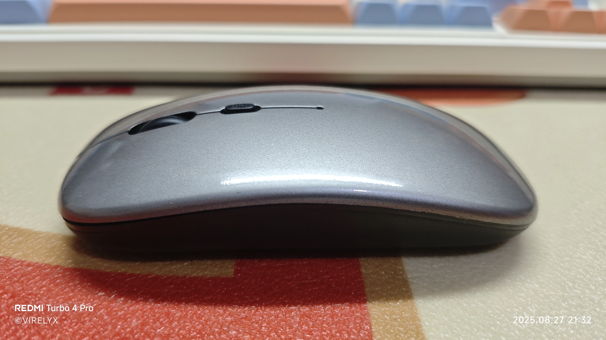

好久不见，朋友们。我这个失踪人口回归了。

今天是军训的倒数第二天，我已无法遏制心底的表达欲，再憋可能就憋出心病了。所以，我就先写到本子上吧，肯定写不完，后续再根据稿子自由发挥。这应该会是一篇万字长文。

本篇文章涉及到的方面很多，包括但不限于自我反思、经验总结和吐槽等。`校园生活部分`包含部分负面情绪，我表示非常抱歉。

关键词：`Vela开发初体验`、`军训七天`、`和平精英`、`新鼠标`、`暑期总结`。

## Vela 开发初体验

不知道 Vela 是什么的同学请先[移步这里](https://iot.mi.com/vela/quickapp/zh/guide/)

7 月 21 日，我于米坛社区看到了 [SimpleRSS](https://www.bandbbs.cn/resources/3740/) 这个小程序，在安装体验后发现其不能解析标准 RSS 源（如本站的 feed 链接），所以我心血来潮，加入了作者提供的的交流 QQ 群。

在与作者进行交流后，我发现 [@yzl3014](https://www.bandbbs.cn/members/427458/) 这位创作者很开朗且聊得来。所以我主动向他求助了一些有关 Vela 系统开发的问题，他一步步指导我入了门。在此之前，我对 Vela 开发都是一知半解，从来没有写出过一个能跑起来的软件。那天，我一步步摸索，写出了一个有基本用户界面的 Vela 快应用并安装到了手表上。

这把我兴奋坏了，我当即打算完成我前期渴望完成的一个 “梦”—— 做一个自定义网络请求工具，以实现我的远程控制需求。

就这样，我开始用即时设计，参考 [@无源流沙](https://www.bandbbs.cn/members/23192/)的界面，一步步设计界面、编写代码。面对功能需求，我每天都会遇到一些新的困难，但在 [@yzl3014](https://www.bandbbs.cn/members/427458/) 的协助下，这些困难都逐一迎刃而解。经历了五天的开发期，我的 Vela 处女作 ——[Poster](https://www.bandbbs.cn/resources/3869/) 正式上线。

软件的主要功能就是以快捷指令的方式一键向特定地址发送特定 POST 请求。利用这个特性，你可以自己搭建一个 API，然后利用手表来实现一些远程控制功能。比如一键关机、结束进程、运行程序等。同时，也可以利用该软件来实现智能家居控制等玩法。

此外，我还为该软件剪辑了宣传片，用尽了毕生所学，你可以去看看：[B 站](https://www.bilibili.com/video/BV1j7tRzqEw2/) | [抖音](https://v.douyin.com/8G3pNcYYvws/)

这次开发也标志着我正式入坑 Vela 圈，成为一名社区开发者了。在今后，我会努力产出更多优质的软件，希望大家多多支持。

> 本软件目前已适配 REDMI Watch 5 和 小米手环 9 Pro。

## 军训七天

8 月 19 日～8 月 26 日，我们前往学校报了到，并进行了为期七天的军训。这七天把我压抑得，我快要爆发了。

### 新环境

8 月 19 日上午，我在父母陪同下前往学校进行军训报到。进入新宿舍，一种熟悉又陌生的气息扑面而来：熟悉是因为它具备着与我初中宿舍相同的设施：柜子、水龙头和浴室；陌生，则是因为宿舍里有着五张陌生的面孔。

一号床看上去很彪悍，一直在盯着我看，让我有点毛骨悚然；二号床看着挺老实，挺冷静的，并没有对我的到来做出什么反应；三号床很开朗朴实，我们很快就打到了一块；四号床长得很帅，不爱说话；五号床则十分冷幽默。六号床… 就是我。

入住宿舍的第一晚，一夜无话。空调开到了 16℃，内机不断地嘶吼着，可室内温度却迟迟降不下来。我将被子扔在了床脚，身上只盖着一层短袖（就是日常外出时穿的短袖，很薄），可是脊背仍止不住地冒汗。就在这样潮湿的环境下，我昏昏睡去。

剩余的几天，我在宿舍生活得还不错，每晚都能准时睡着，睡眠时间也保持在 8 小时左右。空调制冷效果一天比一天好，内机设定温度由一开始的 16℃逐渐变为了 20℃、22℃、26℃…… 我仍记得，倒数第二天晚上，空调开 26℃，冻得我即使用被子捂住全身也仍能感受到寒意。当然，可能也有天气的原因 —— 我们从第三天军训开始下大雨，后续几天保持阴天。

### 军训服

学校军训，使用的服装是学校组织统一购买的的军训服，五十块钱。讲真，衣服穿上身的那一刻，我觉得这辈子买过最亏的物品就是军训服 —— 上半身就是劣质化纤，下半身的布料甚至会刺激我的腿。

在军训过程中，我也无意间听到了一位同学的吐槽：

> 从我家里随便拾一块破抹布的布料都比这个好。

我表示非常赞同。

这身衣服在功能上不透气、不舒适，在外观上也不符合军队标准，完全可以说是一笔智商税了。

### 宿舍

这算是我对这所学校唯二极度不满的地方。首先，以军训期间的作息规定为例：每天晚上 21:40 必须躺在床上，不能坐或站。每天宿管会逮出来一些 21:40 以后还未躺在床上的人。

这规定本身没毛病，但是之后的一条就让我很不理解了：

> 随着时间推移，晚就寝最后时间将会提前。

这意味着什么呢？

以后，如果 21:40 还未上床的人数为 0 ，那么学校就会去抓那些 21:39 上床的人，同理，如果 21:39 也没人违纪，那就去抓 21:38 上床的人，以此类推。

说人话，就是 “无论如何我都要给你挑出点毛病来”。鸡蛋里挑骨头，为了打压学生而打压学生，真做作！

### 课外书

军训倒数第二天的下午，班里自习课上。

我正手捧一本《意林・高票好文》进行阅读，这时，班主任走到我身前，一把翻过我的书，查看封面。她看完之后，我便重新将书翻了回去，打算继续阅读。可是，她嘴里吐出了六个字：“收起来，写作业”。

随后，她便转过身去，面向全班同学大声宣布：

> 跟大家说一下咱们学校的规定哈：班级里，你只能带与课本有关的资料，比如你的教辅。像是杂志之类的课外书，《青年杂志》、《意林》之类的，不允许带进教室，一经发现就没收，没有商量的余地。

讲真，我当时敢怒不敢言，气得身子都在发抖。因为所谓 “校规” 规定：不允许顶撞老师；而我所在的 “精英班” 规定：违反校规者直接降班型；而我的家长要求我 “无论如何都不要被赶出精英班”。

好一个死循环。我极力克制自己将要崩溃的情绪，双拳紧握。突然感觉鼻孔有点凉，我赶紧拿纸垫了一下 —— 好家伙，怒火攻心，流鼻血了。

我他妈才高一，不是高三高考生！为了升学率去限制学生阅读课外读物，妄图通过这种方法来让学生花更多时间投入学习，真是可笑。现在我终于理解了这学校之前为什么那么多跳的了。

### 感触

军训期间，我确确实实提前预习了一部分课本，因为实在是太无聊了。读到语文课本时，我感到了一种莫名的似曾相识。里面的大多数课文都是我在小学或初中遇到过的，有种见到阔别已久的老朋友的熟悉，但是一想到它是我高中三年要作为正式课程学习的内容，又有一种莫名的失落和恐惧。

语文有一篇课文叫《⟨我与地坛⟩节选》，史铁生写的。想要表达的感情是一种子欲养而亲不待的悲凉。我读得特别认真，心都碎了，甚至没忍住落了泪。如果在以前读这篇文章，我可能内心毫无波澜，不会激起任何对作者的共情。但就在这天我几乎全身心都代入进了作者。我感觉这是一种成长。当然，这也许是处于如此绝望的境界下的人的本能。

无独有偶。在经历了第一次强代入感后，我又一次在一篇《意林》选文中找到了自己的影子。原文是这样的：

> 亲爱的儿子：
>
> 
>
> 
>
> 今天是一个不愉快的下午。
>
> 
>
> 
>
> 我带你去买东西，本来高高兴兴的，没想到会在你的怨怼跟我的尴尬里收场。买衣服时你说这件不合适，那件不好看，大卖场里有二十多个摊位，被你走马观花地否定一遍…… **超市买了箱普通的盒装奶**，你抱怨为什么不买贵一点的。我说同一个品牌的牛奶差不多，过日子还是要精打细算些。你终于绷不住了，冲我埋怨： **“一天到晚就知道精打细算，你自己怎么不知道多挣点钱！”** 你气冲冲地直接走了，我独自拖着一堆东西回到家，埋怨我怎么不能多挣点儿钱……
>
> 
>
> 
>
> From：《意林 - 成长卷：何以为青春》P96 《给儿子的三条人生建议》

而我的脑子里快速想起了今年 5 月份的某一天，那天的日记是这样写的：

> 本周五晚上周考结束，18:30 的时候，我在路上和母亲通电话。她问我吃什么，我表示什么都不想吃，已累到没胃口。她说不行，多少都得吃一点。我和她拉扯了好久，中途我和她说想喝奶茶，她嗔怪了一声 “**奶茶不健康呀...**” 就沉默了。在我心中，我大概知道她拒绝了。所以我就没再请求，只是让她简单准备一碗鸡蛋羹。
>
> 
>
> 
>
> 回到家，发现母亲不在家中。“估计是出去买菜了。” 我想。突然，手表震动，母亲给我打来了电话 ——“**奶茶要哪个款式的？**” 没想到她居然答应了，不惜跑腿二十分钟去给我买一杯奶茶。我对着话筒激动地喊：“三拼霸霸奶茶，**冰的**！” 她听不清，于是我让她把手机递给了店员。说完需求之后，我便直接挂断了电话。
>
> 
>
> 
>
> 过了片刻，姐姐找到我：“妈妈不让你买冰奶茶。” 我直接绷不住了，甩了一句：“**那你让她别买了，我自己点外卖。**” 场面就在这时候僵住了……
>
> 
>
> 
>
> From：日记（2025.5.24）

现在想想，我当时真的好不懂事，好幼稚。不过好在我甩过去那句话之后不久就认识到了自己的错误，主动向母亲打了电话道了歉，并同意了买一瓶常温奶茶。后来我久久不能平静，就把这件事写成了日记。

这差不多也是一次蜕变，我感受到了父母以前对我的溺爱

### 内卷

没想到，这所学校的同学们比我想象中的要 “卷” 得多。

军训第一天晚自习，我在看语文课本，旁边的几位女同学拿着刚发的物理试卷在做；第二天晚自习，我看《意林》，旁边的同学在提前背语文古诗词……

我也尝试过去做学校发的页子，但奈何我是 7 月初上的衔接课，玩了一个半月，预习的知识全忘光了。所以，没做几道题我就放弃了。

同时，我心里也产生了强烈的危机感，怕自己开学后成绩垫底，怕同学们轻视自己……

此时，我忽然想起，我曾对**辅导班**抱有很大敌意，曾绞尽脑汁开发[火苗会议调试器](https://virelyx.com/980/)，只为**更舒服地 “摸鱼”**…… 我真的太后悔了。当时摸的鱼，接下来都将变成 **成倍的负面效应**反馈到我身上。

其余时间，比如早上七点整，同学们用完早餐，纷纷走向操场，等待教官要求集合。这段时间里，班主任要求我们必须 “带上语文诗词小页子背诵”。每天晚自习要 “抽查背诵”，如果抽查不合格，就到教室后面一直站着，直到会背为止。

### 军训结束前的心情

之所以单独划分一个板块来写，是因为这种心情太深刻了。

军训结束倒数第二天晚上，教官带领同学们从下午 17:30 开始一直拉练到晚 21:10。这期间，我的面部多次表现出 “时笑时哭” 的狰狞表情。正如所描述的，我当时就是一种 “想笑不会笑，想哭哭不出” 的心情。

“想笑” 是因为我距离军训结束只差最后一晚上了，“不会笑” 是因为我在这里感到的压抑感太强了，真心笑不出来；

“想哭” 是因为即将与眼前的这位帅气、温柔且富有爱心的教官说再见了。不，是再也不见。“哭不出” 则是担心形象扫地。。

看到这里，你可能会问我为什么会对 “暴虐” 自己七天的教官有如此正面的评价。我想说，相比于其他班的教官，他爱吹牛 b，幽默风趣，总是能逗我们笑；他不吝啬以身试法买饮料奖励我们，并说 “哪怕掏空我的钱包”；他总把我们班拉出去与别的班 “比赛”，扬言 “一定要把‘七班最强’这个名声打好”。

## 和平精英

这估计是每逢假期不得不提的一个话题。废话不多说，上时间统计。

| **日期**   | **游玩时长**   |
| ---------- | -------------- |
| 7 月 7 日  | 6 分钟         |
| 7 月 10 日 | 42 分钟        |
| 7 月 11 日 | 小于 1 分钟    |
| 7 月 12 日 | 5 分钟         |
| 7 月 13 日 | 6 分钟         |
| 7 月 16 日 | 50 分钟        |
| 7 月 18 日 | 1 小时 31 分钟 |
| 8 月 7 日  | 1 小时 40 分钟 |
| 8 月 9 日  | 1 小时 5 分钟  |
| 8 月 10 日 | 1 小时 12 分钟 |
| 8 月 12 日 | 1 小时 47 分钟 |
| 8 月 14 日 | 1 小时         |
| 8 月 15 日 | 1 小时 11 分钟 |
| 8 月 16 日 | 47 分钟        |
| 8 月 27 日 | 1 小时 22 分钟 |

我对这个暑假的游戏时间管理还是比较满意的，每天都控制到了 2 小时以内，并且总游玩时长也并不多。

期间有几天，我那在上班的堂姐主动找我玩和平，我便陪着她一块玩，那几天的我，很快乐。

## 新鼠标

军训七天回家之后，发现自己服役了一年多的杂牌鼠标滚轮暴毙了。才放了七天，滚轮就出现了上下滑动乱跳的情况。

于是我也没多想，骑着车前往自家附近的小米之家提了一个小米双模鼠标。（零花钱 -￥69）

结果您猜怎么着，我买它就是奔着它支持 2.4Ghz 无线 + 蓝牙双模连接去的，但回家一试，发现我的 2013 款 MacBookPro 死活搜索不到它。而我的手机、平板都可以正常搜索和连接使用。可能是我电脑的蓝牙版本比较低吧，所以我就接了个扩展坞，把它和键盘接到一块用。

鼠标个头挺大，握起来有点质感。惊喜的是它在这个价位居然给了肩键。当然，可能是我没用过带肩键的鼠标，不知道价格情况。（笑）

## 总结

这个暑假，我做了比较多的事情：

1. 武汉六日游
2. 编写了 Vela 应用程序 “Poster” 并剪辑宣传片
3. 完成了蓝屏工具箱后端重构
4. 开发了软件 “火苗会议调试器”
5. 开发了软件 “田字格生成器”
6. 预习了新高一的数学、物理、化学课程。

总之，这个暑假，大多数时间都用在了开发上，同时也实现了劳逸结合。

还有三天，我的初升高暑假就结束了。在高中毕业前，即使再有假期也不会像现在这样无忧无虑了。经过了七天军训，我感到身心俱疲。这几天我要好好休整一下，准备迎接崭新的学期。高中，加油！

开头说的万字长文其实没做到，只有 4968 字。哈哈，吐出心声的感觉真好。感谢你的聆听。
