晚上好，朋友们。今天下午三点半，我准时蹲守，观看了小米澎湃OS3的发布会。看完之后，我心血来潮，因为我突然感到了小米做系统的认真和负责。所以，我撰写了本篇文章，希望能帮助大家理解，小米澎湃OS 3，究竟更新了什么。

> 声明：文章封面图素材来自小米官网，非商用，仅作为封面，如有侵权，敬请[通知我](mailto:hi@virelyx.com)，我将立刻删除。
>
> 本人仅根据发布会内容进行分析，文章所有观点仅代表本人个人观点。

## 新功能

相信这是米粉们最期待的。

小米澎湃OS 3的更新包括但不限于`**超级岛**`、`锁屏`、**`相册自定义`**、`**系统界面**`、`**相册**`、`**互连互通**`、`系统应用优化`、`**超级小爱Agent模式**`、**`查找手机`**、**`强制性隐私权限控制`**等。其中，标粗的部分是我个人觉得很厉害的更新。大家也可以自行跳转到对应栏目进行浏览。

### 超级岛

万众期待的“灵动岛”，小米这次终于安排上了。不过，小米澎湃OS3的“超级岛”融入了用户的反馈和小米自己对于岛这一组件的思考。

#### 空间效率提升

金凡在发布会上是这么说的：

> 我们认为，灵动岛并不是为了去遮挡屏幕上的摄像头，而是为了让用户更方便地了解此刻正在发生、需要重点关注的信息。

发布会上展示的灵动岛的第一个场景就是充电。只见超级岛右侧的闪电图标不断发出荧光，并且还会有彩虹光晕状的光圈向外扩散，整个动画十分优美。

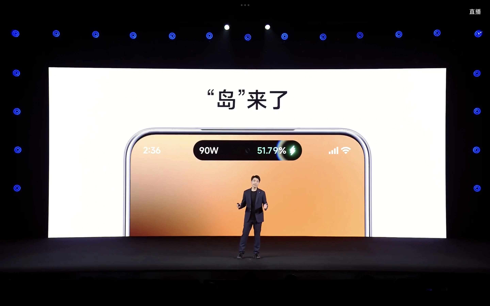超级岛充电状态效果

金凡列举了目前业界的两个灵动岛流派。它们分别是“单岛流”和“双岛流”。前者应该是OPPO的ColorOS岛形态，后者…我才疏学浅，没认出来是什么品牌。请大家见谅。😅

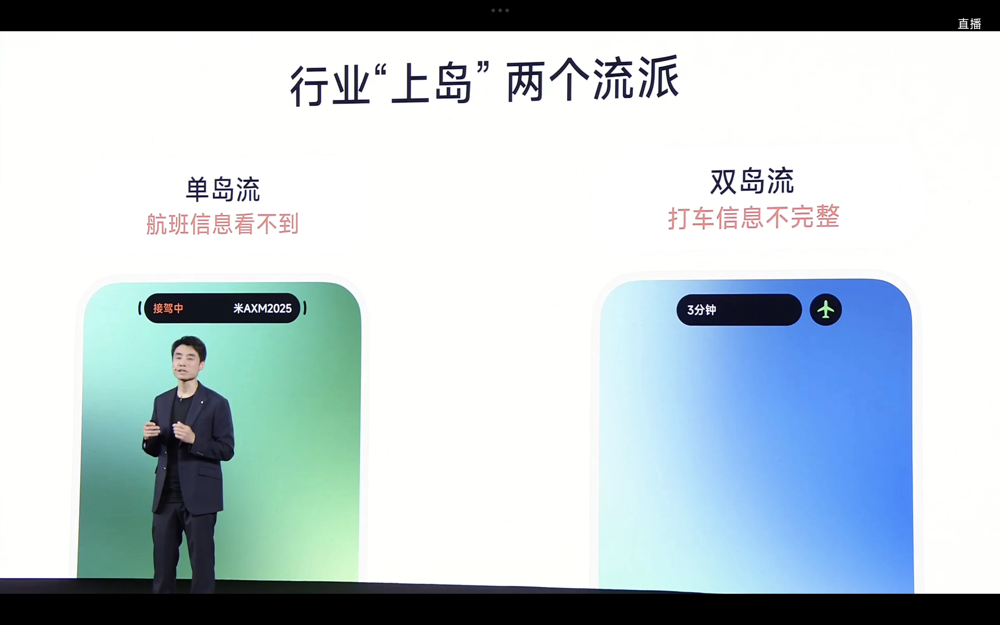灵动岛两大流派

二者各自都有各自的不足。比如，左侧的“单岛流”，在形态上只有一个大岛。虽然显示的信息比较完整，但是只能显示一条信息。如果同时有多个应用登岛，那么只能显示其中一个应用的信息，效率有限。

右侧的“双岛流”，形态上是在大岛的基础上分为了另一个圆形小岛。但是虽然能看到航班图标了，但打车的信息显示得不完整了。

第二个问题来了。当用户点击灵动岛之后，会发生什么呢？

业界的灵动岛展开后也分为了两个流派：“分离派”和“包裹派”。

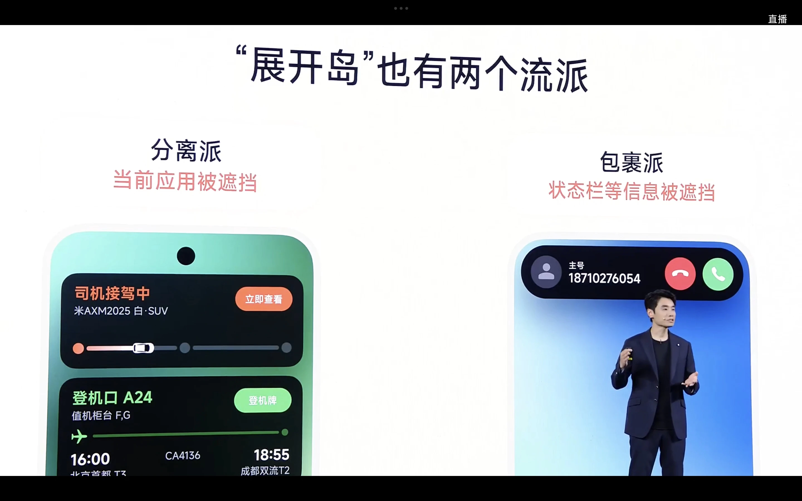业界灵动岛的两个流派

这里“分离派”应该是代指OPPO的ColorOS一类灵动岛，“包裹派”则是代指苹果的iOS一类灵动岛。

“分离派”即为原胶囊状的“岛”下沉，并变为卡片，来展示详细信息。若同时存在多个应用上岛，则自动分裂变为多个小卡片。它有一个缺点——当登岛的应用过多时，信息卡片会遮挡住前台应用的画面，反倒降低了用户获取信息的效率。

“包裹派”即为胶囊“岛”的Y轴位置不变，沿X轴方向向两边延申，某些情况下也会增大高度。设计的初衷大概是“我一定要遮挡住摄像头”，可是这样做却遮挡住了任务栏的图标，某些关键信息也被遮挡了。

既然都有各自的缺点，那怎么办呢？

为此，小米澎湃OS 3给出的答案是——***定制超窄字体，小空间也能展示大内容\***。

定制超窄字体，小空间也能显示大内容

最多支持三岛同台，并且不遮挡任务栏图标。空间利用率“杠杠的”。

<video controls="" src="https://virelyx.com/wp-content/uploads/2025/08/20250828083651444159.mp4"></video>

三岛同台 和 动画展示

#### 动效优美连贯

通过视频可以看到，小米澎湃OS 3，不仅在信息展示效率上有了进步，而且它的动效是共同进步的。

当有电话通知弹出时，右侧的“接听”按钮会产生绿色的环状光晕并不断扩散。

当有音乐卡片时，卡片下方会有类似音频波形的动态光晕。

当用户进行多岛切换时，动画曲线也是十分优美，这几点体现了小米澎湃OS一直以来的优秀审美。

#### 操作逻辑便利

小米的超级岛这次也融入了小米用户常见的通知悬浮提醒元素——下拉条。

友商的灵动岛在展开后只能够再次点击跳转到应用，而小米则给了用户第二种选择——下拉之后呼出应用悬浮窗。这种方案则给了用户一种更便捷的信息查看方式。

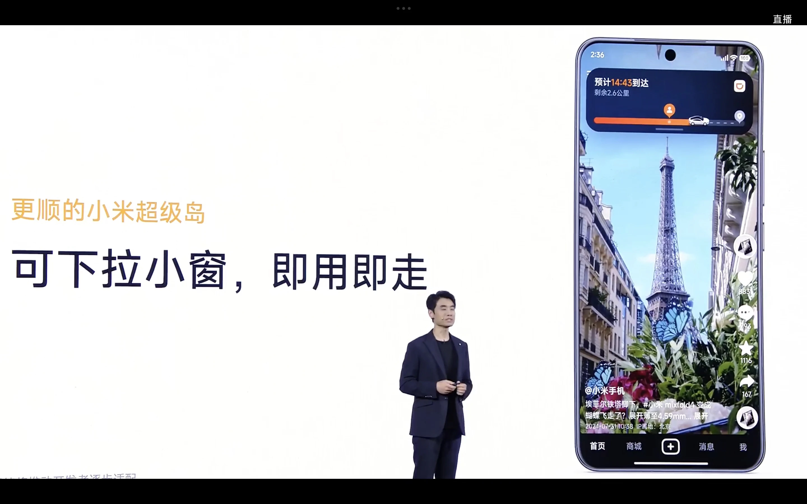

另外，当你在打车途中，需要将自己的行程信息分享给微信好友时，你会怎么办？大概率是进入对应的APP，然后手动点击分享按钮，再来发送，对吧？

而在小米澎湃OS3中，你只需要按住超级岛中的行程信息，将它拖到微信窗口内，即可直接分享。

<video controls="" src="https://virelyx.com/wp-content/uploads/2025/08/20250828085317393217.mp4"></video>

小米超级岛 拖拽分享行程信息

### 锁屏

小米澎湃OS 2的“电影感锁屏”广受大众喜爱，这是众所周知的。

金凡提到，锁屏壁纸动态化可以加深锁屏的故事感。但是大多数用户拥有的只是静态照片，所以澎湃OS推出了AI生成动态壁纸的功能，这是澎湃OS 2就有的功能。

#### AI风格化动态壁纸

在澎湃OS 3中，新增了“AI风格化动态壁纸”功能。即AI可以根据真实人像照片，来生成各种风格的动态壁纸——动漫风、手绘风，油画风等。旨在让动态的瞬间更有趣。

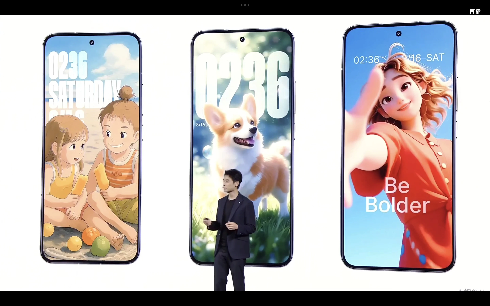AI风格化动态壁纸

#### AI二次元动态壁纸生成&景深效果

此外，小米澎湃OS 3支持了二次元静态图片的动态化。同时，生成的二次元动态壁纸也支持景深效果。

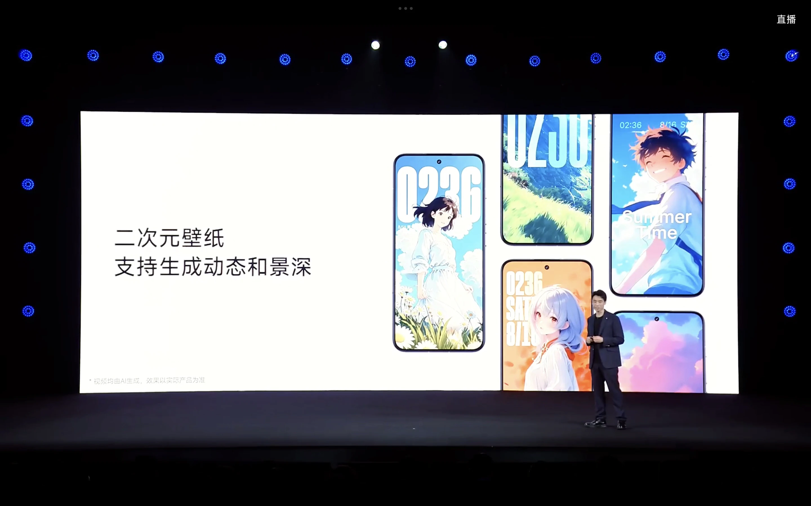AI二次元动态壁纸

#### AI动态壁纸支持分享

还有就是，AI生成的二次元动态壁纸，现已支持分享。用户可以通过小米互传来面对面分享，亦或是分享到社交媒体上。

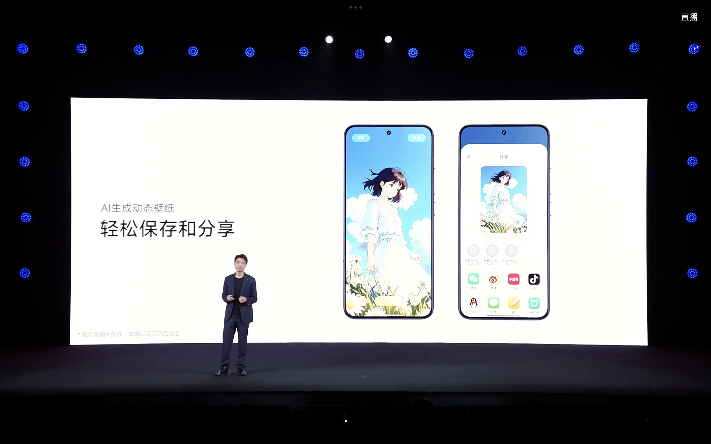AI动态壁纸分享

#### 在线AI动态壁纸社区

受限于当今的AI技术，小米澎湃OS每生成一张AI动态壁纸都要耗费用户3~4分钟的时间。这是技术瓶颈限制了AI生成能力。为了缓解这个问题，小米澎湃OS 3中的AI动态壁纸页面加入了在线壁纸的页面，用户可选择性地将自己生成好的AI动态壁纸分享到这个“社区”里面，其他用户则可以从这个“社区”里面直接下载已有的动态壁纸进行使用。

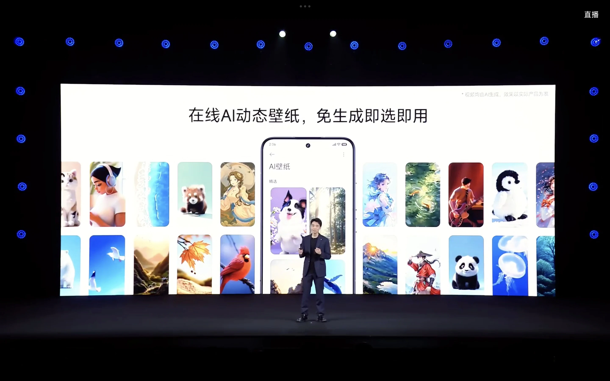在线AI动态壁纸社区

#### “中正”的大数字锁屏？？？

小米澎湃OS 3中，加入了一批以时间等元素居中为主体风格的锁屏样式，金凡管这叫“中正”风格。

这种风格，也确实符合人物锁屏的规律，毕竟不遮挡人物的脸和腿，能够体现出美观性，营造出更强的空间感。

但我不觉得这种设计哪里好看。大家根据自己喜好进行尝试。

大时钟锁屏

#### 壁纸设置入口统一

在小米澎湃OS 1和2中，用户如果想要设置锁屏样式，只有在锁屏界面长按这一个入口。而有些用户想要用相册深处的某张特定照片来设置壁纸，从锁屏界面设置就会导致重新翻阅查找，很不方便。

于是，在澎湃OS 3中，壁纸设置有了统一的入口。不管用户在相册还是在锁屏，只要点击了个性化设置，就会自动跳转到统一设置窗口。在这里，用户可以完成有关壁纸的所有操作。包括壁纸动态化、大时间样式更换、一键设置景深效果。非常方便。

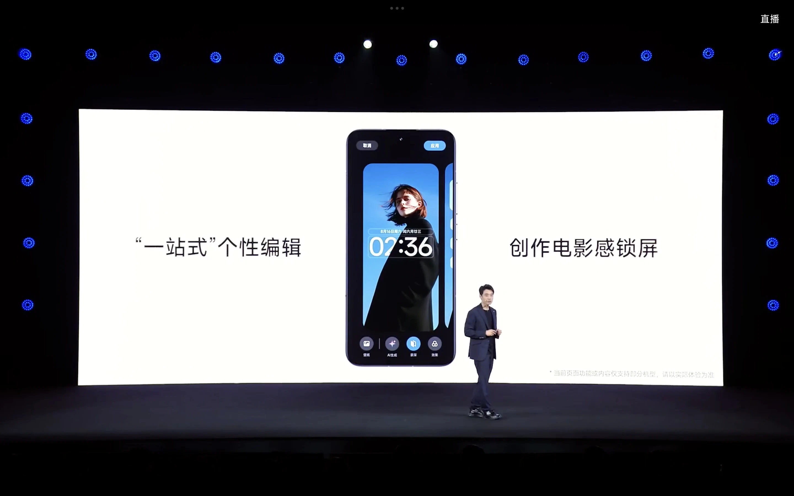一站式个性编辑

### 系统界面

小米澎湃OS 3这次系统界面也进行了大改版。桌面布局、状态栏图标、系统应用界面都或多或少地迎来了改变。

#### 桌面搜索框终于没了

时隔多年，横跨多个MIUI和HyperOS版本，那个一直陪伴小米用户的桌面搜索框终于被“干掉”了。不过它并没有消失，而是被挪动到了原页面提示点的位置。这一点学习了友商。

同时，为了适配多种桌面布局，小米澎湃OS 3对桌面网格进行了重新分配，不过对一般用户而言，感知不会很明显。

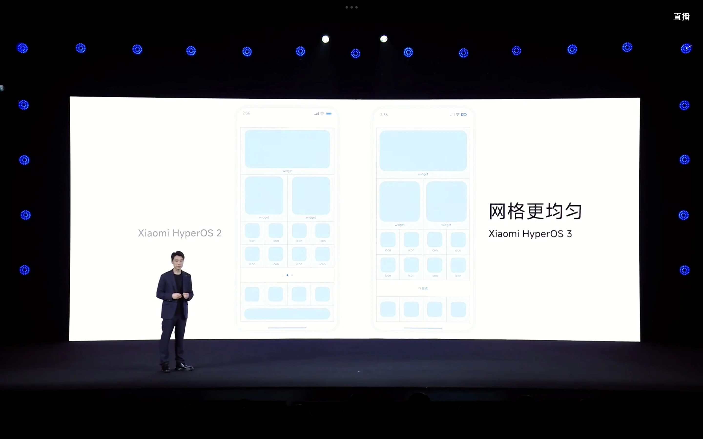网格均匀 & 搜索框换位置

#### 状态栏图标终于改了

自从MIUI以来，小米系统的状态栏图标就饱受诟病。比如电量百分比，在设置为“显示在电池图标内”时，字体比蚂蚁还要小。

在小米澎湃OS 3中，任务栏图标终于迎来了重构，电量百分比数字显示更大了，整体更易读、更清爽了。

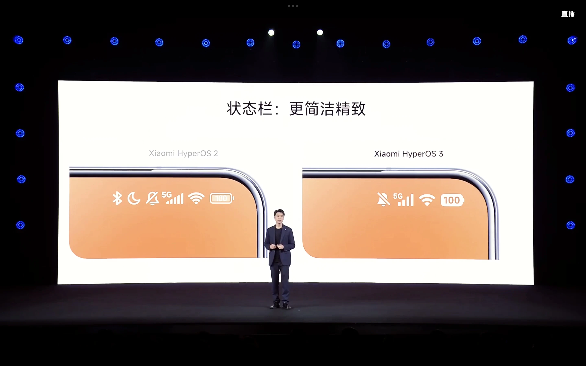状态栏图标重构

#### 桌面图标焕新

小米这两年的图标更新频率极快。从MIUI 14到HyperOS 1大改了一次，而仅间隔了两个版本，在澎湃OS 3中，应用图标再次大改。

（不过这次似乎改得有点像华为？）

应用图标大改

#### 多个场景界面焕新

- 通话界面的快捷操作按钮添加了独立的圆形遮罩；
- 控制中心加入了多彩图标；
- 耳机弹窗删去了“取消”按钮，取而代之的是右上角的“关闭”按钮；
- 天气页面上划后显示的卡片不再是白色遮罩，而是模糊背景遮罩。

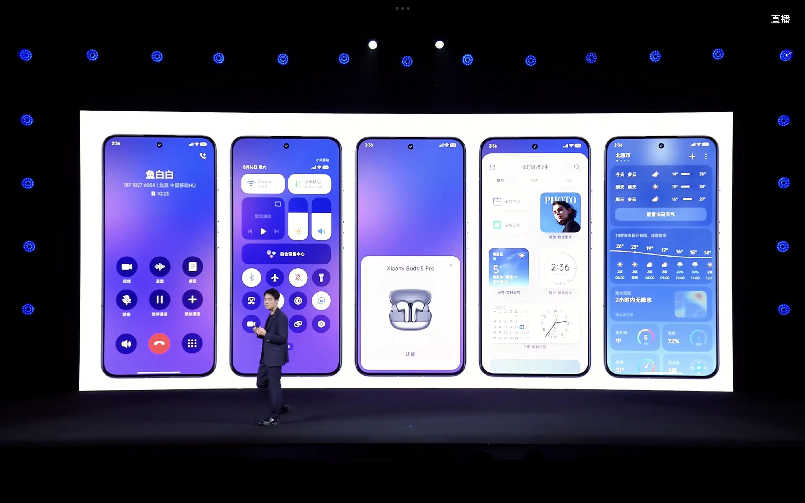系统多个场景界面焕新

### 相册

仍记得母亲一直不愿购买小米手机，只因小米相册的排序逻辑十分单一——按修改时间排列。编辑一张图片后，编辑后的成片会出现在相册第一个位置。这种逻辑对于我们年轻人来说还是可以习惯的，但是对于母亲，就是适应不了——她只能接受编辑后的成片出现在原片的旁边。

而这次，小米相册大改了。

#### 开放自定义设置照片视图、照片排序

金凡在这里列举出了三组矛盾：

- 首页照片：有人喜欢“平铺”展示，有人喜欢“按日分开”展示；
- 排列方式：有人喜欢“按添加时间排列”，有人喜欢“按拍摄时间排列”；
- 第二页：有人喜欢放置“自定义相册”，有人喜欢放置“发现和聚合”模块。

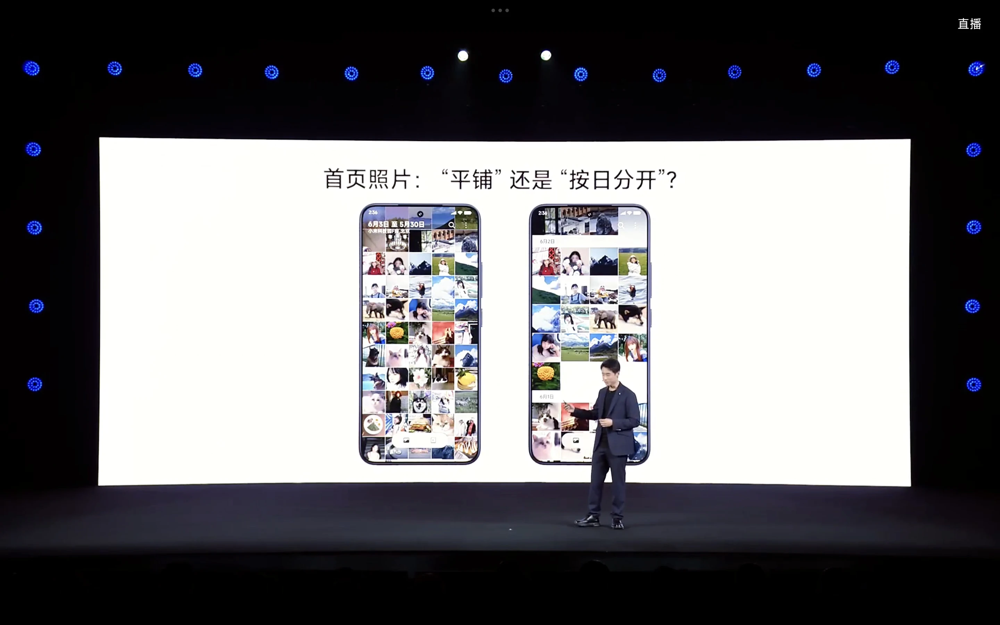

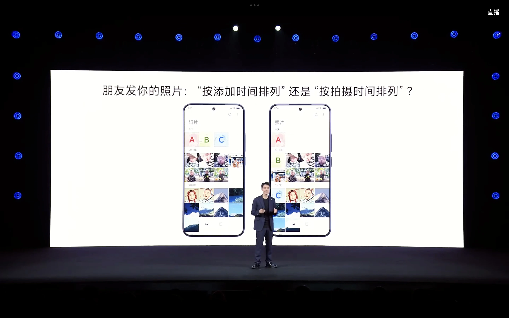

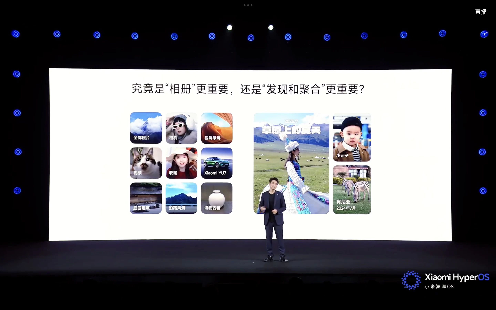

面对这三重矛盾，金凡选择了将选择权交给用户。

首先就是首页自定义，允许用户自行选择首页照片视图、照片排序方式。

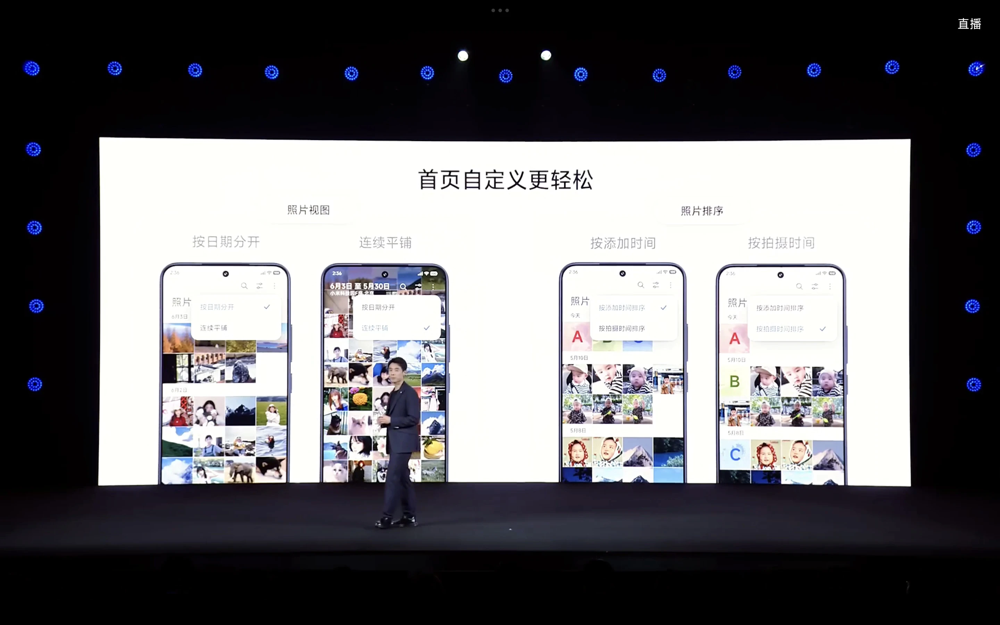相册首页自定义选项

#### 宠物特征识别

金凡在这里举了个例子：当你想要找到自己家猫咪的照片，但你的相册里拍的还有其它猫咪的照片，此时搜索“猫咪”，那么所有有关猫咪的照片就全都被搜索出来了，想要找到自己的猫，仍是一个难题。

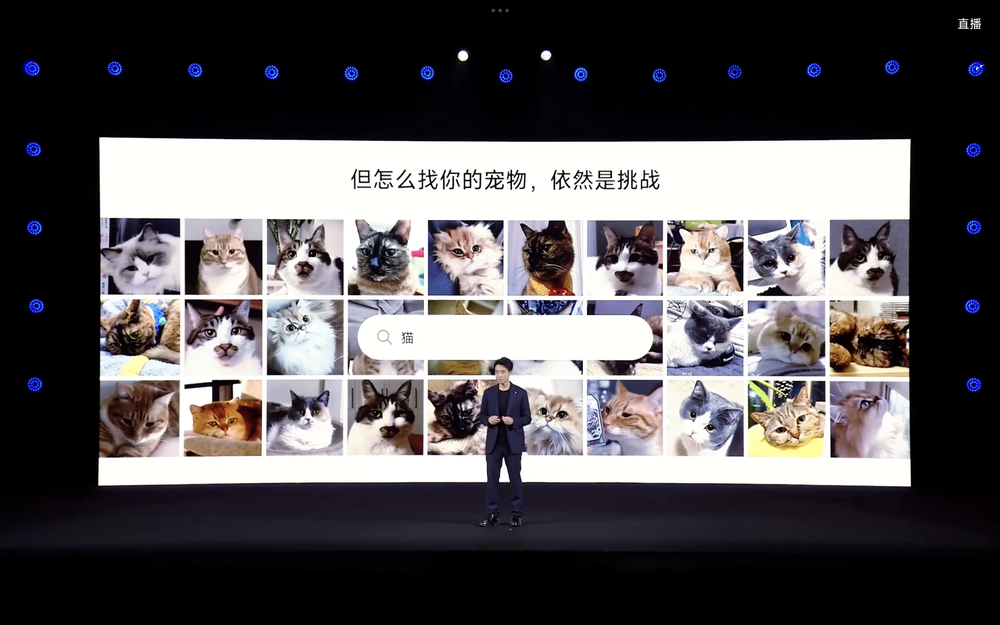怎么找到自家猫咪的照片仍是挑战

澎湃OS 3运用了一个比较聪明的做法。它将人脸识别的部分技术用在了宠物特征识别上，通过分析宠物的毛发特征等，来辨别出是否为自家宠物。

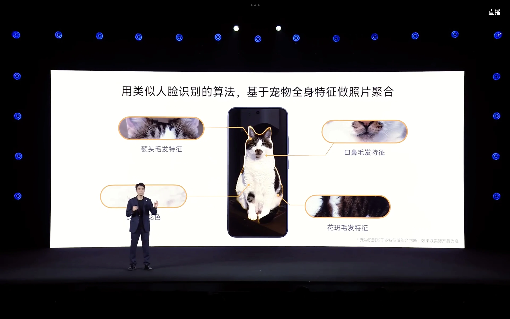宠物特征识别

同时，用户也可以像添加人脸相册一样，添加宠物相册了。

宠物相册

### 互联互通

澎湃OS 3中，互联互通变得更加直接、强大了。

#### 贴贴分享

这个功能小米也是跟进上了。即用户想要分享照片时，将手机背面与他人手机碰一碰，即可完成照片传送。

据说，这样子传输的速率很快，十秒钟能传一百多张。

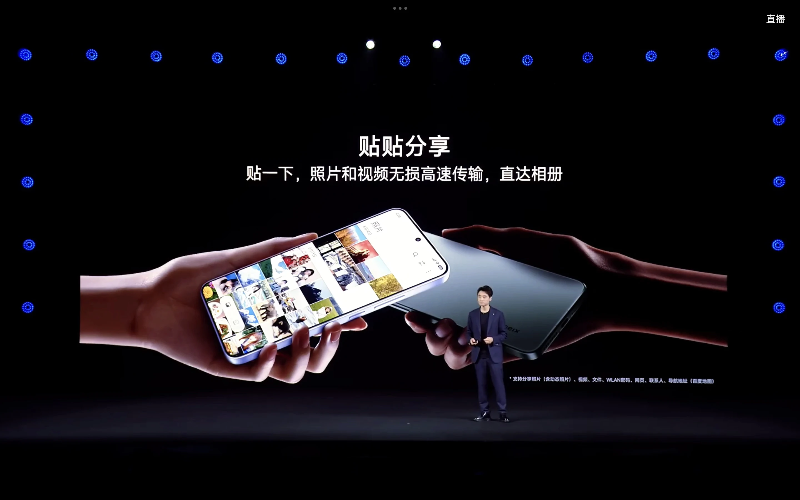贴贴分享

#### 苹果生态互联

在澎湃OS 2中，小米已经实现了在Mac上控制小米手机的功能。但是，这个功能似乎只是一个投屏形式，实际上只是用电脑操作手机屏幕。并且，当手机锁屏时，仍需要在手机端解锁后才可继续使用，比较麻烦。

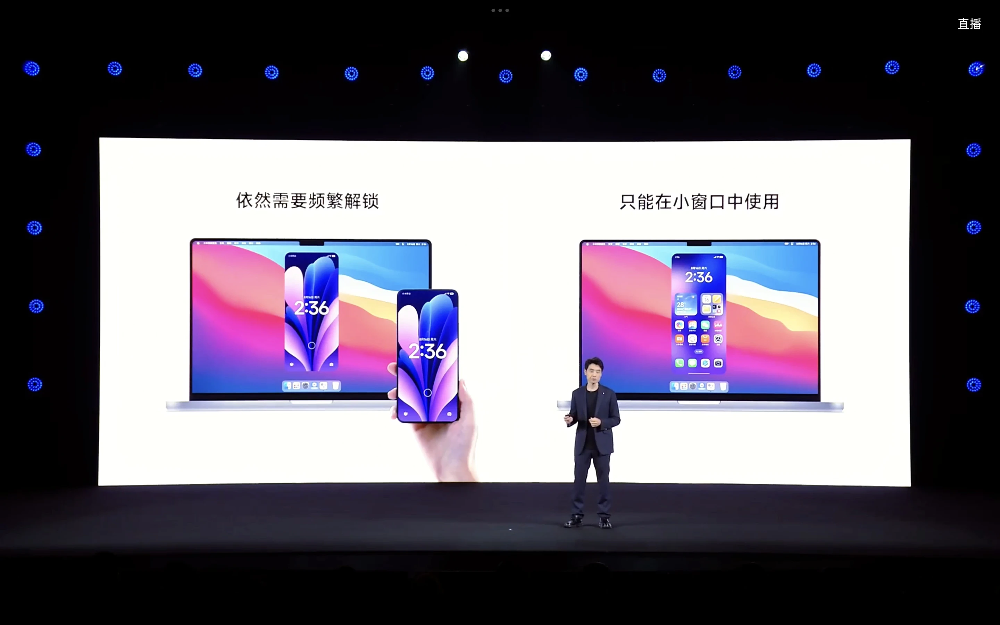Mac控制小米手机的局限性

但是在澎湃OS 3中，首先是支持了电脑端的Touch ID解锁。Touch ID识别通过后，手机端就可以解锁。非常方便。

支持触控ID解锁

另外就是一个重大更新：手机应用也能“大屏显示”。顾名思义，当你在手机上打开某个应用时，你可以在电脑端选择将它作为一个独立窗口分离出来。此时，程序就会以窗口形式显示在你的电脑桌面上，并且界面也会随之改变，有效提升了操作效率。

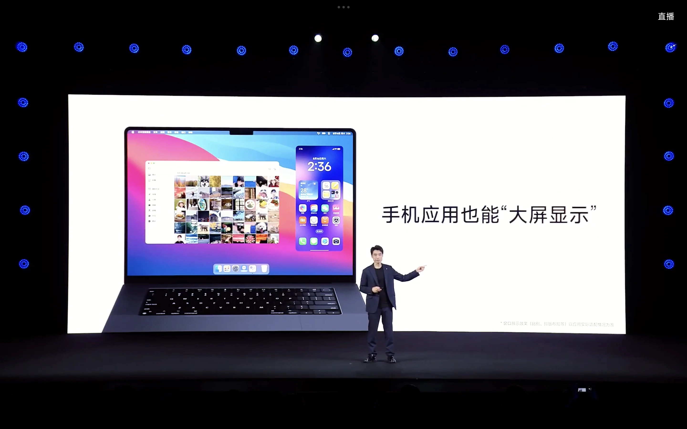手机应用也能“大屏显示”

同时，这个应用窗口化功能支持多个窗口同时开。并且也针对不同种类的应用做了类似平板端平行视窗的适配。比如微信，就会显示为左侧聊天列表，右侧聊天窗口的样式。

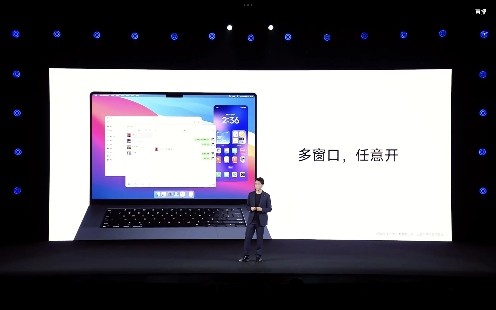多窗口，任意开

#### iPad互联再进化

这里稍微快点带过。首先就是小米手机支持与iPad互联了，iPad可以使用小米妙享桌面，并且iPad端也支持使用面容ID解锁了，如图1；同时，iPad端的小米妙享桌面是以浮窗的形式显示，融合了iPad的后台机制，金凡表示“浑然天成，毫无违和感”，如图2。

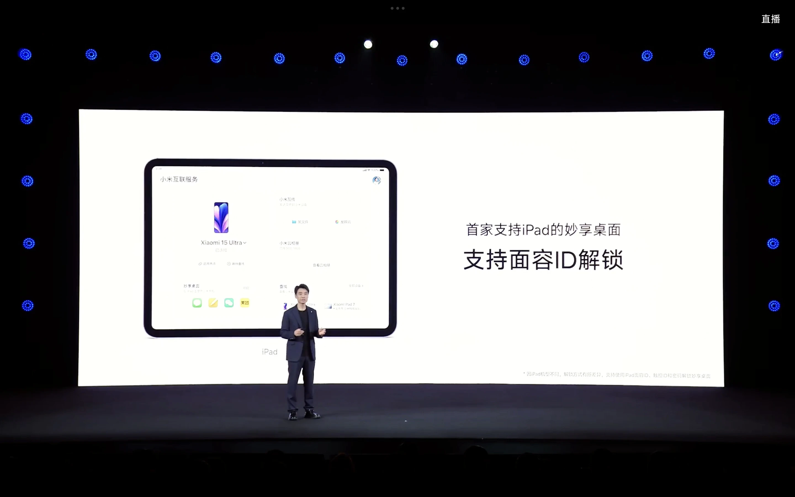

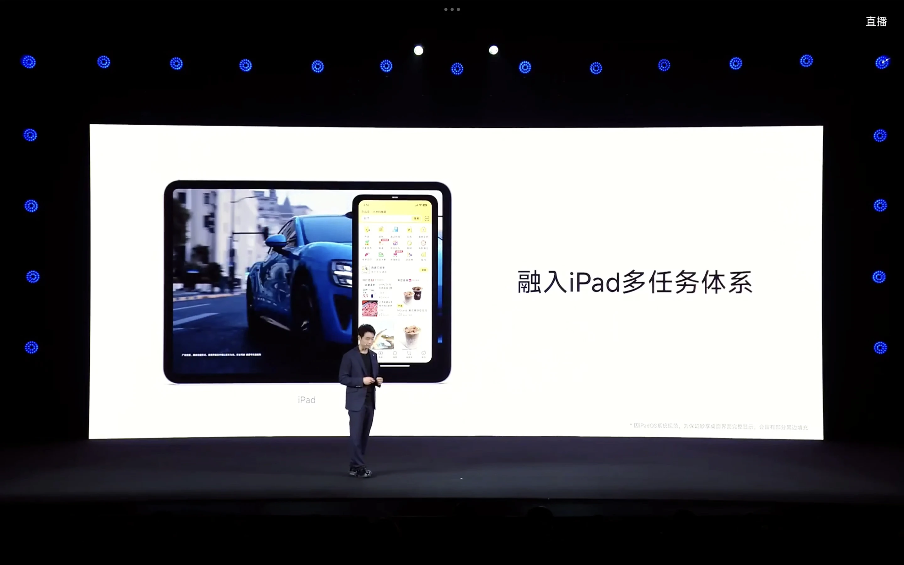

#### iPhone互联再进化

对于iPhone和小米双持用户，如果想用小米手机拍照，并在iPhone上查看拍摄的照片，如果在以前，需要手动通过小米互传来一张张传递照片。而现在，小米澎湃OS 3实现了云相册的互联互通，用户只需要在iPhone端APP上登录小米账号，即可实现小米云相册互通，无感查看小米云相册图片。

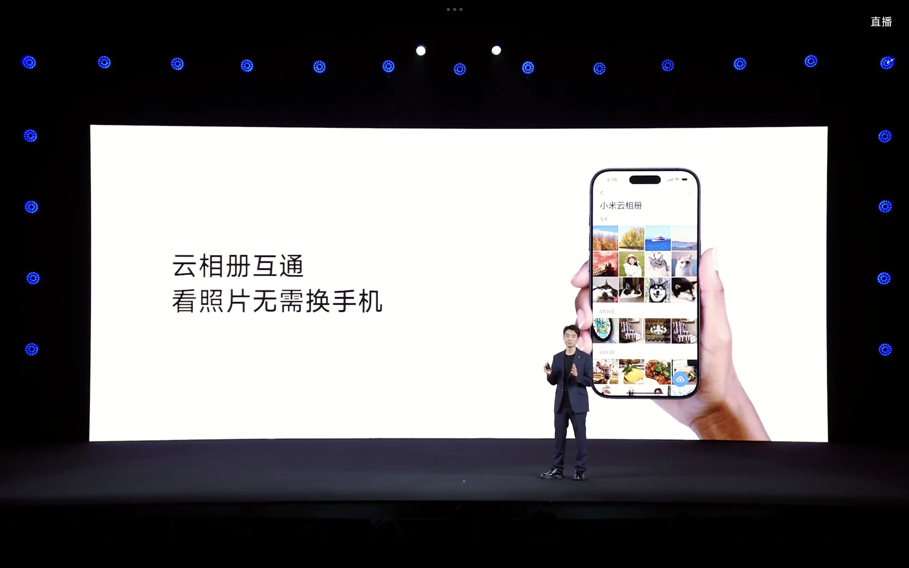iPhone端轻松查看小米云相册

同时，在小米云相册界面中，有“分享”按钮，点击它，即可直接将小米云相册中的照片分享到任意位置：隔空投送、社交媒体，随心所欲。

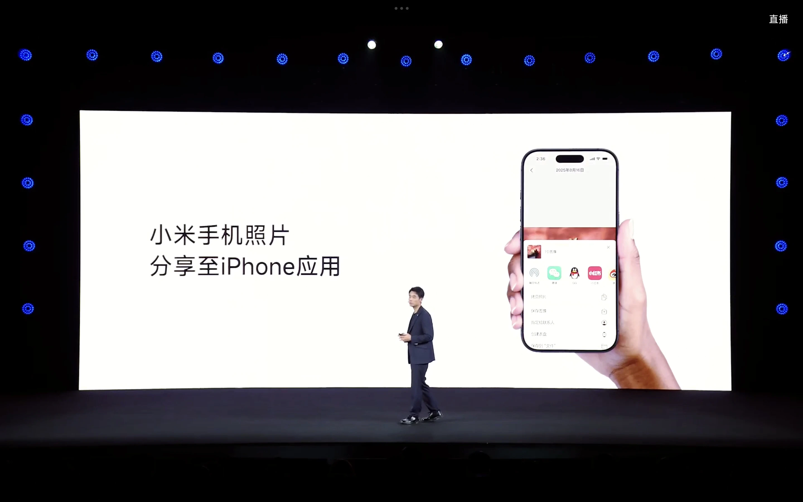iPhone轻松分享小米云相册照片

在小米澎湃OS 3中，iPhone和小米手机支持双向的消息同步了。

当你的小米手机来消息时，iPhone也会自动弹出提醒（如图1）；当你的iPhone来消息时，小米手机也会弹出提醒（如图2）。

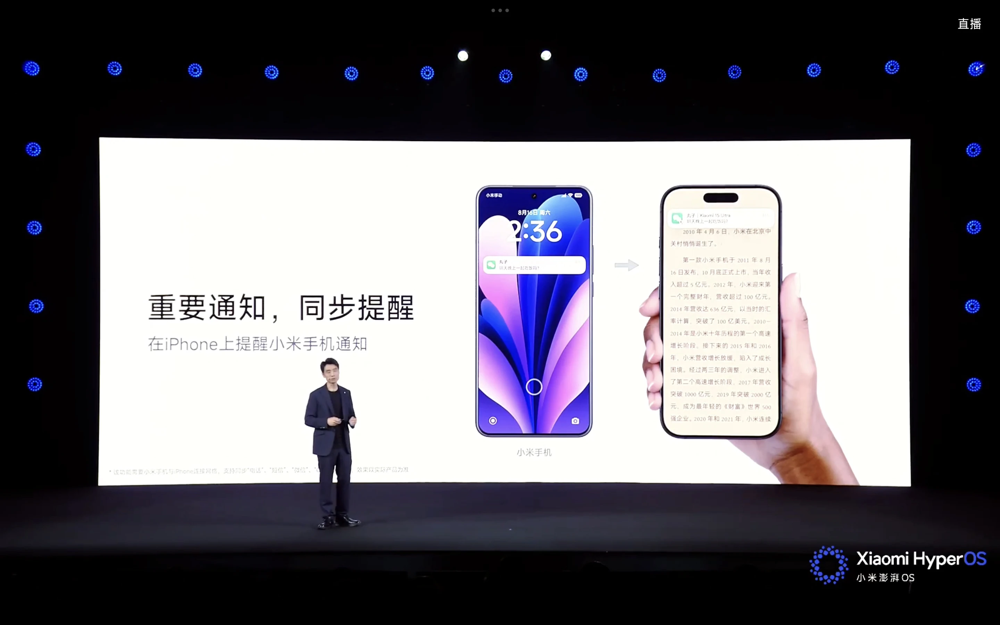

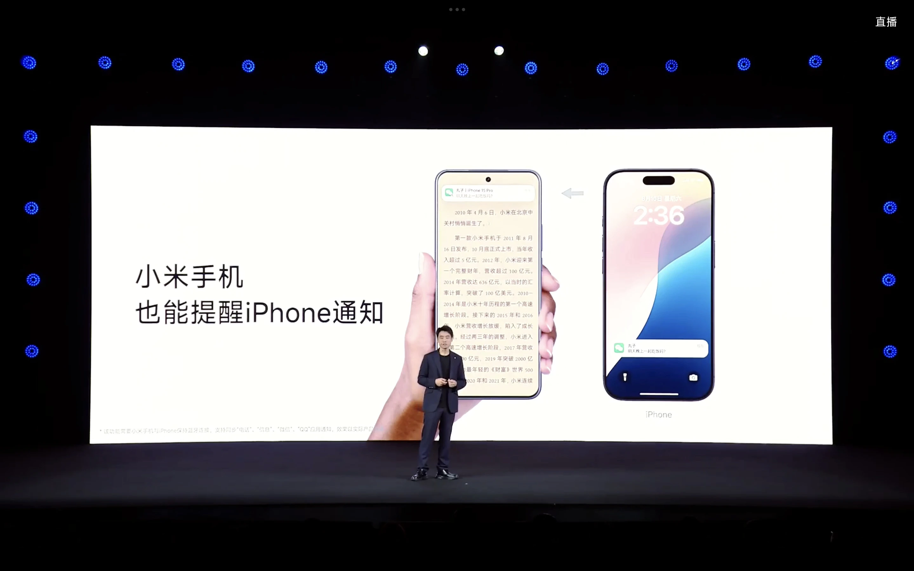

更绝的是，当你在iPhone上点击小米手机的通知提醒时，iPhone会自动拉取小米手机的屏幕镜像。此时，iPhone端支持对小米手机的控制，就像是在iPhone上使用微信一样。

<video controls="" src="https://virelyx.com/wp-content/uploads/2025/08/20250828110350918786.mp4"></video>

iPhone直接拉取小米手机屏幕镜像

### 系统应用优化

#### 分屏支持更多比例

小米澎湃OS 2及以前的系统都有一个饱受诟病的地方：应用分屏模式太过单一。

在最新的澎湃OS 3中，平板端支持了1:9分屏、上下分屏模式，满足了更多用户的需求。

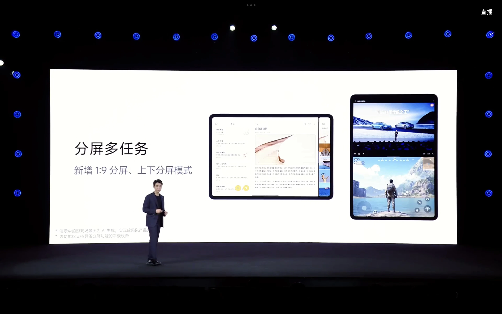更多分屏模式

#### PC级浏览器

在小米平板上，浏览器APP推出了新界面，整体更像PC端浏览器了，并且官方承诺支持TOP100的电脑端网站。

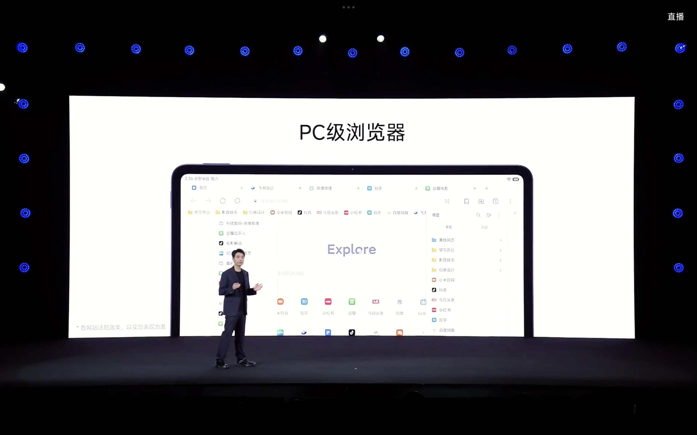PC级浏览器

#### 超级小爱Agent

历时许久，超级小爱终于支持了Agent模式，即直接接管手机来完成某些特定操作。只不过目前这个功能处于初期，在接管手机之后进行的操作可能会有些许停顿。但超级小爱在不断学习进化，估计在将来，超级小爱Agent的操作速度会逐步提升。

<video controls="" src="https://virelyx.com/wp-content/uploads/2025/08/20250828114742537635.mp4"></video>

超级小爱Agent

### 查找设备

查找设备新增“关机自动广播”功能，这个功能非常实用，需要用户手动开启。原理大概如下：

某人的小米手机丢了→小米手机被其他人捡到→小米手机被关机

此时，如果是以前，可能这部手机就“人间蒸发”了。

但现在，搭载小米澎湃OS 3的手机，在关机后，会自动向四周发送加密后的广播，广播自己的实时位置。而附近的小米手机如果接收到广播信号，就会自动向小米云服务器发送丢失手机的状态。即“一方有难，八方支援”。

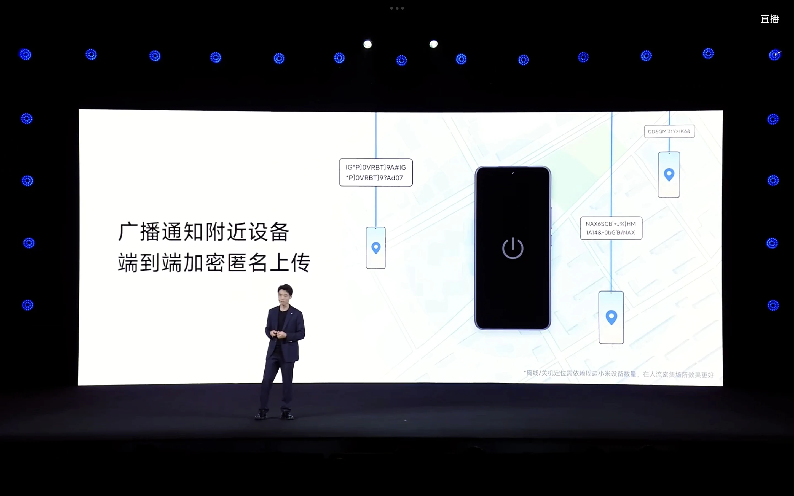关机后自动广播查找信号

这个功能非常硬核，也非常实用。在这里我也想向各大手机厂商**提一个建议**：可以整一个**业内标准协议**，这样，**任意品牌**的手机丢了，附近的**其它品牌手机**接收到广播信号也可以向**对应品牌服务器**上传查找信息。这样，用户手机丢失后，找到的几率就会大大提升，最终造福的也是用户。

### 强制性隐私权限控制

类似于纯血鸿蒙系统的“图书管理员”概念，澎湃OS对于应用选取相册图片的逻辑，由原来的“允许用户选择‘可访问全部相册’”改为了“强制性使用媒体选择器”。

也就是说，以后不管任何应用，当需要使用照片时，只能调用澎湃OS自带的媒体选择器来选择照片（如图1）。严格控制权限，只为保护用户隐私。

像是应用选择文件、日历创建日程、联系人读取、剪贴板读取，都加入了严格的权限控制弹窗（如图2）。这下，澎湃OS的安全性可以看齐鸿蒙了。

不过这样的话，像是微信、QQ等自带图片选择器的软件，可能就需要单独做适配了。某软件的注释里，可能会再出现一次“Fxxk Xiaomi”了。（笑）

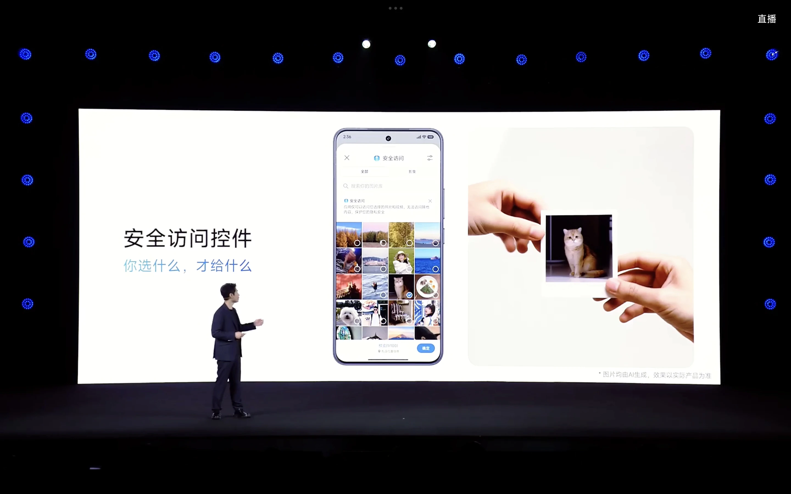

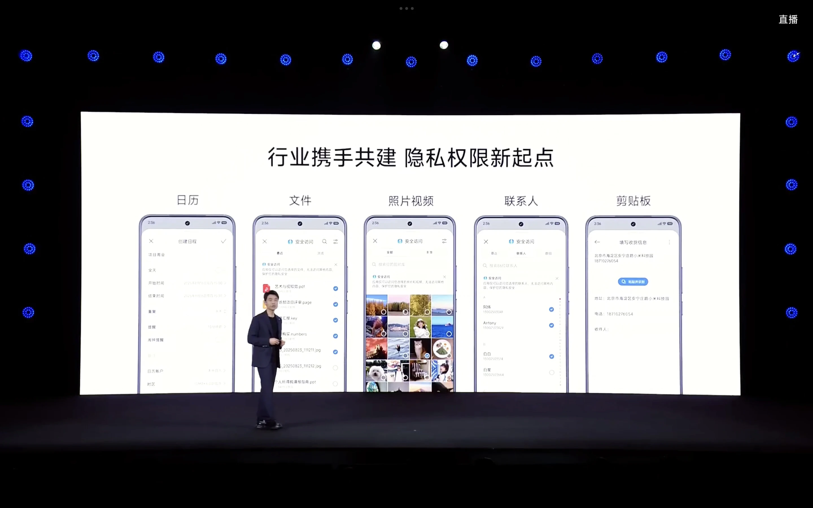

## 优化

小米澎湃OS对于性能的调度也在趋于成熟。在小米澎湃OS 3中，应用打开的响应时延（即，你点击应用图标和应用开始弹出并覆盖屏幕这一过程之间的间隔时长）在小米15等机型上，与澎湃OS 2相比，有了明显降低（如图1）。

应用打开的完成时延（即应用开始显示开屏界面到应用显示内容页面的时长）在小米15等机型上更是有了恐怖如斯的效果（如图2）。

打王者等MOBA手游的帧率曲线、1% Low帧、帧功耗都有了相应的进步（如图3）。

不过，在手游《原神》的测试中，搭载澎湃OS 3的小米15让我感觉不妙：它的帧率曲线明显没有“友商C”稳，1% Low帧也没有友商C高（如图4），那金凡为什么要把友商C拿出来对比呢？

后来听他讲解我才恍然大悟。搭载小米澎湃OS 3的小米15的帧功耗是最低的。小米澎湃OS 3这次不仅在帧率曲线上进步了，而且对功耗控制也更牛了。

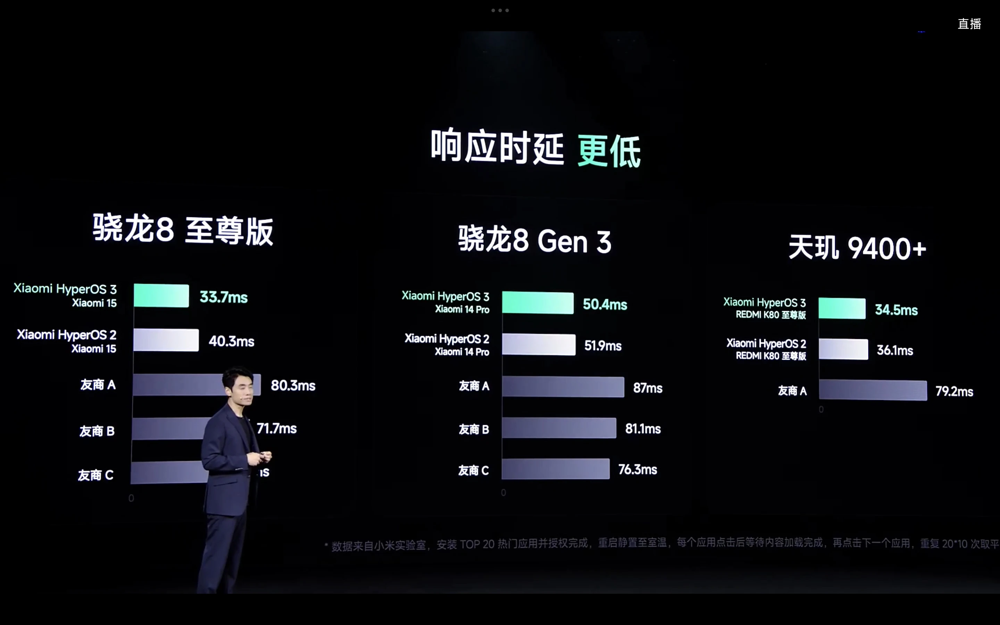

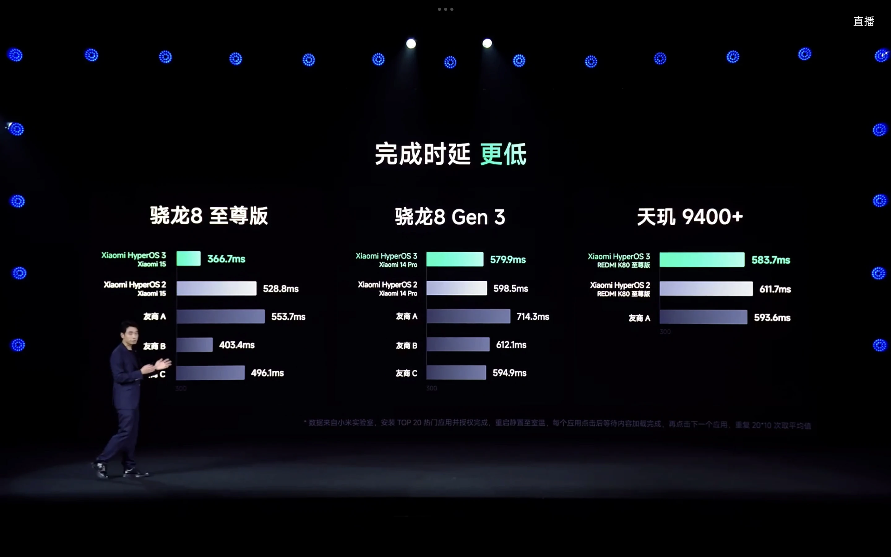

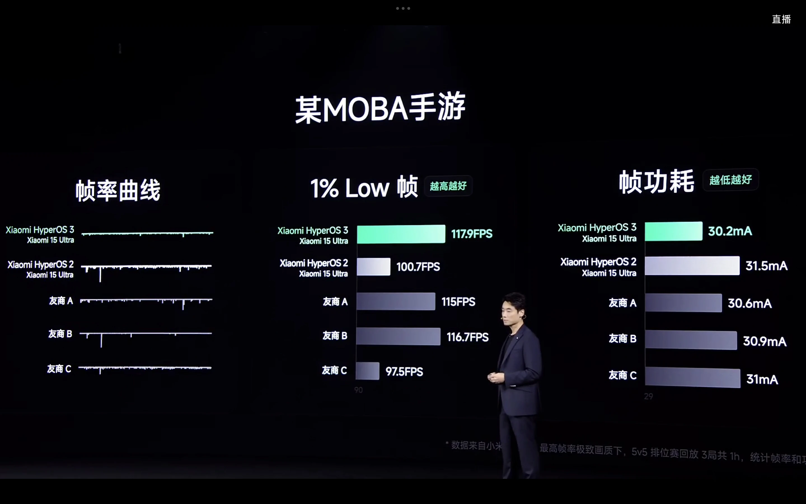

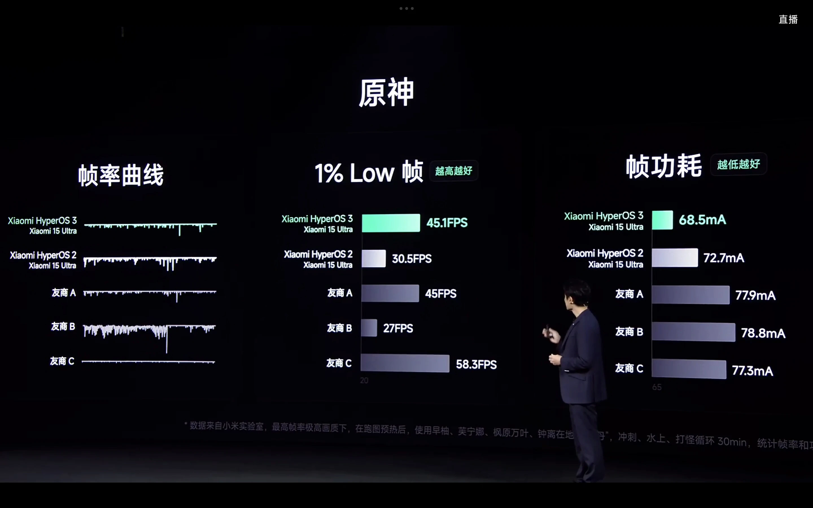

同时，在短视频方面，澎湃OS 3的功耗表现也明显更加优秀。这是为什么？

因为小米工程师团队在系统编译层做了“手脚”。

众所周知，程序运行的原理是从高级语言编译成机器语言，再由处理器进行执行。而传统系统，在高级语言的编译过程中，可能会编译出冗余的机器码，导致无端消耗处理器资源。

而澎湃OS 3针对编译层做出了优化，减少了冗余的机器码，让处理器利用率更高，处理时间自然就下降了。

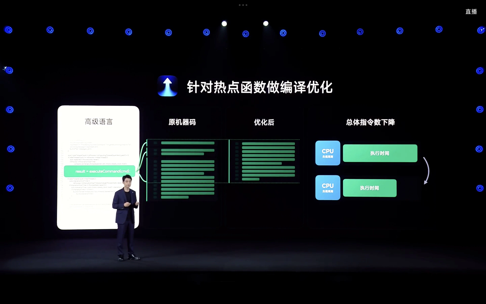编译层优化

总体来说，小米澎湃OS 3这一次的性能优化还是挺聪明的。

## 总结

小米澎湃OS 3，在澎湃OS 2的基础上，性能上做出了优化，美术设计进行了重构。

在我心中，小米的设计一直处于行业前沿，而小米澎湃OS 3，则是进了一大步。

金凡在发布会上说，小米澎湃OS 3吸收了很多用户的建议，这一点我也感同身受——我曾在小米社区多次反馈问题，每次反馈都得到了官方很认真的回复，甚至产品经理主动找我私聊了解情况。

小米前一阵子关于汽车的事情忙完了，现在也开始认真做系统了，小米手机的口碑估计会挽回一点，甚至打翻身仗。

期待小米越做越好！
