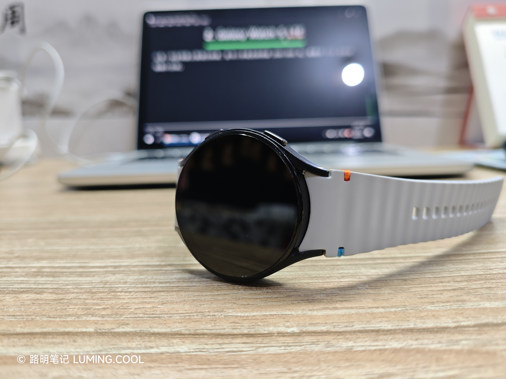

小学六年级，我迷上了华强北的全智能手表，只可惜母亲坚决不愿意给我买，说是耽误学业。

初二那年，我在小米手环 9 发售的时候买了小米手环 8。它功能很少，只能依靠为数不多的官方小游戏表盘来娱乐。

初三那年，我用奖学金买了一块 REDMI Watch 5 eSIM。它很完美。它可以打电话，可以听歌，可以安装第三方快应用和小游戏，550mAh 的电池可以支撑我一周的使用。

高一，我开始接触闲鱼，并先后购买了 TicWatch Pro 3 和 Samsung Galaxy Watch 5 LTE。我喜欢前者的双屏设计，但它“不支持开通 eSIM”；我喜欢后者的系统动效，但其“开通了 eSIM 后只有半天的续航”。最终，我又回到了 REDMI Watch 5 eSIM。我认为，轻智能手表才是住宿学生的最佳选择。

---

# Tic Watch Pro 3

这块手表令我印象深刻，我还为它[写过一篇文章](/posts/2025/11/tic-watch-pro-3/)。里面提到：

> **eSIM**：虽然它理论上支持 eSIM，但只支持**线下扫二维码下载数据**，而这种开通方式早已被时代淘汰。所以，它现在没法开通 eSIM。

当时我去了本地的一家中国联通营业厅，要求开通 eSIM，但是工作人员没受理过这种业务，也没受过这类业务培训。她并没有选择现场学习，而是编造了一个理由：“二维码开卡的形式早已被时代淘汰”。

彼时的我还太天真，对工作人员的话深信不疑，认为 TicWatch 没有开通 eSIM 的途径了。于是它就失去了留在我手里的意义，我就将其挂在闲鱼上卖掉了。

# Galaxy Watch 5 LTE

这是一块在闲鱼上很流行的表，至今二手成交价仍在 200~300 元。我是以 116 元的价格购入它的。

