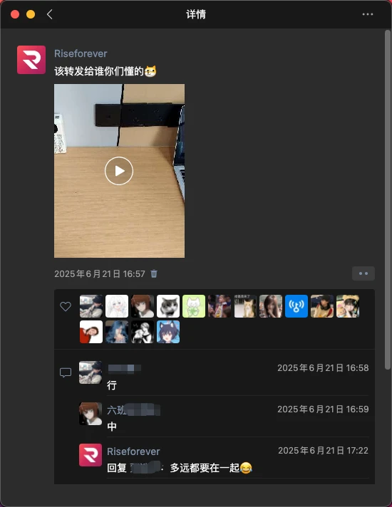
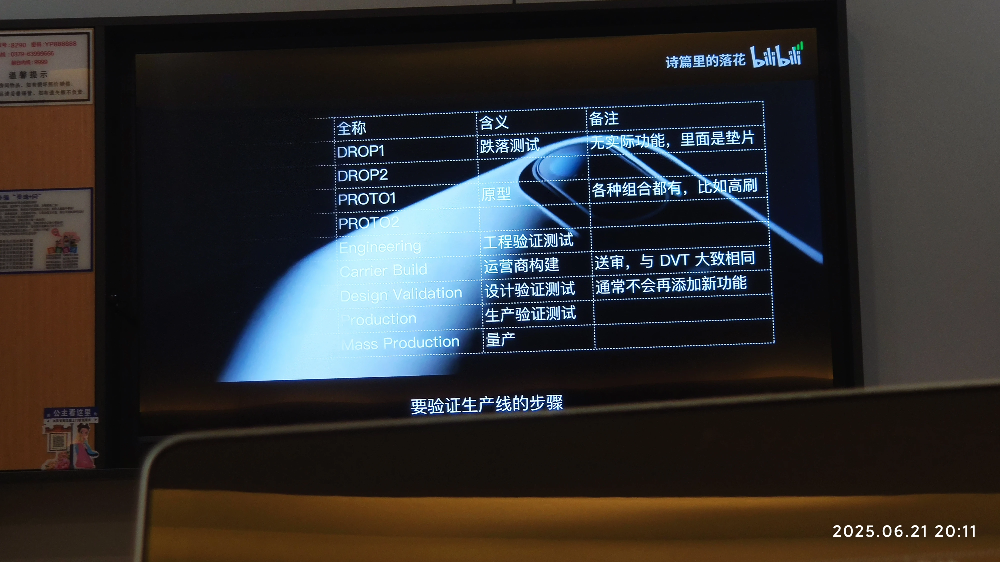
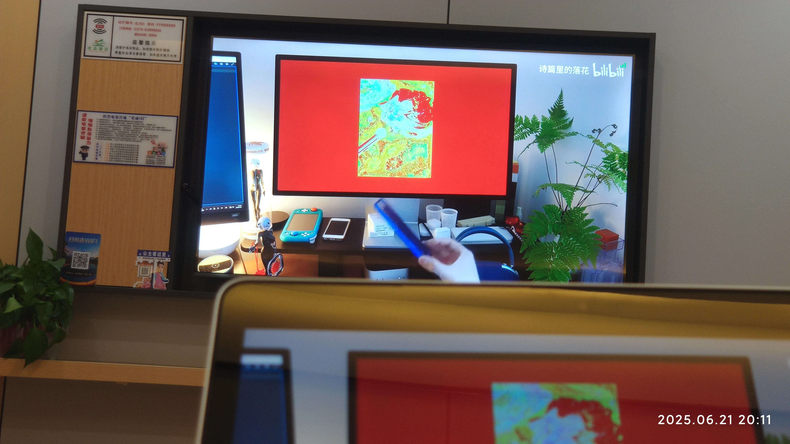
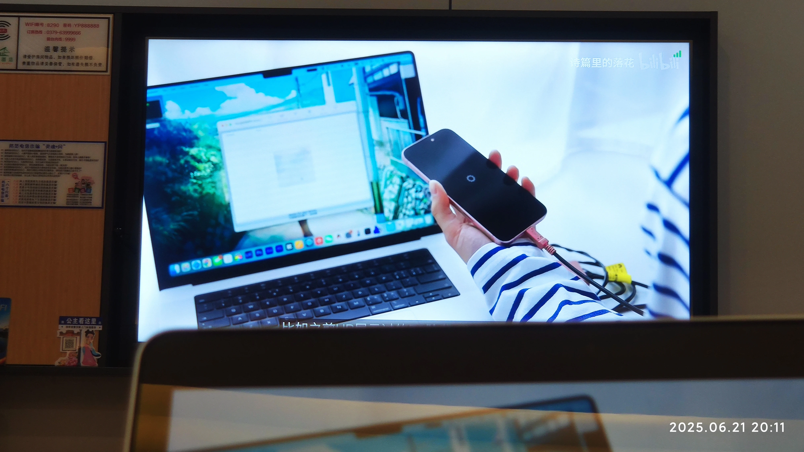
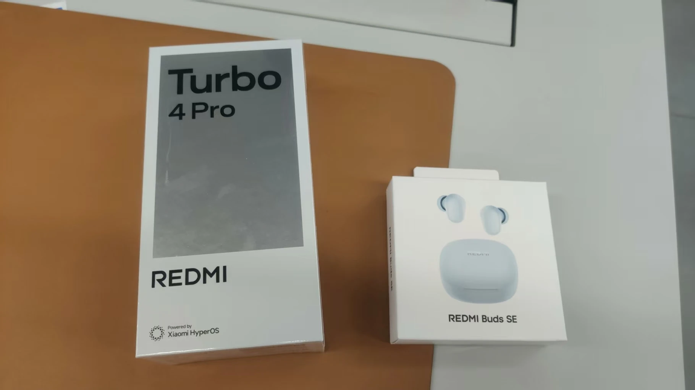

朋友们，好久不见。转眼间，洛阳市中考已经结束了，我已经是一名准高中生了。中考结束，怅然若失，让我把最近的经历讲给你听。

近期关键词：`酒店`、`中考`、`REDMI Turbo 4 Pro`

## 酒店

因为我家和中考考点距离太远了，所以母亲在距离中考（6 月 22 日）还有一周的时候，在考点附近给我订了一家酒店。

我们去得晚了一些。考点附近那些好的酒店全都被订满了，我们只好加价订了一间大床房。价格是原价的 2 倍（268 元 / 晚）。不过我们也很幸运，因为据说第二天之后房价都被炒到一千多了。

中考前一天下午（周六），上完历史一对一课之后，我们按要求去考点看了考场，随后便前往了酒店。

在没来到酒店之前，我问父亲：“这酒店环境怎么样？” 父亲说：“一般。”

结果真到了酒店之后，我觉得被父亲骗了：这哪里是一般，这简直比我 2024 年去北京研学住的酒店还豪华！（研学文章抽空会补档）

21 号下午，在把行李收拾好之后，我便开始把我的 MacBook 投屏到电视上玩。一开始，我只是听歌：

渐渐地，我玩腻了，便拿出了一瓶农夫山泉，喝掉一半，然后用只有一半水的瓶子在桌子上扔 —— 这是在培优班时期我们最喜欢的游戏，也是被制裁过的游戏。

扔完还不忘发个朋友圈 “挑衅” 一下培优班老师？

整个下午，我都处于非常松弛的状态 —— 刷 B 站、打游戏。当时我有一种很奇怪的感觉 —— 身体上感到压力和疲惫，但精神上还是想放松。

21:00，家母便催着我上床睡了。由于害怕第二天早上睡过头，我和母亲便掏出了五重保险 —— 我的小米 9 主力机、iPhone5s 备用机、小米平板 6、REDMI Watch 5、步步高家教机。在给它们依次设定好早晨 6 点的闹铃后，母亲和我安心地睡了。

离校前，班主任安慰我们说：“中考前一天睡不着是正常的，不用紧张。” 而我不到十分钟就酣然入梦。嘿嘿，这就是网友们所说的 “超绝钝感力” 吗？

## 中考

22 日早上 5:30，我自然醒了。估计是以前在学校经常早起的缘故，我的生物钟被调教得特别准。可是母亲并没有让我起床，而是要求我 “继续睡到 6 点”。我只好再次躺下。

半小时后，前一天设置的五重闹铃响了 —— 真是震天响。平板的闹铃最吵，几乎掩盖了其它设备的铃声。而我，几乎是被吓得从床上弹起来。

关闭闹铃之后，我点开手表的睡眠详情。前一天晚上我睡了 8 小时，甚至比我在学校的睡眠时间要长。

从床上起身，我看见旁边的小桌上已被摆上了小笼包和豆浆，心中不由得紧张起来。我赶紧起身去刷牙、洗脸。出发之前临时发现自己头发很油，便又急急匆匆地洗了个头。做完这些之后，我回到床前，拿起小笼包开始吃。吃完之后，我又奔到电脑前，在博客里发了篇文章 —— [中考必胜](https://virelyx.com/956/)。

做完这一切，我们便暂时告别了酒店，踏上了前往考场的路。这对我来说，也是踏上沙场。

中间还发生了一些小插曲。比如我忘了去考点门口找带队老师索要准考证，结果带队老师焦急地打电话催我。这类闹剧，在中考的两天内，我闹了两次。

进入考场之后，我身上就再次体现了前文提到的 “钝感力”—— 哪怕坐到监考老师面前了，我仍然没有任何恐慌和不安。这对现在的我来说是完全做不到的。

考完上午的科目，母亲带我去路边吃了碗米线，便返回了酒店。

由于在酒店待着过于舒服，所以我向母亲提出了个请求 —— 第二天考完之后，把这间房再续一晚。

下午的政治历史、第二天上午的数学物理、第二天下午的英语以此类推。

全科考完之后，我心中的感觉并不都是放暑假的开心，而是 “这么快就考完了” 的惆怅 ——“我还意犹未尽呢”。回到酒店，我毫不犹豫地开始收拾东西。这与我第一天考完的反应恰恰相反 —— 我现在觉得待在这里已经没有任何意义了。所以父亲、母亲和我一同把行李装包，预订网约车，踏上了归途。

## 新手机

中考结束了，外加我手头的战损版的小米 9 已无法满足我的需求，所以向父亲提出了买新手机的请求。令我没想到的是，他毫不犹豫地答应了。

23 号晚上，父亲带着我前往本地的小米之家看手机。我相中了 REDMI K80 和 REDMI Turbo 4 Pro 这两款手机。K80 的性能比 Turbo 4 Pro 要好，但是我真心看不惯 K80 的摄像头 Deco，所以我选了 Turbo 4 Pro。

16 + 256，最终我们以原价 ¥2299 买了下来。没办法，父亲不愿意网上购机，而洛阳的国补刚好停了。所以就 “枪打出头鸟” 了。

赠送的 REDMI Buds SE 不支持降噪，音频协议只支持 SBC ，但是低音还行，差强人意。

其实当时我们还看了 K80 至尊版，店员说 K80 至尊版还没有发布，暂时不知道价格。而我根据 K80 Pro ¥3199 的价格，“推测” 出 K80 至尊版有可能比 K80 Pro 还要贵，所以我根本没有对 K80 至尊版动念头。结果过了两天，K80 至尊版发布了，¥2599。

> 再次当了一回小丑。

外加 Turbo 4 Pro 日用发烫和续航尿崩的 “特性” 无处不在，这让我每时每刻都在后悔 —— 我怎么买了这么一台手机。

但好在它日用挺流畅，就这样吧，用它个三年。

## 结语

中考结束，不管成绩好坏，都代表着我的人生进入了一个新的阶段。

这里引用抖音 [@阿好好好](https://v.douyin.com/-FOeBZuC-YI/)的一段话：

> 我始终相信，上天安排我去哪里读书，遇见谁错过谁，都自有他的道理。
>
> 
>
> 
>
> 没有遗憾不叫人生。反正我们都是泪流满面，却又继续向前走的人。
>
> 
>
> 
>
> 我们终会知道，有人陪伴是幸运的，而一个人才是常态。
>
> 
>
> 
>
> 少年总是感叹日子过得太慢，却又发觉时间悄然离去，毫无痕迹，就像从未来过一样。
>
> 
>
> 
>
> 青春就像一本仓促的书，我们含着泪，一读再读。

Bye~
